# System Architecture: Dr. Md. Momenul Islam

> **Governing Documents:** This architecture is derived from the approved [Project Charter](./00-project-charter.md), [Problem Statement](./01-problem-statement.md), [Requirements Specification](./02-requirements.md), [Safety Policy](./03-safety-policy.md), [User Personas](./04-user-personas.md), and [User Stories](./05-user-stories.md). For current deployment architecture and empirical state, see [Current Implementation State](./13-current-implementation-state.md).
>
> **Purpose:** Define the logical system architecture that both implementation tracks (Track A and Track B) must follow.
>
> **Rule:** No features, technologies, or capabilities have been added beyond what is justified by the governing documents.

> **Classification Key:**
> | Label | Meaning |
> |---|---|
> | **REQUIRED** | Mandatory for the current project |
> | **CURRENT DIRECTION** | Preferred but not yet formally locked |
> | **TO BE DECIDED** | Decision not yet finalized |
> | **OUT OF SCOPE** | Deliberately excluded |

---

## 1. Architectural Goal

The system separates the following concerns into distinct, independently maintainable components:

1. **User Interface** — Presentation and user interaction
2. **API / Backend** — Request handling and orchestration
3. **Safety Processing** — Safety assessment and enforcement
4. **Retrieval / Knowledge Base** — Evidence lookup from approved sources
5. **AI Generation** — Language model interaction
6. **Response Validation** — Output checking before delivery
7. **Source Attribution** — Citation tracing and metadata preservation
8. **Application Data** — Non-medical persistent data
9. **Configuration / Secrets** — Externalized settings and credentials

This separation ensures that individual components can be changed, tested, or replaced without rewriting the entire system.

---

## 2. High-Level Architecture Overview

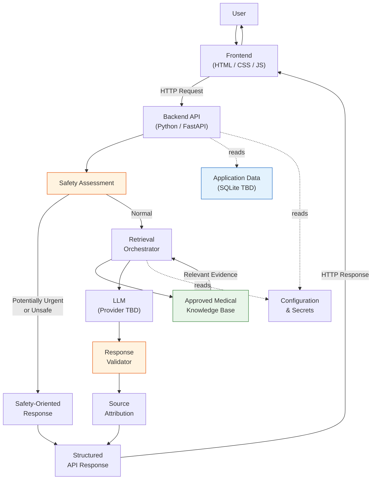

> **Key:** Green = Medical Knowledge (approved sources only). Blue = Application Data (separate from medical knowledge). Orange = Safety-critical components.

---

## 3. Frontend Layer

| Attribute | Detail |
|---|---|
| **Technology** | React 18, Vite 5, TypeScript 5, Tailwind CSS 3.4, Lucide React |
| **Status** | IMPLEMENTED (Track A) |
| **Design Paradigm** | Calm Clinical Minimalism (Progressive Disclosure) |

**Responsibilities:**
* Present the application interface (landing page, chat interface).
* Accept user questions in English, Native Bangla (বাংলা), or Banglish.
* Display retrieved clinical evidence and grounded summaries.
* Display uncertainty communication and retrieval confidence states.
* Display warning signs and urgency guidance (high-visibility bilingual emergency override).
* Display source attribution with OGL v3.0 license clause.
* Display safety disclaimers.
* Communicate with the backend exclusively through HTTP (`/api/v1/chat`, `/api/v1/health`).

**The frontend must NOT:**
* Contain LLM API keys or any privileged secrets.
* Directly call the LLM provider from the browser.
* Implement medical safety policy independently of the backend.
* Be the source of truth for safety decisions.

> The exact UI layout, visual design, and component specification are defined in [`10-ui-specification.md`](./10-ui-specification.md).

---

## 4. Backend API Layer

| Attribute | Detail |
|---|---|
| **Technology** | Python + FastAPI |
| **Status** | CURRENT DIRECTION |

**Responsibilities:**
* Validate incoming API requests (BE-03).
* Receive user input securely (BE-02).
* Coordinate safety processing (BE-04).
* Coordinate knowledge retrieval (BE-05).
* Construct the AI generation request with retrieved context (BE-06).
* Validate AI output before returning it.
* Return structured API responses (BE-07).
* Handle failures safely (BE-08).
* Keep secrets outside source code (BE-09).

The backend contains the **core application logic** and serves as the single orchestration point.

> The exact API endpoints and response contracts are defined in [`08-api-specification.md`](./08-api-specification.md).

---

## 5. Safety Layer

| Attribute | Detail |
|---|---|
| **Governing Document** | [Safety Policy](./03-safety-policy.md) |
| **Status** | REQUIRED (exact medical criteria: RESEARCH REQUIRED) |

The safety layer is a **first-class architectural component**, not an afterthought.

**Conceptual Flow:**

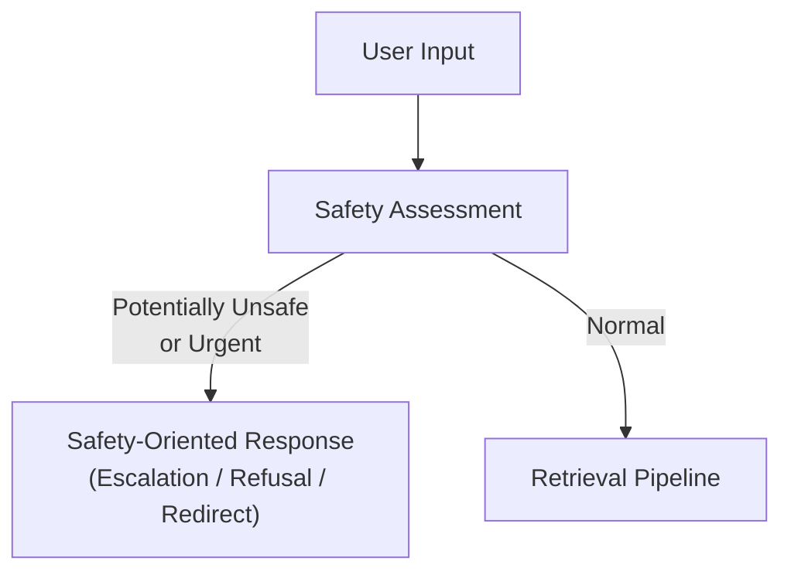

**Design Constraints:**
* Safety must be **independently testable** (NFR-09).
* Safety must **not depend entirely** on an LLM system prompt.
* Where practical, **deterministic application-level checks** should be separated from model-generated behavior.
* Safety rules are governed by the Safety Policy (SP-01 through SP-08).

| Item | Status |
|---|---|
| Exact safety classification rules and medical criteria | **RESEARCH REQUIRED** |
| Exact implementation pattern (rule engine, keyword detection, classifier, etc.) | **TO BE DECIDED** |

---

## 6. Retrieval Layer

| Attribute | Detail |
|---|---|
| **Status** | REQUIRED (exact libraries: TO BE DECIDED) |

**Responsibilities:**
* Accept a processed user question.
* Search the approved knowledge base.
* Return relevant content with preserved metadata.
* Preserve document identity for source attribution.
* Provide enough context for grounded response generation.

**Constraints:**
* The system must **not** treat arbitrary internet search results as the trusted knowledge base (KB-06).
* The initial implementation should remain **understandable** and avoid unnecessary abstraction (Project Charter §6).
* The first implementation should support **simple retrieval** before semantic retrieval is introduced (AI-07).

| Item | Status |
|---|---|
| Exact retrieval library/technology | **TO BE DECIDED** |

---

## 7. Knowledge Base Layer

| Attribute | Detail |
|---|---|
| **Status** | REQUIRED (exact source list: TO BE DECIDED) |

The knowledge base is **strictly separate** from application/user data.

**Conceptual Structure:**

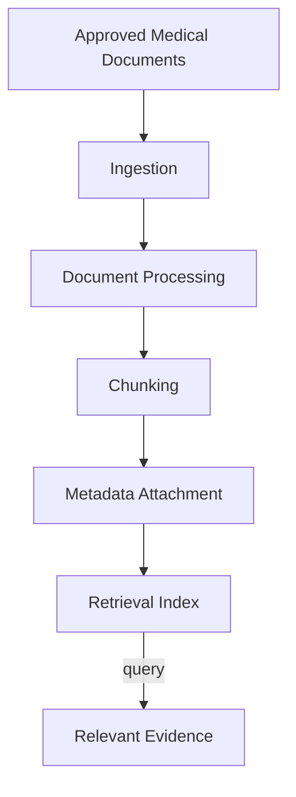

**Each knowledge document must preserve:**

| Metadata Field | Requirement |
|---|---|
| Title | KB-02 |
| Publisher / Organization | KB-02 |
| Source URL or reference | KB-02 |
| Document identifier | KB-02 |
| Publication / update information (where available) | KB-02 |
| Chunk identity (where applicable) | KB-03, KB-04 |

| Item | Status |
|---|---|
| Approved medical source list | **TO BE DECIDED** (after external research) |
| Exact chunking strategy | **TO BE DECIDED** |

---

## 8. Embedding / Vector Search Layer

The final system may use semantic embeddings and a vector database for improved retrieval. However, this is **not a mandatory architectural decision yet**.

**Logical Role:**

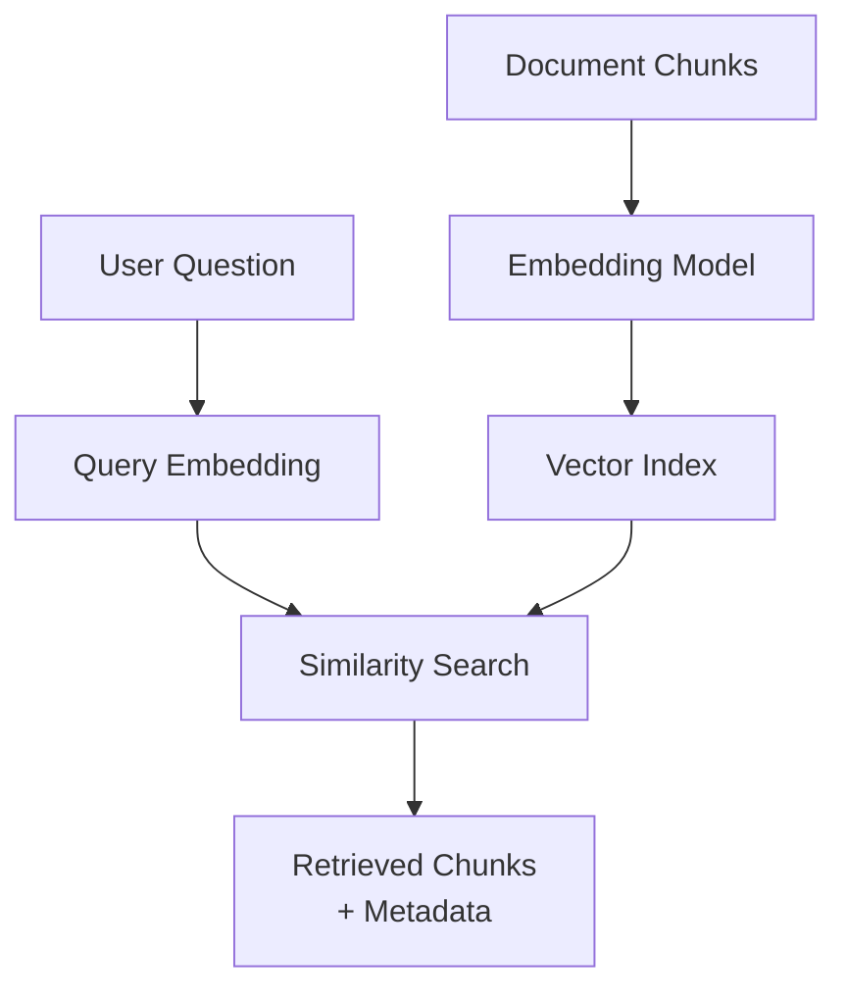

**Progressive Introduction (per Project Charter §6):**
1. Simple retrieval (keyword/basic search) — understand the fundamentals.
2. Embeddings — understand how text is represented as vectors.
3. Vector search — understand similarity-based retrieval.
4. Full RAG pipeline — combine retrieval with LLM generation.

| Item | Status |
|---|---|
| Embedding model | **TO BE DECIDED** |
| Vector database (ChromaDB is a candidate) | **TO BE DECIDED** |

---

## 9. LLM Layer

| Attribute | Detail |
|---|---|
| **Status** | REQUIRED (exact provider: TO BE DECIDED) |

**Responsibilities:**
* Receive the user question, relevant retrieved context, system safety instructions, and response-format instructions.
* Generate a structured health-information response.

**Constraints:**
* The LLM is **not** the sole source of medical truth (AI-03).
* A fluent response must **not** be assumed correct.
* The architecture must make the **model replaceable** without rewriting the application (AI-06).
* The system prompt must enforce safety rules (Safety Policy §11).

| Item | Status |
|---|---|
| LLM provider / model | **TO BE DECIDED** |
| Exact production system prompt | **TO BE DECIDED** |

---

## 10. Response Validation Layer

| Attribute | Detail |
|---|---|
| **Status** | REQUIRED (exact architecture: TO BE DECIDED) |

After LLM generation, the response passes through validation **before** reaching the user.

**Potential Validation Checks:**

| Check | Purpose |
|---|---|
| Required response fields exist | Structural integrity |
| Source attribution present (where required) | SRC-01 compliance |
| No fabricated citation structure | SRC-03 compliance |
| Prohibited certainty patterns detected | SP-02, SP-03 compliance |
| Prohibited unsafe prescribing detected | SP-05 compliance |
| Urgency/safety information present when required | SP-06 compliance |
| Malformed model output rejected or repaired | Reliability |

| Item | Status |
|---|---|
| Exact validation rule set and architecture | **TO BE DECIDED** |

---

## 11. Source Attribution Layer

**Traceability Chain:**

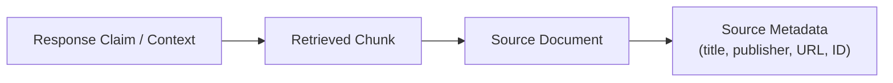

**Requirements:**
* The architecture must prevent fabricated citations (SRC-03, SP-08).
* Sources must be represented as **structured data** in the backend, not plain text manually inserted into LLM responses.
* The user-facing citation format is defined in the UI and API specifications.

---

## 12. Application Data Layer

Application data is **strictly separate** from the medical knowledge base.

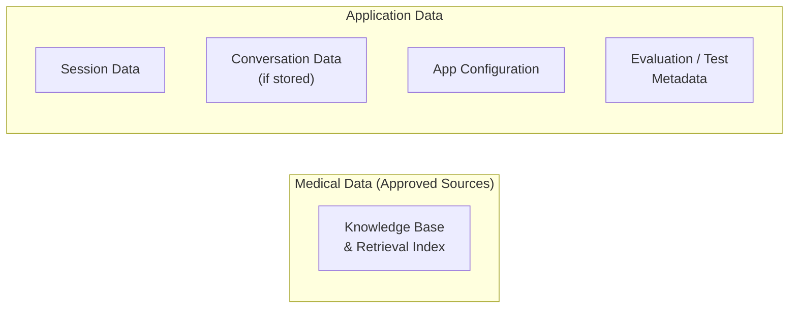

| Item | Status |
|---|---|
| Exact persistence technology (SQLite is a candidate) | **TO BE DECIDED** |
| Conversation storage and retention policy | **TO BE DECIDED** (PR-05) |

---

## 13. Privacy / Secrets Layer

Secrets must remain **outside source control** at all times.

| Secret Type | Handling |
|---|---|
| LLM API keys | Environment variables; never in code or frontend |
| Database credentials | Environment variables |
| Authentication secrets | Environment variables |
| Deployment credentials | Environment variables |

**Rules:**
* The browser must **never** receive privileged API keys (PR-03).
* A `.env.example` file documents required variables without actual values.
* Health-related user input is treated as sensitive (NFR-07, PR-04).

---

## 14. Configuration Layer

Configuration should be **externalized** where practical.

| Configuration Item | Example |
|---|---|
| Model / provider selection | `LLM_PROVIDER`, `LLM_MODEL` |
| API URLs | `LLM_API_URL` |
| Retrieval parameters | `RETRIEVAL_TOP_K` |
| Environment selection | `ENVIRONMENT=dev` |
| Knowledge-base paths | `KB_DATA_PATH` |

Secrets must **not** be hard-coded. Non-secret configuration should also be externalized to support different environments and easy modification.

---

## 15. Failure Handling

The architecture defines **safe behavior** for every critical failure scenario, following [Safety Policy §13](./03-safety-policy.md).

| Failure Scenario | Required Behavior | Prohibited Behavior |
|---|---|---|
| LLM unavailable | Fail safely; inform user | Silently return empty or fabricated response |
| Retrieval fails | Fail safely; do not present response as evidence-grounded | Generate ungrounded response and present it as grounded |
| Knowledge base unavailable | Fail safely; inform user | Pretend retrieval occurred |
| Safety assessment fails | Default to conservative handling | Skip safety and proceed normally |
| Response validation fails | Reject or repair response safely | Deliver unvalidated response |
| Source metadata missing | Do not present response as source-grounded | Fabricate citation metadata |

| Item | Status |
|---|---|
| Exact fallback message wording | **TO BE DECIDED** |

---

## 16. Request Lifecycle

### 16.1 Normal Request Lifecycle

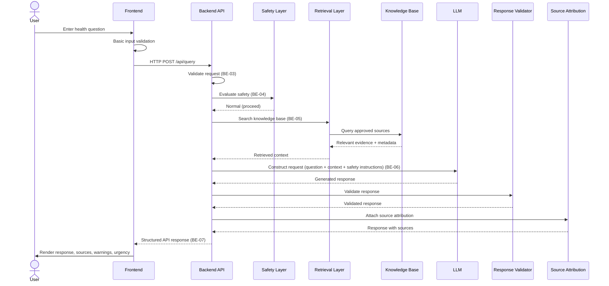

### 16.2 Urgent Request Lifecycle

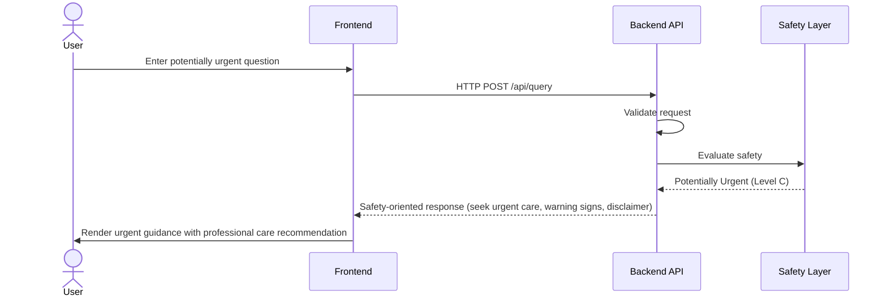

### 16.3 Unsafe Request Lifecycle

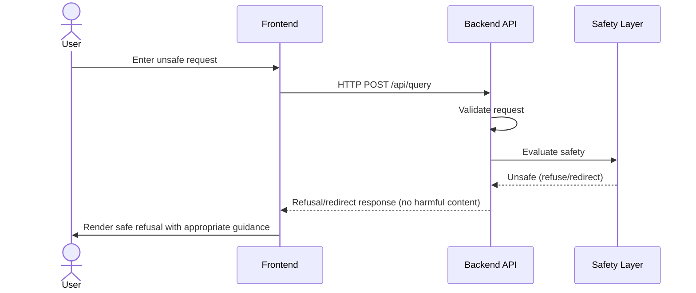

### 16.4 No Relevant Retrieval

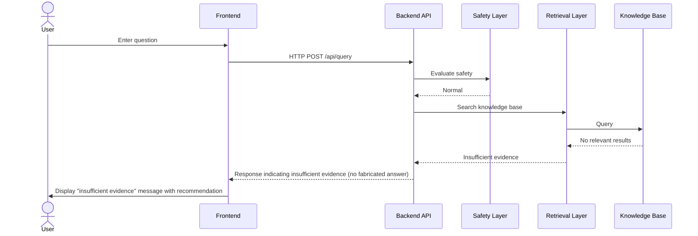

### 16.5 LLM Failure

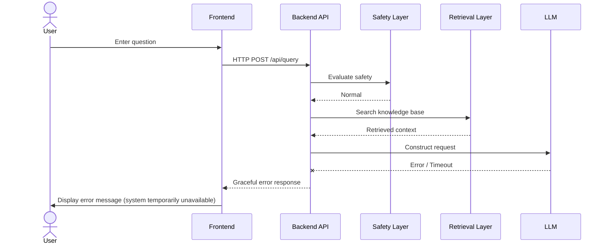

### 16.6 Retrieval Failure

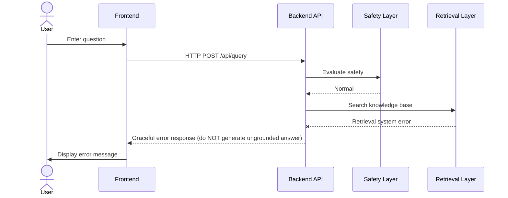

---

## 17. Logical Component Diagram

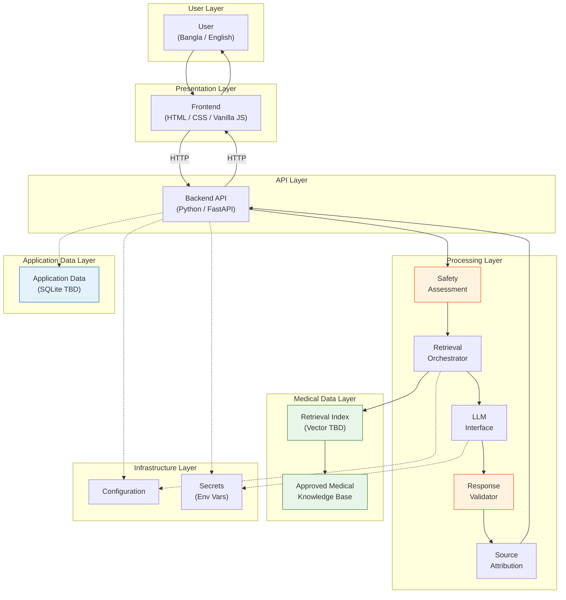

---

## 18. Track A / Track B Compatibility

The architecture is **implementation-neutral**. Both tracks follow the identical logical architecture.

**Both tracks share:**

```
Frontend → Backend API → Safety → Retrieval → LLM → Validation → Response
```

### What Must Be Identical

| Aspect | Requirement |
|---|---|
| Functional requirements | Same (FR-01 through FR-11) |
| Safety requirements | Same (SR-01 through SR-10) |
| API behavior and response contract | Same (defined in `08-api-specification.md`) |
| Knowledge-source rules | Same (KB-01 through KB-06) |
| Testing requirements | Same (NFR-09, Safety Policy §16) |
| Safety policy | Same (`03-safety-policy.md`) |

### What May Differ

| Aspect | Allowed Variation |
|---|---|
| Internal code organization | Implementation style may vary |
| Development speed | Expected to differ |
| Libraries used | May differ when justified |
| Code comments and documentation style | May differ |
| Development process | Agent-assisted (A) vs. manual (B) |

---

## 19. Architecture Principles

| # | Principle | Description |
|---|---|---|
| 1 | **Separation of Concerns** | Each component has a clear, single responsibility. |
| 2 | **Replaceability** | LLM provider, retrieval implementation, and data stores should be replaceable without rewriting the application. |
| 3 | **Safety by Architecture** | Safety is enforced by dedicated components, not solely by LLM prompts. |
| 4 | **Evidence Grounding** | Medical content comes from approved evidence whenever knowledge-grounded output is required. |
| 5 | **Least Privilege** | Components receive only the access and credentials they need. The frontend never receives API keys. |
| 6 | **Testability** | Safety, retrieval, generation, and validation are independently testable. |
| 7 | **Simplicity** | Complex infrastructure is not introduced until a demonstrated requirement exists. |

---

## 20. Technology Decisions

| Decision | Current Direction | Status |
|---|---|---|
| Frontend | HTML / CSS / Vanilla JavaScript | REQUIRED |
| Backend | Python / FastAPI | CURRENT DIRECTION |
| LLM provider | Not chosen | TO BE DECIDED |
| Embedding model | Not chosen | TO BE DECIDED |
| Vector database | Not chosen (ChromaDB is a candidate) | TO BE DECIDED |
| Application database | Not chosen (SQLite is a candidate) | TO BE DECIDED |
| Authentication | Not yet required | TO BE DECIDED |
| Deployment platform | Not chosen | TO BE DECIDED |

> Every technology decision must eventually be justified by requirements. Technologies must not be adopted simply because they are familiar.

---

## 21. Architecture Traceability

| Architecture Component | Traced Requirements |
|---|---|
| Frontend | FR-01, FR-02, FR-03, UI-01–UI-06, NFR-01, NFR-02 |
| Backend API | BE-01–BE-09, NFR-03, NFR-04 |
| Safety Layer | SR-01–SR-10, FR-07, FR-08, FR-10, SP-01–SP-08 |
| Retrieval Layer | FR-04, KB-01–KB-06, AI-01, AI-07 |
| Knowledge Base | KB-01–KB-06, SRC-04 |
| LLM Interface | FR-05, AI-01–AI-06 |
| Response Validator | SR-02, SR-03, SR-04, AI-03, AI-05, NFR-09 |
| Source Attribution | FR-09, SRC-01–SRC-04 |
| Application Data | FR-11, PR-05 |
| Configuration / Secrets | NFR-06, PR-03, BE-09 |
| Privacy Handling | NFR-07, PR-01–PR-05 |

---

## 22. Architecture Boundaries — Explicit Exclusions

The following are **OUT OF SCOPE** for this architecture unless the [Project Charter](./00-project-charter.md) is formally amended:

| Excluded Capability | Status |
|---|---|
| Hospital information systems | OUT OF SCOPE |
| Emergency dispatch | OUT OF SCOPE |
| Electronic medical records | OUT OF SCOPE |
| Autonomous medical treatment | OUT OF SCOPE |
| Clinical decision authority | OUT OF SCOPE |
| Foundation-model training | OUT OF SCOPE |
| Wearable device integrations | OUT OF SCOPE |
| Voice interface | OUT OF SCOPE |
| Image-based diagnosis | OUT OF SCOPE |
| Multi-tenant deployment | OUT OF SCOPE |

---

## Pending Decisions Summary

| Item | Section | Status |
|---|---|---|
| Safety classification implementation pattern | §5 | TO BE DECIDED |
| Exact retrieval library / technology | §6 | TO BE DECIDED |
| Approved medical source list | §7 | TO BE DECIDED (after research) |
| Chunking strategy | §7 | TO BE DECIDED |
| Embedding model | §8 | TO BE DECIDED |
| Vector database | §8 | TO BE DECIDED |
| LLM provider / model | §9 | TO BE DECIDED |
| Production system prompt | §9 | TO BE DECIDED |
| Response validation rule set | §10 | TO BE DECIDED |
| Exact persistence technology | §12 | TO BE DECIDED |
| Conversation retention policy | §12 | TO BE DECIDED |
| Fallback message wording | §15 | TO BE DECIDED |
| Authentication mechanism | §20 | TO BE DECIDED |
| Deployment platform | §20 | TO BE DECIDED |
