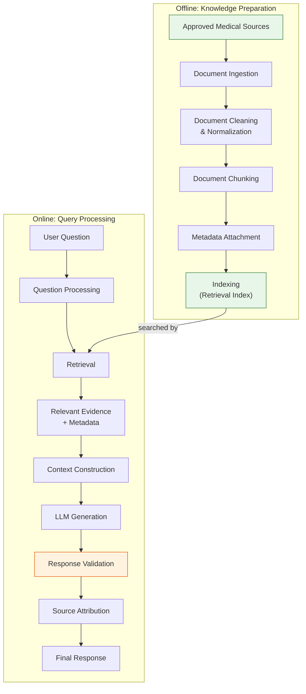
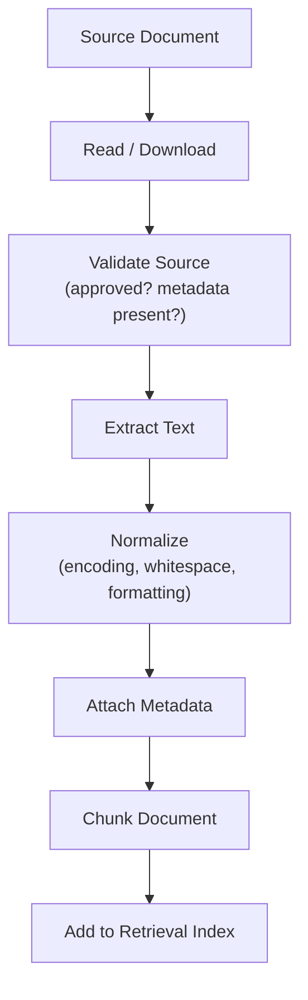
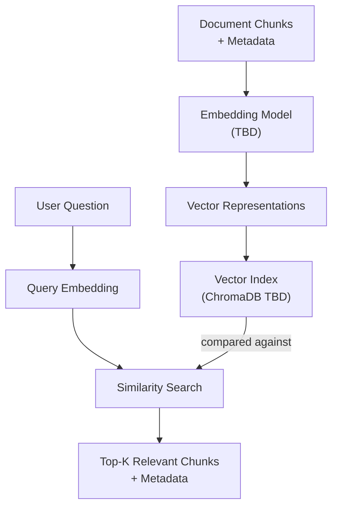
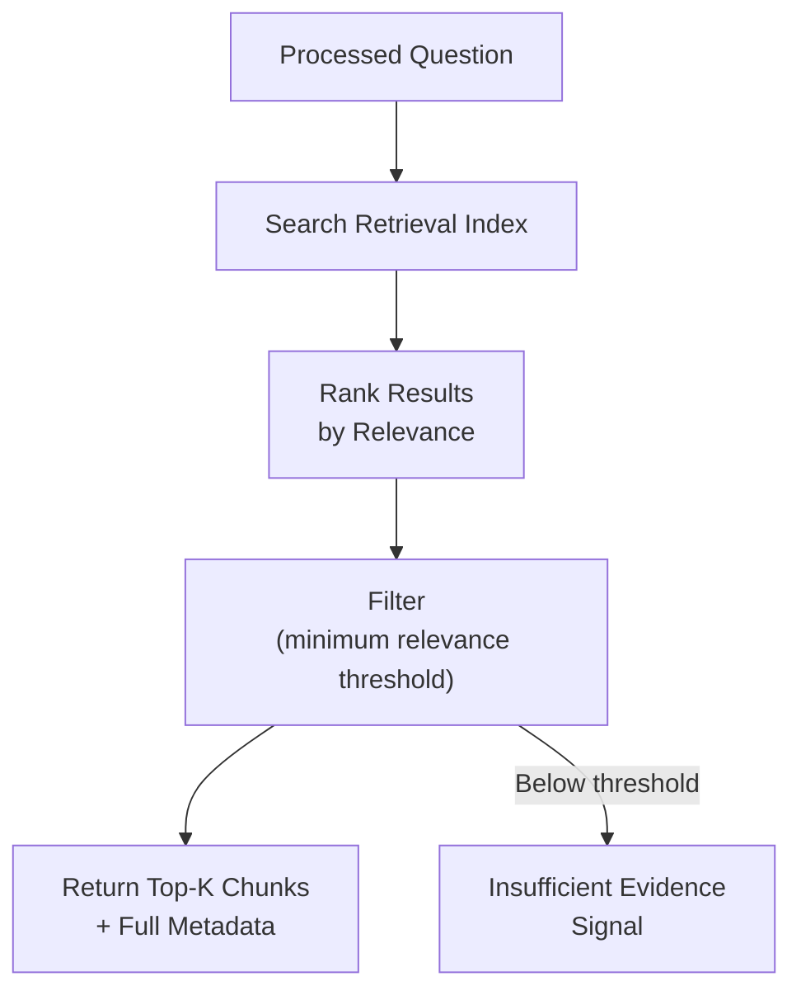
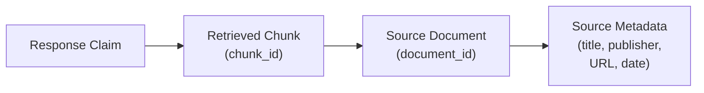
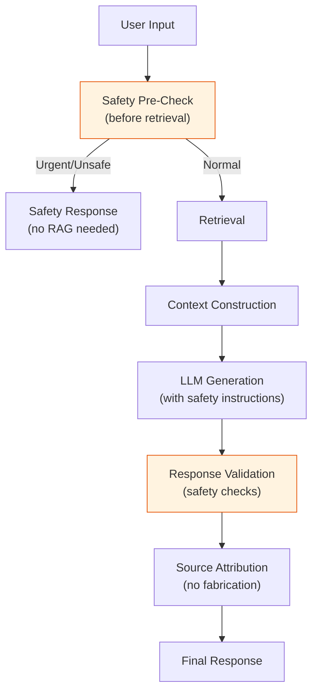

# RAG Architecture: Dr. Md. Momenul Islam

> **Governing Documents:** This document is derived from the approved [Project Charter](file:///d:/my-ai-project/Dr.%20Md.%20Momenul%20Islam/docs/00-project-charter.md), [Problem Statement](file:///d:/my-ai-project/Dr.%20Md.%20Momenul%20Islam/docs/01-problem-statement.md), [Requirements Specification](file:///d:/my-ai-project/Dr.%20Md.%20Momenul%20Islam/docs/02-requirements.md), [Safety Policy](file:///d:/my-ai-project/Dr.%20Md.%20Momenul%20Islam/docs/03-safety-policy.md), [User Personas](file:///d:/my-ai-project/Dr.%20Md.%20Momenul%20Islam/docs/04-user-personas.md), [User Stories](file:///d:/my-ai-project/Dr.%20Md.%20Momenul%20Islam/docs/05-user-stories.md), and [System Architecture](file:///d:/my-ai-project/Dr.%20Md.%20Momenul%20Islam/docs/06-system-architecture.md).
>
> **Purpose:** Define the Retrieval-Augmented Generation (RAG) pipeline in enough logical detail that both Track A (agent build) and Track B (manual build) can implement the same system.
>
> **Rule:** No features, technologies, or capabilities have been added beyond what is justified by the governing documents.

> **Classification Key:**
> | Label | Meaning |
> |---|---|
> | **REQUIRED** | Mandatory for the current project |
> | **RESEARCH REQUIRED** | Needs external evidence before finalizing |
> | **TO BE DECIDED** | Decision not yet finalized |
> | **OUT OF SCOPE** | Deliberately excluded |

---

## 1. RAG Objective

The purpose of Retrieval-Augmented Generation (RAG) in this project is to make the health-information assistant rely on **relevant approved medical evidence** instead of depending solely on the language model's internal knowledge.

**RAG must:**
* Improve grounding by anchoring responses to specific, retrievable source material.
* Enable source attribution by preserving the link between generated content and its evidence.
* Reduce (but not eliminate) the risk of unsupported medical claims.

**RAG must NOT be described as:**
* A guarantee of correctness.
* An elimination of hallucination.
* A replacement for professional medical evaluation.
* A clinical validation mechanism.

> Retrieval improves evidence grounding. It does not make the system infallible. The response validation layer and safety policy remain essential even when retrieval succeeds.

---

## 2. RAG Pipeline Overview



The pipeline has two distinct phases:
* **Offline (Knowledge Preparation):** Processing and indexing approved documents. This happens before user queries.
* **Online (Query Processing):** Handling a user question in real time — from question processing through to final response.

---

## 3. Knowledge Source Rules

The RAG system may retrieve **only** from the project's approved knowledge base (KB-01, KB-06).

### Trusted Sources (TO BE DECIDED — exact list after research)

Potential approved source categories (from Project Charter §8):
* World Health Organization (WHO)
* Government health authorities
* Reputable public-health agencies
* Peer-reviewed medical literature
* Established clinical guidelines

### Prohibited Sources

The RAG system must **NOT** automatically trust:

| Source Type | Status |
|---|---|
| Arbitrary web search results | PROHIBITED |
| Random websites | PROHIBITED |
| Social media content | PROHIBITED |
| Unverified medical blogs | PROHIBITED |
| User-provided medical claims | PROHIBITED |
| Model-generated medical content | PROHIBITED |
| Unverified datasets | PROHIBITED |

Each approved source must have a **documented provenance** — a clear record of where the document came from, who published it, and when.

| Item | Status |
|---|---|
| Exact approved source list | **TO BE DECIDED** (after external research) |

---

## 4. Document Ingestion

The ingestion process converts approved source documents into a retrievable, indexed format.

### Ingestion Pipeline



### Ingestion Requirements

| ID | Requirement | Classification |
|---|---|---|
| ING-01 | Only approved sources may enter the ingestion pipeline. | REQUIRED (KB-01, KB-06) |
| ING-02 | Each document must be validated for source provenance before processing. | REQUIRED |
| ING-03 | Text extraction must preserve meaningful content without introducing artifacts. | REQUIRED |
| ING-04 | Character encoding must be handled correctly for both Bangla and English text. | REQUIRED |
| ING-05 | Source metadata must be attached before chunking so that every chunk inherits provenance. | REQUIRED (KB-02) |
| ING-06 | The ingestion process must be repeatable — re-ingesting the same document should produce consistent results. | REQUIRED |
| ING-07 | New sources can be added without rewriting application logic. | REQUIRED (KB-05) |

### Supported Document Formats

| Format | Status |
|---|---|
| Plain text (.txt) | REQUIRED (initial) |
| Markdown (.md) | REQUIRED (initial) |
| PDF | TO BE DECIDED |
| HTML (from authoritative pages) | TO BE DECIDED |
| Other formats | TO BE DECIDED (as needed) |

---

## 5. Document Cleaning and Normalization

Before chunking, ingested text should be cleaned and normalized.

### Cleaning Steps

| Step | Purpose |
|---|---|
| Encoding normalization | Ensure consistent UTF-8 encoding for Bangla and English |
| Whitespace normalization | Remove excessive whitespace, line-break artifacts |
| Header/footer removal | Remove non-content elements (page numbers, repeated headers) |
| Formatting artifact removal | Remove artifacts from PDF extraction or HTML conversion |
| Content validation | Verify that extracted text is readable and meaningful |

### Cleaning Constraints

* Cleaning must **not** alter the medical meaning of the text.
* Cleaning must **not** remove meaningful section headings that aid retrieval.
* Cleaning must **not** strip metadata-relevant information (e.g., author, publication date embedded in the text).

---

## 6. Document Chunking

Documents must be split into retrievable chunks that are small enough to be useful for retrieval but large enough to preserve meaningful medical context.

### Chunking Considerations

| Consideration | Detail |
|---|---|
| **Chunk size** | Must be large enough to preserve medical context, small enough for focused retrieval. Exact size is **TO BE DECIDED**. |
| **Overlap** | Overlapping chunks may help preserve context at boundaries. Strategy is **TO BE DECIDED**. |
| **Context preservation** | A chunk should not split a medical concept mid-sentence where possible. |
| **Section awareness** | Where documents have clear sections (e.g., "Symptoms", "Treatment", "When to See a Doctor"), chunking should respect these boundaries where practical. |

### Chunk Identity

Each chunk must carry a unique identity that links back to its source document:

| Field | Purpose | Requirement |
|---|---|---|
| `chunk_id` | Unique identifier for the chunk | REQUIRED |
| `document_id` | Links to the parent source document | REQUIRED (KB-04) |
| `chunk_index` | Position within the document | REQUIRED |
| `text` | The chunk content | REQUIRED |
| `metadata` | Inherited source metadata | REQUIRED (KB-02) |

### Chunking Anti-Patterns

* Do **not** chunk so aggressively that a single symptom description is split across multiple chunks with no overlap.
* Do **not** strip metadata during chunking.
* Do **not** merge content from different source documents into a single chunk.

| Item | Status |
|---|---|
| Exact chunk size | **TO BE DECIDED** |
| Overlap strategy | **TO BE DECIDED** |
| Chunking library/method | **TO BE DECIDED** |

---

## 7. Metadata Attachment

Every chunk in the retrieval index must carry metadata from its source document.

### Required Metadata Fields

| Field | Source | Requirement |
|---|---|---|
| `title` | Source document title | KB-02 |
| `publisher` | Publishing organization (e.g., WHO, DGHS) | KB-02 |
| `source_url` | Original URL or reference | KB-02 |
| `document_id` | Stable identifier for the source document | KB-02 |
| `publication_date` | Date of publication or last update (where available) | KB-02 |
| `chunk_id` | Unique chunk identifier | KB-04 |
| `chunk_index` | Position of chunk within the document | KB-03 |

### Metadata Rules

* Metadata must be attached **before** chunking so that every chunk inherits full provenance.
* Metadata must be **preserved through the entire pipeline** — ingestion → chunking → indexing → retrieval → response → user display (SRC-04).
* Metadata must **not** be fabricated. If a field is unavailable, it should be marked as unknown rather than invented.

---

## 8. Indexing

Processed chunks with metadata are stored in a retrieval index that can be searched at query time.

### Progressive Indexing Strategy

Following the Project Charter's progressive learning path (§6), the indexing approach evolves:

| Phase | Approach | Purpose |
|---|---|---|
| **Phase 1** | Simple keyword/text search | Understand basic retrieval fundamentals |
| **Phase 2** | Embeddings | Understand how text is represented as vectors |
| **Phase 3** | Vector similarity search | Understand semantic retrieval |
| **Phase 4** | Full RAG pipeline | Combine retrieval with LLM generation |

### Phase 1 — Simple Retrieval

* Basic text matching (keyword search, TF-IDF, or similar).
* No embedding model required.
* Purpose: understand what retrieval means before introducing vector search.

### Phase 2–3 — Embedding and Vector Search



**Embedding Concepts (for learning reference):**
* An embedding model converts text into a numerical vector that captures semantic meaning.
* Similar texts produce vectors that are close together in vector space.
* Retrieval then becomes finding stored vectors most similar to the query vector.

| Item | Status |
|---|---|
| Embedding model | **TO BE DECIDED** |
| Vector database (ChromaDB is a candidate) | **TO BE DECIDED** |
| Similarity metric (cosine, dot product, etc.) | **TO BE DECIDED** |
| Number of results to retrieve (Top-K) | **TO BE DECIDED** |

---

## 9. Question Processing

Before retrieval, the user's question may need processing.

### Processing Steps

| Step | Purpose | Status |
|---|---|---|
| Input validation | Ensure the input is not empty, excessively long, or malformed | REQUIRED (BE-03) |
| Language detection | Determine if the question is in Bangla, English, or mixed | TO BE DECIDED |
| Query formulation | Convert user input into a form suitable for retrieval | TO BE DECIDED |
| Safety pre-check | Route to safety layer before retrieval when needed | REQUIRED (Safety Policy §3) |

### Language Considerations

* The retrieval index may contain documents primarily in English (from WHO, clinical guidelines, etc.).
* A Bangla question may need to be processed or translated to retrieve relevant English-language evidence.
* Translation must **not** alter the medical meaning of the query (Safety Policy, SP-03, SP-07).
* The exact language-processing architecture is **TO BE DECIDED** (FR-03).

---

## 10. Retrieval

At query time, the retrieval layer searches the index for chunks most relevant to the user's question.

### Retrieval Flow



### Retrieval Requirements

| ID | Requirement | Classification |
|---|---|---|
| RET-01 | Retrieval must search only the approved knowledge base. | REQUIRED (KB-01) |
| RET-02 | Retrieved chunks must include full source metadata. | REQUIRED (KB-04, SRC-04) |
| RET-03 | Retrieval must return a defined number of relevant results (Top-K). | REQUIRED |
| RET-04 | When no sufficiently relevant results are found, the system must signal "insufficient evidence" rather than fabricating relevance. | REQUIRED (RS-04, RS-06) |
| RET-05 | Retrieval results must preserve chunk identity and document identity. | REQUIRED (KB-03, KB-04) |
| RET-06 | Retrieval must not introduce content from unapproved sources. | REQUIRED (KB-06) |

### Retrieval Edge Cases

| Scenario | Required Behavior |
|---|---|
| No relevant results found | Signal insufficient evidence; do not fabricate (Safety Policy §13, RS-06) |
| Results from conflicting sources | Preserve all results; let context construction and LLM handle (Safety Policy §9) |
| Query is ambiguous | Return best available results; communicate uncertainty (FR-06) |
| Knowledge base is unavailable | Fail safely; do not generate ungrounded response (Safety Policy §13) |

---

## 11. Context Construction

After retrieval, the backend constructs the input for the LLM by combining:

1. **System instructions** — Safety rules, response format, behavior constraints.
2. **Retrieved context** — The relevant evidence chunks with metadata.
3. **User question** — The original user input.

### Context Structure (Conceptual)

```
┌─────────────────────────────────────────────┐
│ SYSTEM INSTRUCTIONS                         │
│ • You are a health information assistant     │
│ • You are NOT a doctor (SP-01)              │
│ • Prioritize retrieved evidence (AI-02)      │
│ • Communicate uncertainty (SP-03)           │
│ • Do not fabricate sources (SP-08)           │
│ • [Full safety instruction set]              │
├─────────────────────────────────────────────┤
│ RETRIEVED CONTEXT                           │
│ [Source 1: title, publisher, chunk text]      │
│ [Source 2: title, publisher, chunk text]      │
│ [Source N: ...]                               │
├─────────────────────────────────────────────┤
│ USER QUESTION                               │
│ [Original user input]                        │
└─────────────────────────────────────────────┘
```

### Context Construction Rules

| Rule | Requirement |
|---|---|
| The LLM must receive the user question and relevant retrieved context (AI-01). | REQUIRED |
| The system must instruct the LLM to prioritize retrieved evidence (AI-02). | REQUIRED |
| Source metadata must be included in the context so the LLM can reference it. | REQUIRED |
| When no relevant evidence is retrieved, the context must indicate this. | REQUIRED |
| The system prompt must enforce all safety policy rules (Safety Policy §11). | REQUIRED |
| Context size must respect the LLM's context window limit. | REQUIRED |

### Context Size Management

If the total context (system instructions + retrieved chunks + user question) approaches the LLM's context window limit:
* Reduce the number of retrieved chunks rather than truncating safety instructions.
* Safety instructions must **never** be truncated to make room for more context.

| Item | Status |
|---|---|
| Exact system prompt wording | **TO BE DECIDED** |
| Context window budget allocation | **TO BE DECIDED** (depends on chosen LLM) |

---

## 12. LLM Generation

The LLM generates a health-information response based on the constructed context.

### LLM Responsibilities

* Generate a response that addresses the user's question using the retrieved evidence.
* Communicate uncertainty when evidence is insufficient (SP-03).
* Include source references in the response structure.
* Follow all safety instructions in the system prompt.
* Produce output in a structured format that can be validated.

### LLM Constraints

| Constraint | Requirement |
|---|---|
| The LLM must not be treated as the sole source of medical truth (AI-03). | REQUIRED |
| A fluent response must not be assumed correct. | REQUIRED |
| The LLM must not fabricate citations (SP-08, SRC-03). | REQUIRED |
| The model must be replaceable without rewriting the application (AI-06). | REQUIRED |

### Expected Output Structure (Conceptual)

The LLM should produce a structured response containing:

| Field | Description | Requirement |
|---|---|---|
| `answer` | The health-information response text | REQUIRED |
| `uncertainty` | Uncertainty communication | REQUIRED (FR-06) |
| `warning_signs` | Relevant warning signs (when applicable) | REQUIRED (FR-07) |
| `urgency_level` | General urgency indication (when applicable) | REQUIRED (FR-08) |
| `sources_used` | References to the retrieved sources used | REQUIRED (FR-09) |
| `professional_care` | Recommendation to seek professional care (when applicable) | REQUIRED (SR-07) |

The exact response schema is defined in [`08-api-specification.md`](file:///d:/my-ai-project/Dr.%20Md.%20Momenul%20Islam/docs/08-api-specification.md).

| Item | Status |
|---|---|
| LLM provider / model | **TO BE DECIDED** |
| Exact structured output format | **TO BE DECIDED** |

---

## 13. Response Validation

After LLM generation, the response passes through validation **before** reaching the user. This is a safety-critical step.

### Validation Checks

| Check | Purpose | Related Requirement |
|---|---|---|
| Required fields present | Structural integrity | BE-07 |
| Source attribution present (where required) | Citation compliance | SRC-01 |
| Cited sources match retrieved sources | No fabricated citations | SRC-02, SRC-03 |
| No definitive diagnosis language | Safety compliance | SR-02, SP-02 |
| No unsafe prescription language | Safety compliance | SR-03, SP-05 |
| No false certainty language | Safety compliance | SR-06, SP-03 |
| Urgency/safety information present (when required) | Safety compliance | SP-06 |
| Response is well-formed | Reliability | NFR-04 |

### Validation Failure Behavior

| Scenario | Required Behavior |
|---|---|
| Missing required fields | Reject response; return safe fallback | 
| Fabricated citation detected | Remove citation; flag for review |
| Prohibited language patterns detected | Reject or modify response conservatively |
| Malformed LLM output | Reject; return safe error response |

| Item | Status |
|---|---|
| Exact validation rule set and implementation | **TO BE DECIDED** |
| Prohibited language pattern list | **TO BE DECIDED** |

---

## 14. Source Attribution

The final step before delivering the response is attaching verified source attribution.

### Attribution Traceability Chain



### Attribution Requirements

| ID | Requirement | Classification |
|---|---|---|
| ATTR-01 | Every knowledge-grounded claim should reference the source chunk(s) that supported it. | REQUIRED (SRC-01) |
| ATTR-02 | The displayed source must correspond to the actual retrieved material. | REQUIRED (SRC-02) |
| ATTR-03 | The system must never fabricate a citation. | REQUIRED (SRC-03, SP-08) |
| ATTR-04 | Source metadata must be preserved from ingestion through to user display. | REQUIRED (SRC-04) |
| ATTR-05 | Sources should be structured data in the backend, not plain text manually inserted into LLM responses. | REQUIRED |

### Attribution Display

The user-facing citation format is defined in [`10-ui-specification.md`](file:///d:/my-ai-project/Dr.%20Md.%20Momenul%20Islam/docs/10-ui-specification.md) and [`08-api-specification.md`](file:///d:/my-ai-project/Dr.%20Md.%20Momenul%20Islam/docs/08-api-specification.md).

---

## 15. RAG Safety Integration

RAG is part of the safety architecture, not a replacement for it.

### Safety Integration Points



### RAG Does Not Guarantee Safety

| Misconception | Reality |
|---|---|
| "RAG eliminates hallucination" | RAG reduces but does not eliminate hallucination. The LLM can still misinterpret or misrepresent retrieved content. |
| "Retrieved content is always correct" | Retrieved content comes from approved sources, but the LLM's interpretation must still be validated. |
| "RAG makes safety checks unnecessary" | Safety checks remain mandatory regardless of retrieval quality (SP-04, AI-03). |
| "Source attribution proves correctness" | Attribution proves provenance, not that the LLM's use of the source is accurate. |

---

## 16. Bangla and English in the RAG Pipeline

Language handling affects multiple stages of the RAG pipeline.

### Language Impact by Stage

| Pipeline Stage | Language Consideration | Status |
|---|---|---|
| **Ingestion** | Sources may be in English, Bangla, or both. Encoding must support both. | REQUIRED |
| **Chunking** | Chunking logic must handle both scripts correctly. | REQUIRED |
| **Indexing** | Embeddings must support the languages present in the knowledge base. | TO BE DECIDED |
| **Question Processing** | Bangla questions may need processing to match English-language sources. | TO BE DECIDED |
| **Retrieval** | Cross-language retrieval (Bangla query → English document) requires consideration. | TO BE DECIDED |
| **Context Construction** | Retrieved English content may need to be presented alongside Bangla responses. | TO BE DECIDED |
| **Response Generation** | The LLM must respond in the user's language while maintaining medical accuracy. | REQUIRED |

### Safety-Critical Language Rule

Translation or language processing must **not** alter the medical meaning of:
* Warning signs
* Urgency guidance
* Uncertainty communication
* Safety disclaimers

(Safety Policy SP-03, SP-07; User Story US-BNG-03)

| Item | Status |
|---|---|
| Exact cross-language retrieval strategy | **TO BE DECIDED** |
| Exact translation/language-processing architecture | **TO BE DECIDED** (FR-03) |

---

## 17. RAG Failure Modes

| Failure Mode | Cause | Required Behavior | Safety Policy Reference |
|---|---|---|---|
| **No relevant results** | Query has no matching content in the knowledge base | Signal insufficient evidence; do not fabricate answer | §13, RS-04, RS-06 |
| **Retrieval system unavailable** | Index or database is down | Fail safely; do not generate ungrounded response | §13 |
| **Low-confidence results** | Retrieved chunks have low relevance scores | Communicate uncertainty; may still present with caveats | SP-03 |
| **Conflicting sources** | Multiple approved sources disagree | Present both; communicate conflict; prefer more authoritative source per source-priority rules | §9 |
| **Embedding model unavailable** | Embedding service is down (Phase 2+) | Fall back safely; do not present ungrounded response as grounded | §13 |
| **Context too large** | Too many results exceed LLM context window | Reduce chunks; never truncate safety instructions | — |
| **Source metadata missing** | Metadata was lost during pipeline | Do not present response as source-grounded | §13 |

---

## 18. RAG Evaluation Criteria

The RAG pipeline should be evaluated on:

| Criterion | Description | Related Requirement |
|---|---|---|
| **Retrieval Relevance** | Do retrieved chunks actually relate to the user's question? | FR-04 |
| **Retrieval Coverage** | Does the knowledge base contain information for common health questions? | KB-01 |
| **Grounding Accuracy** | Does the LLM response accurately reflect the retrieved evidence? | AI-02, AI-05 |
| **Source Attribution Accuracy** | Do cited sources match the actual retrieved material? | SRC-01, SRC-02, SRC-03 |
| **Hallucination Detection** | Does the response contain claims not supported by retrieved evidence? | AI-03, SP-08 |
| **Safety Compliance** | Does the response follow all safety rules? | SR-01–SR-10 |
| **Language Quality** | Is the response understandable in the user's language? | FR-03, FR-05 |
| **Failure Handling** | Does the system behave correctly when retrieval fails? | NFR-04 |

Exact test cases will be defined in [`11-testing-strategy.md`](file:///d:/my-ai-project/Dr.%20Md.%20Momenul%20Islam/docs/11-testing-strategy.md).

---

## 19. Progressive Implementation Strategy

Following the Project Charter's learning path (§6), the RAG pipeline should be built progressively:

| Phase | What Is Built | What the Developer Learns |
|---|---|---|
| **Phase 1: Basic Retrieval** | Simple keyword/text search over a small set of approved documents. No embeddings. No vector database. | What retrieval means. How documents are searched. How results are returned. |
| **Phase 2: Embeddings** | Introduce an embedding model to convert text to vectors. Understand similarity. | How text is represented numerically. What semantic similarity means. |
| **Phase 3: Vector Search** | Introduce a vector database. Store embeddings. Search by similarity. | How vector databases work. How Top-K retrieval functions. |
| **Phase 4: Full RAG** | Connect retrieval to LLM. Build context construction. Generate grounded responses. | How RAG works end-to-end. How context is built. How the LLM uses evidence. |
| **Phase 5: Safety + Validation** | Add response validation, source attribution verification, and safety checks. | How to validate AI output. How safety integrates with RAG. |

> **Important:** Do not skip phases. Each phase builds understanding required for the next. (Project Charter §6: "Do not introduce complex frameworks before the underlying concepts are understood.")

---

## 20. Technology Decisions

| Decision | Current Direction | Status |
|---|---|---|
| Embedding model | Not chosen | **TO BE DECIDED** |
| Vector database | Not chosen (ChromaDB is a candidate) | **TO BE DECIDED** |
| Chunking library/method | Not chosen | **TO BE DECIDED** |
| Chunk size and overlap | Not chosen | **TO BE DECIDED** |
| Similarity metric | Not chosen | **TO BE DECIDED** |
| Top-K value | Not chosen | **TO BE DECIDED** |
| Cross-language retrieval strategy | Not chosen | **TO BE DECIDED** |
| Document format support beyond .txt/.md | Not chosen | **TO BE DECIDED** |

> **Constraint:** LangChain, LlamaIndex, and similar high-level frameworks must **NOT** be introduced unless the project documentation identifies a clear, justified reason (Project Charter §7).

---

## 21. RAG Traceability

| RAG Component | Traced Requirements |
|---|---|
| Knowledge Source Rules | KB-01, KB-06 |
| Document Ingestion | KB-02, KB-05, ING-01–ING-07 |
| Document Chunking | KB-03, KB-04 |
| Metadata Attachment | KB-02, SRC-04 |
| Indexing | AI-07 |
| Question Processing | FR-01, FR-02, FR-03, BE-03 |
| Retrieval | FR-04, KB-01–KB-06, RET-01–RET-06 |
| Context Construction | AI-01, AI-02 |
| LLM Generation | FR-05, AI-01–AI-06 |
| Response Validation | SR-01–SR-10, AI-03, AI-05, SRC-01–SRC-03 |
| Source Attribution | FR-09, SRC-01–SRC-04, ATTR-01–ATTR-05 |
| Safety Integration | SR-01–SR-10, SP-01–SP-08, RS-01–RS-06 |
| Bangla/English Handling | FR-03, UI-05 |

---

## 22. RAG Boundaries — Explicit Exclusions

The following are **OUT OF SCOPE** for the RAG architecture:

| Excluded Capability | Status |
|---|---|
| Real-time web search as a retrieval source | OUT OF SCOPE |
| User-uploaded documents as knowledge sources | OUT OF SCOPE |
| Automated knowledge-base expansion from internet crawling | OUT OF SCOPE |
| Multi-modal retrieval (images, audio, video) | OUT OF SCOPE |
| Fine-tuning or training the LLM on medical data | OUT OF SCOPE |
| Clinical decision support retrieval | OUT OF SCOPE |

---

## Pending Decisions Summary

| Item | Section | Status |
|---|---|---|
| Approved medical source list | §3 | TO BE DECIDED (after research) |
| PDF and HTML ingestion support | §4 | TO BE DECIDED |
| Chunk size and overlap strategy | §6 | TO BE DECIDED |
| Chunking library/method | §6 | TO BE DECIDED |
| Embedding model | §8 | TO BE DECIDED |
| Vector database | §8 | TO BE DECIDED |
| Similarity metric | §8 | TO BE DECIDED |
| Top-K value | §8 | TO BE DECIDED |
| Language detection approach | §9 | TO BE DECIDED |
| Cross-language retrieval strategy | §16 | TO BE DECIDED |
| Translation / language-processing architecture | §16 | TO BE DECIDED |
| Exact system prompt wording | §11 | TO BE DECIDED |
| Context window budget allocation | §11 | TO BE DECIDED |
| Response validation rule set | §13 | TO BE DECIDED |
| Prohibited language pattern list | §13 | TO BE DECIDED |


## 23. Gate 3 Approved Governance Updates

The following principles were formally validated and merged via Gate 3 research (see gate-3-final-review.md and gate-3-governance-merge.md):

1. **Pre-RAG Screening:** Safety screening occurs strictly before ordinary RAG generation.
2. **Deterministic Layer:** Deterministic high-confidence safety checks are mandatory as the first line of defense.
3. **Input Distributions:** Bangla and Romanized Bangla (Banglish) are materially different input distributions that require targeted architectural handling.
4. **Engineering Candidates:** MuRIL and transliteration remain engineering candidates for cross-script handling; neither is the final selected production implementation yet.
5. **Model Restrictions:** BanglaBERT-small remains research-only for this project under its currently verified CC BY-NC-SA 4.0 checkpoint license.
6. **BdNC Romanized Corpus:** Access and licensing terms remain unresolved; it is not approved for production ingestion until the official usage terms are verified.
