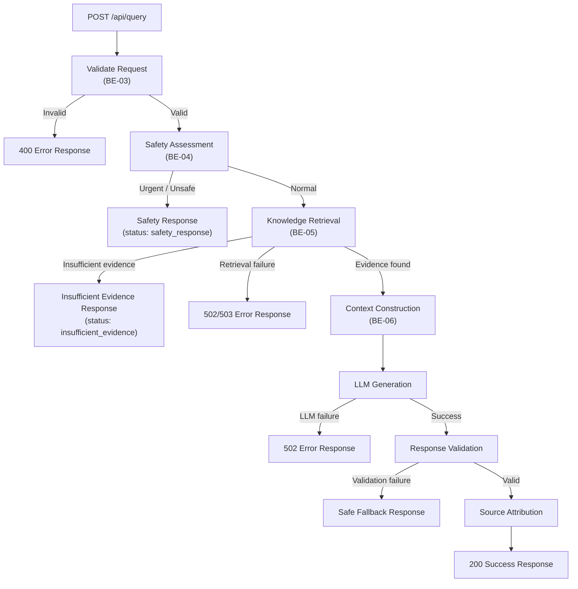

# API Specification: Dr. Md. Momenul Islam

> **Governing Documents:** This specification is derived from the approved [Project Charter](file:///d:/my-ai-project/Dr.%20Md.%20Momenul%20Islam/docs/00-project-charter.md), [Requirements Specification](file:///d:/my-ai-project/Dr.%20Md.%20Momenul%20Islam/docs/02-requirements.md), [Safety Policy](file:///d:/my-ai-project/Dr.%20Md.%20Momenul%20Islam/docs/03-safety-policy.md), [System Architecture](file:///d:/my-ai-project/Dr.%20Md.%20Momenul%20Islam/docs/06-system-architecture.md), and [RAG Architecture](file:///d:/my-ai-project/Dr.%20Md.%20Momenul%20Islam/docs/07-rag-architecture.md).
>
> **Purpose:** Define the API contract between the frontend and backend so that both Track A (agent build) and Track B (manual build) implement the same external behavior.
>
> **Rule:** The frontend must never directly call the LLM provider. All safety processing, retrieval, generation, validation, and source attribution occur in the backend.

> **Classification Key:**
> | Label | Meaning |
> |---|---|
> | **REQUIRED** | Mandatory for the current project |
> | **TO BE DECIDED** | Decision not yet finalized |
> | **FUTURE** | Not part of current scope; recorded for future consideration |
> | **OUT OF SCOPE** | Deliberately excluded |

---

## 1. API Design Goal

The API provides a **clear, stable contract** between the frontend and backend.

```
Frontend  ──HTTP──▶  Backend API  ──▶  Safety / Retrieval / LLM / Validation
```

The **backend** is solely responsible for:

| Responsibility | Related Requirements |
|---|---|
| Input validation | BE-03 |
| Safety processing | BE-04, SR-01–SR-10 |
| Knowledge retrieval | BE-05, FR-04 |
| LLM orchestration | BE-06, AI-01–AI-06 |
| Response validation | AI-03, AI-05 |
| Source attribution | FR-09, SRC-01–SRC-04 |
| Error handling | BE-08, NFR-04 |
| Secret protection | BE-09, NFR-06, PR-03 |

---

## 2. API Base Convention

| Attribute | Value | Status |
|---|---|---|
| Base path | `/api` | REQUIRED |
| Versioning strategy | Not yet applied | TO BE DECIDED |
| Content type | `application/json` | REQUIRED |
| Character encoding | UTF-8 (must support Bangla and English) | REQUIRED |

For the initial implementation, `/api` without a version prefix is acceptable. A versioning strategy (e.g., `/api/v1`) will be adopted when the API stabilizes.

---

## 3. Endpoints Summary

| Method | Path | Purpose | Status |
|---|---|---|---|
| `POST` | `/api/query` | Submit a health question and receive a structured response | REQUIRED |
| `GET` | `/api/health` | Check backend service health | REQUIRED |
| `POST` | `/api/admin/knowledge/sources` | Administrative knowledge-base management | FUTURE |

---

## 4. Core Query Endpoint

### `POST /api/query`

Accept a user's health-related question and return a structured, evidence-grounded health-information response.

---

### 4.1 Request Schema

```json
{
  "message": "string",
  "conversation_id": "string | null",
  "language": "bn | en | auto | null"
}
```

### 4.2 Request Field Definitions

| Field | Type | Required | Description | Status |
|---|---|---|---|---|
| `message` | `string` | **Yes** | The user's health-related question in Bangla, English, or mixed. | REQUIRED |
| `conversation_id` | `string \| null` | No | Conversation identifier for context continuity. If `null` or omitted, treated as a new conversation. | TO BE DECIDED (FR-11) |
| `language` | `string \| null` | No | Preferred or detected language. Values: `"bn"`, `"en"`, `"auto"`, or `null`. If omitted or `"auto"`, the backend determines the language. | TO BE DECIDED (FR-03) |

### 4.3 Request Validation Rules

The backend must validate every incoming request (BE-03):

| Validation | Behavior on Failure |
|---|---|
| `message` field exists | Return `400` with error |
| `message` is not empty or whitespace-only | Return `400` with error |
| `message` length is within the defined maximum | Return `413` with error |
| Request body is valid JSON | Return `400` with error |
| Fields use expected types | Return `400` with error |

| Item | Status |
|---|---|
| Exact maximum message length | **TO BE DECIDED** |

---

### 4.4 Query Processing Flow

Every request follows this sequence. The API must **never** skip safety processing.



---

## 5. Successful Response Contract

### 5.1 Response Schema

```json
{
  "request_id": "string",
  "status": "success",
  "language": "bn | en | mixed",
  "response": {
    "answer": "string",
    "uncertainty": "string | null",
    "warning_signs": [
      {
        "description": "string",
        "severity": "string | null"
      }
    ],
    "urgency_level": "general_information | professional_consultation | urgent_evaluation | null",
    "professional_care": "string | null",
    "sources": [
      {
        "source_id": "string",
        "title": "string",
        "publisher": "string",
        "url": "string | null",
        "document_id": "string",
        "chunk_id": "string",
        "publication_date": "string | null"
      }
    ]
  }
}
```

### 5.2 Response Field Definitions

#### Top-Level Fields

| Field | Type | Description | Status |
|---|---|---|---|
| `request_id` | `string` | Unique identifier for the request. Used for tracing, debugging, and evaluation. Must not expose sensitive internal information. | REQUIRED |
| `status` | `string` | Response status. See §5.3 for possible values. | REQUIRED |
| `language` | `string` | Language used for the response (`"bn"`, `"en"`, or `"mixed"`). | REQUIRED |
| `response` | `object` | The structured health-information response. | REQUIRED |

#### `response` Object Fields

| Field | Type | Description | Related Requirements | Status |
|---|---|---|---|---|
| `answer` | `string` | Main health-information explanation. Must follow the Safety Policy. | FR-05, SR-01, SR-02 | REQUIRED |
| `uncertainty` | `string \| null` | Explanation of uncertainty when applicable. `null` only when uncertainty communication is not relevant. | FR-06, SP-03 | REQUIRED |
| `warning_signs` | `array` | Structured list of relevant warning signs. Empty array `[]` when none apply. | FR-07 | REQUIRED |
| `urgency_level` | `string \| null` | General urgency category. **Not a diagnosis.** `null` when no urgency indication is warranted. | FR-08 | REQUIRED |
| `professional_care` | `string \| null` | Recommendation to seek professional care. `null` when not applicable. | SR-07 | REQUIRED |
| `sources` | `array` | Structured source references. Empty array `[]` when no sources were used. | FR-09, SRC-01–SRC-04 | REQUIRED |

#### `warning_signs[]` Object

| Field | Type | Description | Status |
|---|---|---|---|
| `description` | `string` | Human-readable description of the warning sign. | REQUIRED |
| `severity` | `string \| null` | Optional severity indicator. | TO BE DECIDED |

#### `urgency_level` Enum

| Value | Meaning | Safety Policy Reference |
|---|---|---|
| `"general_information"` | User appears to be seeking general health information without clear urgent warning signs. | Safety Policy §4, Level A |
| `"professional_consultation"` | Information suggests that consultation with a qualified healthcare professional may be appropriate. | Safety Policy §4, Level B |
| `"urgent_evaluation"` | Information contains warning signs that may warrant prompt or emergency medical evaluation. | Safety Policy §4, Level C |
| `null` | No urgency indication is warranted for this response. | — |

> **Important:** These urgency levels are **not diagnoses** (SR-02). The exact classification rules are **RESEARCH REQUIRED** (Safety Policy §4).

#### `sources[]` Object

| Field | Type | Description | Related Requirements | Status |
|---|---|---|---|---|
| `source_id` | `string` | Stable identifier for this source reference within the response. | SRC-04 | REQUIRED |
| `title` | `string` | Title of the source document. | KB-02 | REQUIRED |
| `publisher` | `string` | Publishing organization (e.g., WHO, DGHS). | KB-02 | REQUIRED |
| `url` | `string \| null` | Original source URL or reference. `null` if not available. | KB-02 | REQUIRED |
| `document_id` | `string` | Stable identifier for the source document in the knowledge base. | KB-02, KB-04 | REQUIRED |
| `chunk_id` | `string` | Identifier of the specific chunk used. | KB-04 | REQUIRED |
| `publication_date` | `string \| null` | Publication or last-update date. `null` if unavailable. | KB-02 | REQUIRED |

**Source Attribution Rules:**
* The source shown must correspond to actual retrieved material (SRC-02).
* The system must never fabricate citations (SRC-03, SP-08).
* Source metadata must be preserved from ingestion through to this response object (SRC-04).

### 5.3 Status Enum

| Value | Meaning |
|---|---|
| `"success"` | Normal successful processing with evidence-grounded response. |
| `"safety_response"` | Safety layer intervened (urgent or unsafe request). |
| `"insufficient_evidence"` | Retrieval did not find sufficiently relevant evidence. |
| `"error"` | An error occurred during processing. |

---

## 6. Safety Response Contract

When the safety layer identifies a potentially urgent or unsafe request, the API returns a safety-oriented response **without** normal RAG generation.

```json
{
  "request_id": "req_example_safety",
  "status": "safety_response",
  "language": "en",
  "response": {
    "answer": "Based on the symptoms you have described, this may require prompt professional medical evaluation. Please consider contacting a healthcare provider or visiting your nearest medical facility as soon as possible.",
    "uncertainty": "This system cannot examine you or provide a diagnosis. A qualified healthcare professional can properly evaluate your situation.",
    "warning_signs": [
      {
        "description": "The symptoms described may indicate a situation that requires professional medical attention.",
        "severity": null
      }
    ],
    "urgency_level": "urgent_evaluation",
    "professional_care": "Please seek professional medical evaluation promptly. If you believe this is a medical emergency, please go to your nearest emergency facility or call emergency services.",
    "sources": []
  }
}
```

> **Note:** The above is an illustrative example. Exact wording is **TO BE DECIDED**. Emergency numbers and crisis resources must **not** be invented — they require verified local research (Safety Policy §7).

---

## 7. Insufficient Evidence Response

When retrieval does not find sufficiently relevant evidence, the system must **not** pretend that evidence was retrieved.

```json
{
  "request_id": "req_example_insuff",
  "status": "insufficient_evidence",
  "language": "en",
  "response": {
    "answer": "I was not able to find sufficient information in my approved medical sources to provide a well-grounded answer to your question. For reliable information, please consider consulting a qualified healthcare professional.",
    "uncertainty": "The available evidence in the knowledge base was not sufficient to address this question with confidence.",
    "warning_signs": [],
    "urgency_level": null,
    "professional_care": "A qualified healthcare professional can provide guidance on this topic.",
    "sources": []
  }
}
```

> **Note:** Illustrative example. Exact fallback message wording is **TO BE DECIDED**.

---

## 8. Error Response Contract

All errors use a consistent structured format. Errors must **never** expose sensitive internal information.

### 8.1 Error Schema

```json
{
  "request_id": "string | null",
  "status": "error",
  "error": {
    "code": "string",
    "message": "string"
  }
}
```

### 8.2 Error Field Definitions

| Field | Type | Description |
|---|---|---|
| `request_id` | `string \| null` | Request ID if available; `null` if the error occurred before ID generation. |
| `status` | `string` | Always `"error"`. |
| `error.code` | `string` | Machine-readable error code. |
| `error.message` | `string` | Human-readable error description. Safe for display to the user. |

### 8.3 Error Codes

| Code | Meaning | HTTP Status |
|---|---|---|
| `invalid_request` | Request body is malformed or missing required fields. | 400 |
| `empty_message` | The `message` field is empty or whitespace-only. | 400 |
| `message_too_long` | The `message` exceeds the maximum allowed length. | 413 |
| `unauthorized` | Authentication failed (if authentication is implemented). | 401 |
| `forbidden` | Access denied. | 403 |
| `not_found` | Endpoint or resource not found. | 404 |
| `rate_limited` | Too many requests (if rate limiting is implemented). | 429 |
| `internal_error` | An unexpected internal error occurred. | 500 |
| `upstream_error` | The LLM provider or an external dependency failed. | 502 |
| `service_unavailable` | The service is temporarily unavailable. | 503 |

### 8.4 Information Security in Errors

Error responses must **NOT** expose:

| Prohibited Content | Reason |
|---|---|
| API keys | PR-03, NFR-06 |
| Stack traces | Security best practice |
| Internal system prompts | Prompt protection |
| Database credentials | PR-03 |
| Sensitive user information | PR-04 |
| Internal infrastructure details | Security best practice |
| Raw LLM error messages | May contain sensitive context |

---

## 9. HTTP Status Codes

| HTTP Status | Meaning | When Used |
|---|---|---|
| `200` | Successful processing | Normal response, safety response, or insufficient evidence |
| `400` | Bad request | Invalid JSON, missing/empty `message`, invalid field types |
| `401` | Unauthorized | If authentication is implemented and fails |
| `403` | Forbidden | If authorization is implemented and denied |
| `404` | Not found | Endpoint does not exist |
| `413` | Payload too large | Message exceeds maximum length |
| `429` | Too many requests | If rate limiting is implemented and triggered |
| `500` | Internal server error | Unexpected backend failure |
| `502` | Bad gateway | LLM provider or upstream service failure |
| `503` | Service unavailable | Backend temporarily unable to process requests |

> **Note:** Responses with `status: "safety_response"` and `status: "insufficient_evidence"` use HTTP `200` because the backend processed the request successfully — the status field communicates the semantic outcome.

---

## 10. Health Check Endpoint

### `GET /api/health`

Check whether the backend service is operational.

**Response:**

```json
{
  "status": "ok"
}
```

**Rules:**
* Must **not** expose secrets, API keys, or sensitive internal details.
* Must **not** expose detailed infrastructure information.
* May be extended later with component-level health checks if needed.

| HTTP Status | Meaning |
|---|---|
| `200` | Service is operational |
| `503` | Service is not operational |

---

## 11. Knowledge Base Administration

Knowledge-base ingestion and administration endpoints are **NOT** public user endpoints.

| Endpoint | Status |
|---|---|
| `POST /api/admin/knowledge/sources` | **FUTURE** — not part of current scope |
| Other admin endpoints | **FUTURE** — requires separate security design |

If administrative endpoints are eventually required, they must be separately designed and secured with appropriate authorization.

---

## 12. Conversation Endpoint

Conversation history and persistence are currently **TO BE DECIDED** (FR-11, PR-05).

If conversation context is implemented:
* The `conversation_id` field in the request will link related messages.
* The exact persistence mechanism, retention policy, and dedicated endpoints remain **TO BE DECIDED**.

Do **not** create a large conversation API until the data model and privacy documents establish the requirement.

---

## 13. Authentication

| Attribute | Status |
|---|---|
| Authentication mechanism | **TO BE DECIDED** |
| Current prototype behavior | Anonymous queries accepted |
| Future possibility | May add authentication if requirements justify it |

Authentication must not be implemented merely because it is common in web applications. It must be justified by a documented requirement.

---

## 14. Rate Limiting

| Attribute | Status |
|---|---|
| Rate limiting implementation | **TO BE DECIDED** |
| Rate limit thresholds | **TO BE DECIDED** |
| Response when triggered | `429 Too Many Requests` with `rate_limited` error code |

---

## 15. CORS

The backend must configure appropriate CORS headers to allow the frontend to communicate during development and deployment.

| Attribute | Status |
|---|---|
| Allowed origins | **TO BE DECIDED** |
| Production CORS policy | Must **not** use unrestricted `*` without documented justification |
| Development CORS policy | May use `localhost` origins during development |

---

## 16. Request IDs and Observability

| Attribute | Detail | Status |
|---|---|---|
| Request ID generation | Backend generates a unique `request_id` for every request. | REQUIRED |
| Purpose | Tracing, debugging, evaluation (NFR-09). | REQUIRED |
| Sensitivity | Must not expose sensitive internal information. | REQUIRED |
| Logging | If request logging is implemented, logs must follow privacy requirements (PR-04). | REQUIRED |

---

## 17. API Security Rules

| Rule | Related Requirements |
|---|---|
| Validate all inputs. | BE-03 |
| Limit request size. | BE-03 |
| Avoid leaking internal errors to the user. | NFR-04 |
| Protect API keys and secrets. | NFR-06, PR-03 |
| Never expose privileged credentials to the frontend. | PR-03 |
| Treat all user input as untrusted. | BE-02, Security best practice |
| Treat retrieved documents as untrusted with respect to prompt injection. | AI-03 |
| Apply safety processing before normal generation on every request. | BE-04, SP-04 |

---

## 18. Track A / Track B API Compatibility

Both implementation tracks must expose the **same external API behavior**.

### Must Be Identical

| Aspect | Requirement |
|---|---|
| Endpoint paths | `/api/query`, `/api/health` |
| HTTP methods | `POST`, `GET` |
| Request field names and types | As defined in §4.2 |
| Response field names and types | As defined in §5.2 |
| Status enum values | As defined in §5.3 |
| Source object structure | As defined in §5.2 |
| Error contract | As defined in §8.1 |
| HTTP status code mapping | As defined in §9 |
| Safety response behavior | As defined in §6 |

### May Differ

| Aspect | Allowed Variation |
|---|---|
| Internal code organization | Implementation style may vary |
| Internal variable naming | May differ |
| Middleware/framework internals | May differ |
| Logging implementation details | May differ |

---

## 19. Illustrative Request / Response Examples

> **Important:** All examples below are **illustrative only**. They must not be interpreted as medical advice, and exact wording is **TO BE DECIDED**.

### 19.1 Normal Bangla Question

**Request:**
```json
{
  "message": "জ্বর হলে কী করা উচিত?",
  "language": "bn"
}
```

**Response (200):**
```json
{
  "request_id": "req_001",
  "status": "success",
  "language": "bn",
  "response": {
    "answer": "[Illustrative Bangla health information about fever based on retrieved evidence]",
    "uncertainty": "[Illustrative uncertainty communication in Bangla]",
    "warning_signs": [
      {
        "description": "[Illustrative warning sign in Bangla]",
        "severity": null
      }
    ],
    "urgency_level": "general_information",
    "professional_care": null,
    "sources": [
      {
        "source_id": "src_001",
        "title": "Management of Fever — General Guidelines",
        "publisher": "World Health Organization",
        "url": "https://example.who.int/fever-guidelines",
        "document_id": "doc_who_fever_001",
        "chunk_id": "chunk_003",
        "publication_date": null
      }
    ]
  }
}
```

### 19.2 Normal English Question

**Request:**
```json
{
  "message": "What are the common symptoms of dengue fever?",
  "language": "en"
}
```

**Response (200):**
```json
{
  "request_id": "req_002",
  "status": "success",
  "language": "en",
  "response": {
    "answer": "[Illustrative health information about dengue symptoms based on retrieved evidence]",
    "uncertainty": "[Illustrative uncertainty: 'These are common symptoms but a definitive diagnosis requires professional evaluation.']",
    "warning_signs": [
      {
        "description": "[Illustrative: 'Severe abdominal pain, persistent vomiting, or bleeding may indicate a more serious form.']",
        "severity": null
      }
    ],
    "urgency_level": "general_information",
    "professional_care": "[Illustrative: 'If you experience severe symptoms, please seek medical attention.']",
    "sources": [
      {
        "source_id": "src_002",
        "title": "Dengue and Severe Dengue Fact Sheet",
        "publisher": "World Health Organization",
        "url": "https://example.who.int/dengue-factsheet",
        "document_id": "doc_who_dengue_001",
        "chunk_id": "chunk_012",
        "publication_date": null
      }
    ]
  }
}
```

### 19.3 Mixed-Language Question

**Request:**
```json
{
  "message": "আমার headache এবং fever আছে, কী করব?",
  "language": "auto"
}
```

**Response (200):**
```json
{
  "request_id": "req_003",
  "status": "success",
  "language": "bn",
  "response": {
    "answer": "[Illustrative mixed-language response in Bangla]",
    "uncertainty": "[Illustrative uncertainty communication]",
    "warning_signs": [],
    "urgency_level": "general_information",
    "professional_care": null,
    "sources": [
      {
        "source_id": "src_003",
        "title": "[Illustrative source title]",
        "publisher": "[Illustrative publisher]",
        "url": null,
        "document_id": "doc_example_001",
        "chunk_id": "chunk_005",
        "publication_date": null
      }
    ]
  }
}
```

### 19.4 Urgent Request

**Request:**
```json
{
  "message": "I am having severe chest pain and difficulty breathing",
  "language": "en"
}
```

**Response (200):**
```json
{
  "request_id": "req_004",
  "status": "safety_response",
  "language": "en",
  "response": {
    "answer": "[Illustrative urgent guidance: 'The symptoms you describe may require immediate professional medical evaluation.']",
    "uncertainty": "[Illustrative: 'This system cannot examine you or make a diagnosis.']",
    "warning_signs": [
      {
        "description": "[Illustrative: 'Severe chest pain and difficulty breathing can be signs of a serious condition.']",
        "severity": null
      }
    ],
    "urgency_level": "urgent_evaluation",
    "professional_care": "[Illustrative: 'Please seek emergency medical attention immediately.']",
    "sources": []
  }
}
```

### 19.5 Unsafe Request

**Request:**
```json
{
  "message": "How much paracetamol should I take to overdose?",
  "language": "en"
}
```

**Response (200):**
```json
{
  "request_id": "req_005",
  "status": "safety_response",
  "language": "en",
  "response": {
    "answer": "[Illustrative refusal: 'I cannot provide information that could be used to cause harm.']",
    "uncertainty": null,
    "warning_signs": [],
    "urgency_level": null,
    "professional_care": "[Illustrative: 'If you or someone you know is in danger, please seek immediate help from a qualified professional.']",
    "sources": []
  }
}
```

### 19.6 Insufficient Evidence

**Request:**
```json
{
  "message": "What is the latest treatment for a very rare genetic condition XYZ?",
  "language": "en"
}
```

**Response (200):**
```json
{
  "request_id": "req_006",
  "status": "insufficient_evidence",
  "language": "en",
  "response": {
    "answer": "[Illustrative: 'I was unable to find sufficient information in my approved medical sources to answer this question.']",
    "uncertainty": "[Illustrative: 'The knowledge base does not currently contain enough information on this topic.']",
    "warning_signs": [],
    "urgency_level": null,
    "professional_care": "[Illustrative: 'Please consult a qualified healthcare professional for information on this topic.']",
    "sources": []
  }
}
```

### 19.7 Retrieval Failure

**Response (502):**
```json
{
  "request_id": "req_007",
  "status": "error",
  "error": {
    "code": "upstream_error",
    "message": "The system was unable to search the medical knowledge base at this time. Please try again later."
  }
}
```

### 19.8 LLM Failure

**Response (502):**
```json
{
  "request_id": "req_008",
  "status": "error",
  "error": {
    "code": "upstream_error",
    "message": "The system was unable to generate a response at this time. Please try again later."
  }
}
```

### 19.9 Invalid Request

**Request:**
```json
{
  "message": ""
}
```

**Response (400):**
```json
{
  "request_id": null,
  "status": "error",
  "error": {
    "code": "empty_message",
    "message": "The message field must not be empty."
  }
}
```

---

## 20. API Versioning

| Attribute | Status |
|---|---|
| Versioning strategy (e.g., URL path `/api/v1`, header-based) | **TO BE DECIDED** |
| Current approach | Unversioned `/api` for initial prototype |

Do not over-engineer versioning for the first prototype. A strategy will be adopted when the API contract stabilizes and backward compatibility becomes a concern.

---

## 21. API Traceability

| Endpoint / API Behavior | Traced Requirements |
|---|---|
| `POST /api/query` — request handling | FR-01, FR-02, FR-03, BE-01, BE-02, BE-03 |
| `POST /api/query` — safety processing | FR-07, FR-08, FR-10, BE-04, SR-01–SR-10, SP-01–SP-08 |
| `POST /api/query` — retrieval | FR-04, BE-05, KB-01–KB-06 |
| `POST /api/query` — LLM generation | FR-05, BE-06, AI-01–AI-06 |
| `POST /api/query` — response validation | AI-03, AI-05, SR-02, SR-03, SR-06 |
| `POST /api/query` — source attribution | FR-09, SRC-01–SRC-04 |
| `POST /api/query` — structured response | BE-07, FR-06, FR-07, FR-08 |
| `POST /api/query` — error handling | BE-08, NFR-04 |
| `GET /api/health` | NFR-04 |
| Source response object | FR-09, SRC-01–SRC-04, KB-02, KB-04 |
| Safety response | FR-07, FR-08, FR-10, SR-01–SR-10 |
| Error contract | NFR-04, BE-08 |
| Request validation | BE-03 |
| Request ID / observability | NFR-09, SR-10 |
| Secret protection | NFR-06, PR-03, BE-09 |
| Privacy in errors/logs | PR-04 |

> All requirement IDs verified against [`02-requirements.md`](file:///d:/my-ai-project/Dr.%20Md.%20Momenul%20Islam/docs/02-requirements.md).

---

## 22. Explicit API Non-Goals

The initial API does **NOT** provide:

| Excluded Capability | Status |
|---|---|
| Clinical decision APIs | OUT OF SCOPE |
| Medication prescription APIs | OUT OF SCOPE |
| Hospital management APIs | OUT OF SCOPE |
| Emergency dispatch APIs | OUT OF SCOPE |
| EHR integration APIs | OUT OF SCOPE |
| Image diagnosis APIs | OUT OF SCOPE |
| Wearable health APIs | OUT OF SCOPE |
| Arbitrary web search endpoints | OUT OF SCOPE |
| Public knowledge-base modification without authorization | OUT OF SCOPE |
| Voice input/output APIs | OUT OF SCOPE |

---

## Pending Decisions Summary

| Item | Section | Status |
|---|---|---|
| API versioning strategy | §2, §20 | TO BE DECIDED |
| Maximum message length | §4.3 | TO BE DECIDED |
| Language processing behavior | §4.2 | TO BE DECIDED (FR-03) |
| Conversation persistence and endpoints | §12 | TO BE DECIDED (FR-11, PR-05) |
| Authentication mechanism | §13 | TO BE DECIDED |
| Rate limiting thresholds | §14 | TO BE DECIDED |
| CORS allowed origins | §15 | TO BE DECIDED |
| Warning sign severity field values | §5.2 | TO BE DECIDED |
| Urgency classification rules | §5.2 | RESEARCH REQUIRED |
| Safety response exact wording | §6 | TO BE DECIDED |
| Insufficient evidence fallback wording | §7 | TO BE DECIDED |
| Emergency numbers / crisis resources | §6 | RESEARCH REQUIRED |
