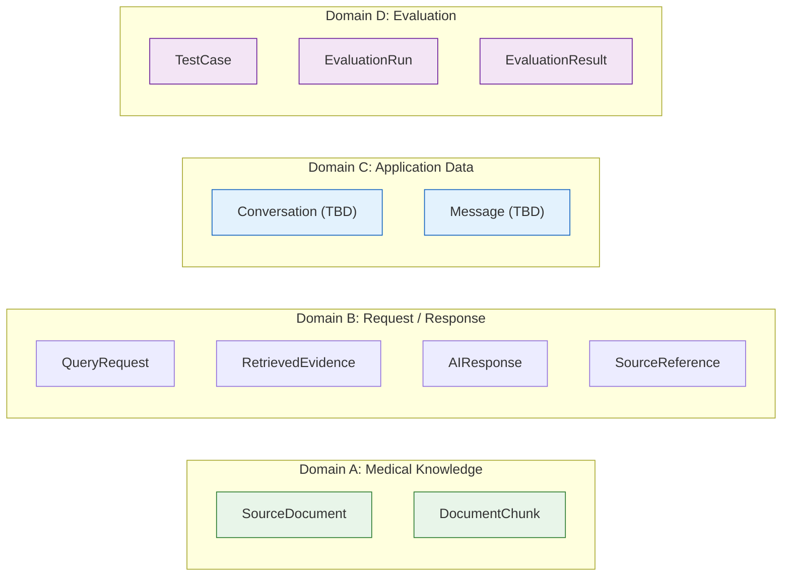
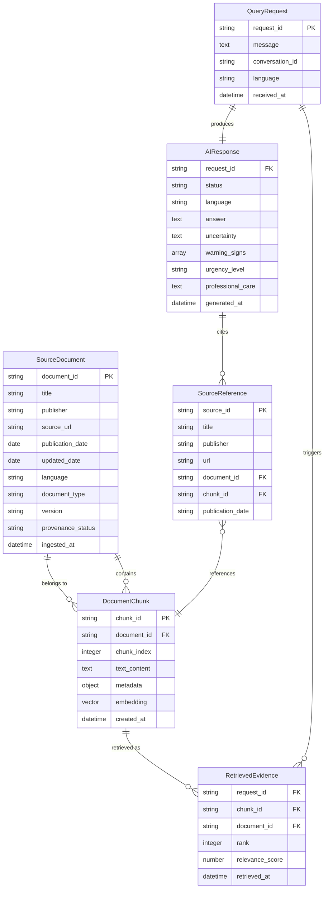
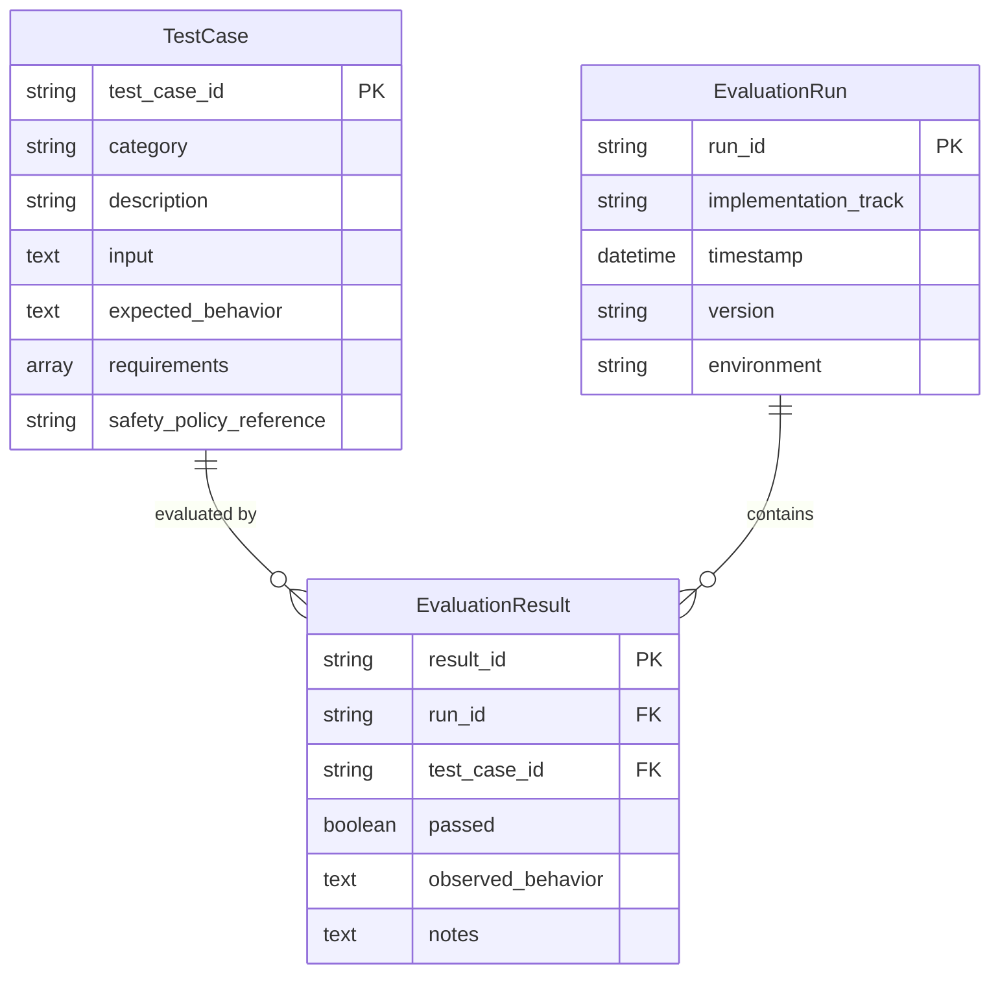
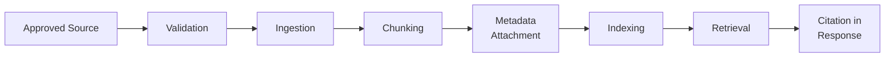
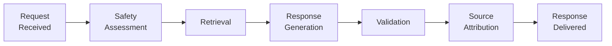
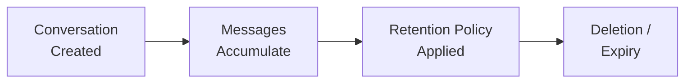

# Data Model: Dr. Md. Momenul Islam

> **Governing Documents:** This document is derived from the approved [Project Charter](./00-project-charter.md), [Requirements Specification](./02-requirements.md), [Safety Policy](./03-safety-policy.md), [System Architecture](./06-system-architecture.md), [RAG Architecture](./07-rag-architecture.md), and [API Specification](./08-api-specification.md). For current system state, see [Current Implementation State](./13-current-implementation-state.md).
>
> **Purpose:** Define the logical data model required by the current system, keeping it simple, understandable, and aligned with both implementation tracks.
>
> **Rule:** No entities have been added that are outside the approved project scope. User-generated text must never automatically become trusted medical knowledge.

> **Classification Key:**
> | Label | Meaning |
> |---|---|
> | **REQUIRED** | Mandatory for the current project |
> | **TO BE DECIDED** | Decision not yet finalized |
> | **FUTURE** | Not part of current scope |
> | **OUT OF SCOPE** | Deliberately excluded |

---

## 1. Data Model Principles

1. **Separate** trusted medical knowledge from user/application data.
2. **Preserve** source provenance from ingestion through to user display.
3. **Preserve** chunk-level traceability for source attribution.
4. **Support** source attribution in API responses (SRC-01–SRC-04).
5. **Support** RAG retrieval (FR-04, AI-01, AI-07).
6. **Minimize** collection of sensitive user information (PR-01, PR-02).
7. **Avoid** unnecessary user-account or medical-record structures.
8. **Support** both Track A and Track B with the same logical model.
9. **Keep** unresolved persistence decisions marked as TO BE DECIDED.

---

## 2. Core Data Domains

The data model is organized into four strictly separated domains:



| Domain | Contents | Sensitivity |
|---|---|---|
| **A — Medical Knowledge** | Approved source documents, chunks, retrieval index metadata | Low (public sources) |
| **B — Request / Response** | Query requests, retrieved evidence, AI responses, source references | High (contains user health questions) |
| **C — Application Data** | Conversation, session data (if implemented) | High (contains health-related user content) |
| **D — Evaluation** | Test cases, evaluation runs, evaluation results | Medium (may contain realistic health scenarios) |

> **Critical Rule:** Domain A (Medical Knowledge) and Domains B/C (User/Application Data) must **never** be mixed. User-generated text must not automatically enter the trusted medical knowledge base (KB-06).

---

## 3. Domain A — Medical Knowledge Entities

### 3.1 SourceDocument

Represents one approved medical or public-health source in the knowledge base.

| Field | Type | Required | Description | Requirement |
|---|---|---|---|---|
| `document_id` | string | Yes | Stable unique identifier for this source document. | KB-02 |
| `title` | string | Yes | Source document title. | KB-02 |
| `publisher` | string | Yes | Publishing organization (e.g., WHO, DGHS). | KB-02 |
| `source_url` | string / null | Yes | Original source URL or reference. `null` if not available. | KB-02 |
| `publication_date` | date / null | No | Date of publication (where available). | KB-02 |
| `updated_date` | date / null | No | Date of last update (where available). | KB-02 |
| `language` | string | Yes | Source language (`"en"`, `"bn"`, or other). | REQUIRED |
| `document_type` | string | Yes | Category: guideline, fact sheet, paper, clinical protocol, etc. | REQUIRED |
| `version` | string / null | No | Document version if available. | REQUIRED |
| `provenance_status` | string | Yes | Controlled status: `"approved"`, `"pending_review"`, `"rejected"`. | REQUIRED |
| `ingested_at` | datetime | Yes | Timestamp when the document entered the system. | REQUIRED |

> **Important:** The `provenance_status` field alone is **not** sufficient to make a source medically trustworthy. The source must first be approved according to the knowledge-base governance process (KB-01, KB-06).

---

### 3.2 DocumentChunk

Represents a retrievable section of a source document.

| Field | Type | Required | Description | Requirement |
|---|---|---|---|---|
| `chunk_id` | string | Yes | Unique chunk identifier. | KB-04 |
| `document_id` | string | Yes | Reference to parent SourceDocument. | KB-04 |
| `chunk_index` | integer | Yes | Ordinal position of this chunk within the source document. | KB-03 |
| `text` | text | Yes | The chunk content. | KB-03 |
| `metadata` | object | Yes | Inherited source metadata (title, publisher, URL, document_id, etc.). | KB-02 |
| `embedding` | vector / null | No | Vector embedding (if semantic retrieval is implemented). | TO BE DECIDED |
| `created_at` | datetime | Yes | Timestamp when the chunk was created during ingestion. | REQUIRED |

> **Note:** The `embedding` field is optional at the logical level because Phase 1 (basic retrieval) does not require embeddings. It becomes relevant in Phase 2–3 of the progressive implementation (RAG Architecture §19).

---

### 3.3 Source Metadata Preservation

The same metadata fields must remain traceable through the entire pipeline:

```
Ingestion → Chunking → Indexing → Retrieval → Response → Frontend Display
```

The following metadata must be preserved at every stage:

| Metadata Field | Origin | Traced Through |
|---|---|---|
| `title` | SourceDocument | → DocumentChunk.metadata → RetrievedEvidence → SourceReference → API response |
| `publisher` | SourceDocument | → DocumentChunk.metadata → RetrievedEvidence → SourceReference → API response |
| `source_url` | SourceDocument | → DocumentChunk.metadata → RetrievedEvidence → SourceReference → API response |
| `document_id` | SourceDocument | → DocumentChunk → RetrievedEvidence → SourceReference → API response |
| `publication_date` | SourceDocument | → DocumentChunk.metadata → SourceReference → API response |
| `chunk_id` | DocumentChunk | → RetrievedEvidence → SourceReference → API response |
| `language` | SourceDocument | → DocumentChunk.metadata |

This chain satisfies SRC-04 (preserve source metadata through the retrieval pipeline).

---

## 4. Domain B — Request / Response Entities

### 4.1 QueryRequest

Represents an incoming user health question, corresponding to the API specification's `POST /api/query` request.

| Field | Type | Required | Description | Requirement |
|---|---|---|---|---|
| `request_id` | string | Yes | Unique request identifier. | REQUIRED |
| `message` | text | Yes | User's health-related question. | FR-01, FR-02 |
| `conversation_id` | string / null | No | Optional conversation reference (if context is implemented). | FR-11 (TO BE DECIDED) |
| `language` | string / null | No | Requested/detected language (`"bn"`, `"en"`, `"auto"`, `null`). | FR-03 |
| `received_at` | datetime | Yes | Timestamp when the request was received. | REQUIRED |

**Privacy Rules:**
* Do not add unnecessary personally identifiable information (PR-01).
* Do not add patient records, demographic profiles, or medical history unless a later requirement explicitly introduces them (PR-02).

---

### 4.2 RetrievedEvidence

Represents a chunk returned by the retrieval stage for a specific request.

| Field | Type | Required | Description | Requirement |
|---|---|---|---|---|
| `request_id` | string | Yes | The request that triggered retrieval. | REQUIRED |
| `chunk_id` | string | Yes | Reference to the retrieved DocumentChunk. | KB-04 |
| `document_id` | string | Yes | Reference to the parent SourceDocument. | KB-04 |
| `rank` | integer | Yes | Retrieval rank (1 = most relevant). | REQUIRED |
| `relevance_score` | number / null | No | Retrieval similarity/relevance score (where available). | REQUIRED |
| `retrieved_at` | datetime | Yes | Timestamp of retrieval. | REQUIRED |

This entity enables the system to trace **which source material was retrieved** for any given request (KB-04, SRC-04, SR-10).

---

### 4.3 AIResponse

Represents the structured response generated by the system, corresponding to the API specification's response contract.

| Field | Type | Required | Description | Requirement |
|---|---|---|---|---|
| `request_id` | string | Yes | Reference to the originating QueryRequest. | REQUIRED |
| `status` | string | Yes | Response status: `"success"`, `"safety_response"`, `"insufficient_evidence"`, `"error"`. | REQUIRED |
| `language` | string | Yes | Language of the response (`"bn"`, `"en"`, `"mixed"`). | FR-03 |
| `answer` | text | Yes | Main health-information explanation. | FR-05 |
| `uncertainty` | text / null | Yes | Uncertainty communication. | FR-06 |
| `warning_signs` | array | Yes | Structured warning signs. Empty `[]` when none apply. | FR-07 |
| `urgency_level` | string / null | Yes | `"general_information"`, `"professional_consultation"`, `"urgent_evaluation"`, or `null`. | FR-08 |
| `professional_care` | text / null | Yes | Recommendation to seek professional care. | SR-07 |
| `generated_at` | datetime | Yes | Timestamp of response generation. | REQUIRED |

The model preserves the distinction between answer, uncertainty, warning signs, urgency, professional-care recommendation, and sources — these are **not** collapsed into a single text blob.

---

### 4.4 SourceReference

Represents a source attached to an API response. Must always point to actual retrieved material (SRC-02, SRC-03).

| Field | Type | Required | Description | Requirement |
|---|---|---|---|---|
| `source_id` | string | Yes | Stable identifier for this source reference within the response. | SRC-04 |
| `title` | string | Yes | Title of the source document. | KB-02 |
| `publisher` | string | Yes | Publishing organization. | KB-02 |
| `url` | string / null | Yes | Original source URL. `null` if not available. | KB-02 |
| `document_id` | string | Yes | Reference to the SourceDocument. | KB-02, KB-04 |
| `chunk_id` | string | Yes | Reference to the specific DocumentChunk used. | KB-04 |
| `publication_date` | string / null | Yes | Publication or update date. `null` if unavailable. | KB-02 |

**Critical Rule:** A SourceReference must **always** point to material that was actually retrieved for this request. Fabricated citations are prohibited (SRC-03, SP-08).

---

## 5. Entity Relationship Diagram



---

## 6. Relationship Summary

| Relationship | Cardinality | Description |
|---|---|---|
| SourceDocument → DocumentChunk | 1 : many | One source document produces many chunks. |
| QueryRequest → RetrievedEvidence | 1 : many | One request triggers retrieval of many chunks. |
| DocumentChunk → RetrievedEvidence | 1 : many | One chunk may be retrieved by many requests. |
| QueryRequest → AIResponse | 1 : 1 | One request produces one response. |
| AIResponse → SourceReference | 1 : many | One response may cite many sources. |
| SourceReference → DocumentChunk | many : 1 | Many source references may point to the same chunk. |
| DocumentChunk → SourceDocument | many : 1 | Many chunks belong to one source document. |

---

## 7. Domain C — Application Data (TO BE DECIDED)

Conversation and session persistence are currently **TO BE DECIDED** (FR-11, PR-05).

### 7.1 Conversation (Conditional)

If conversation context is eventually implemented:

| Field | Type | Required | Description |
|---|---|---|---|
| `conversation_id` | string | Yes | Unique conversation identifier. |
| `created_at` | datetime | Yes | Conversation start timestamp. |
| `updated_at` | datetime | Yes | Last activity timestamp. |

### 7.2 Message (Conditional)

| Field | Type | Required | Description |
|---|---|---|---|
| `message_id` | string | Yes | Unique message identifier. |
| `conversation_id` | string | Yes | Reference to parent Conversation. |
| `role` | string | Yes | `"user"` or `"assistant"`. |
| `content` | text | Yes | Message content. |
| `created_at` | datetime | Yes | Message timestamp. |

**Conditions for implementation:**
* Do **not** assume conversation persistence is required until requirements justify it.
* Do **not** store conversation data without a documented purpose (PR-05).
* Any stored health-related content must follow privacy and retention requirements (PR-01–PR-05).
* Retention policy must be defined **before** persistent conversation storage is implemented.

| Item | Status |
|---|---|
| Conversation persistence requirement | **TO BE DECIDED** (FR-11) |
| Data retention policy | **TO BE DECIDED** (PR-05) |

---

### 7.3 Session Data (TO BE DECIDED)

Authentication is currently undecided. Therefore:

* Do **not** design a full user-account schema.
* Do **not** create password, profile, role, or medical-history tables.
* If anonymous sessions are needed, model only the minimum necessary information.

| Item | Status |
|---|---|
| Authentication mechanism | **TO BE DECIDED** |
| Session model | **TO BE DECIDED** |

---

## 8. Domain D — Evaluation Entities

The project needs to compare Track A and Track B implementations. The evaluation model supports repeatable, structured testing.

### 8.1 TestCase

| Field | Type | Required | Description |
|---|---|---|---|
| `test_case_id` | string | Yes | Unique test case identifier. |
| `category` | string | Yes | Category (e.g., normal, urgent, unsafe, medication, Bangla, mixed). Aligned with Safety Policy §16. |
| `description` | string | Yes | Human-readable description of the test case. |
| `input` | text | Yes | The test input (health question). |
| `expected_behavior` | text | Yes | What the system should do. |
| `requirements` | array | Yes | List of requirement IDs being tested (e.g., `["FR-04", "SR-02"]`). |
| `safety_policy_reference` | string / null | No | Reference to specific Safety Policy section if applicable. |

### 8.2 EvaluationRun

| Field | Type | Required | Description |
|---|---|---|---|
| `run_id` | string | Yes | Unique evaluation run identifier. |
| `implementation_track` | string | Yes | `"track_a"` or `"track_b"`. |
| `timestamp` | datetime | Yes | When the evaluation was run. |
| `version` | string / null | No | Version or commit hash of the implementation. |
| `environment` | string / null | No | Environment description (e.g., `"dev"`, `"test"`). |

### 8.3 EvaluationResult

| Field | Type | Required | Description |
|---|---|---|---|
| `result_id` | string | Yes | Unique result identifier. |
| `run_id` | string | Yes | Reference to parent EvaluationRun. |
| `test_case_id` | string | Yes | Reference to the TestCase. |
| `passed` | boolean | Yes | Whether the test passed. |
| `observed_behavior` | text | Yes | What the system actually did. |
| `notes` | text / null | No | Additional evaluation notes. |

### Evaluation ER Diagram



| Item | Status |
|---|---|
| Exact evaluation persistence format (JSON, SQLite, etc.) | **TO BE DECIDED** |

---

## 9. Knowledge Base Versioning

The data model should support controlled updates to the medical knowledge base.

| Field | Entity | Purpose |
|---|---|---|
| `version` | SourceDocument | Track document revisions. |
| `ingested_at` | SourceDocument | Record when a document entered the system. |
| `updated_date` | SourceDocument | Track when the source was last updated. |
| `created_at` | DocumentChunk | Record when chunks were generated. |

This enables the system to know which version of a document was used when a response was generated, supporting auditability (SR-10).

| Item | Status |
|---|---|
| Full versioning strategy (e.g., snapshot-based, incremental) | **TO BE DECIDED** |

---

## 10. Data Separation

```
┌─────────────────────────────────────┐
│  TRUSTED MEDICAL KNOWLEDGE          │
│  (Domain A)                         │
│                                     │
│  ├── SourceDocument                 │
│  ├── DocumentChunk                  │
│  ├── Retrieval Index                │
│  └── Source Metadata                │
│                                     │
│  RULES:                             │
│  • Only approved sources (KB-01)    │
│  • No user-generated content (KB-06)│
│  • Governed by knowledge-base       │
│    governance process               │
├─────────────────────────────────────┤
│            STRICT BOUNDARY          │
├─────────────────────────────────────┤
│  APPLICATION / USER DATA            │
│  (Domains B, C, D)                  │
│                                     │
│  ├── QueryRequest                   │
│  ├── RetrievedEvidence              │
│  ├── AIResponse                     │
│  ├── SourceReference                │
│  ├── Conversation (TBD)             │
│  ├── Session (TBD)                  │
│  └── Evaluation Data                │
│                                     │
│  RULES:                             │
│  • Contains user-generated content  │
│  • Subject to privacy rules         │
│  • Subject to retention policies    │
│  • Must never auto-enter Domain A   │
└─────────────────────────────────────┘
```

**Why the two domains must not be mixed:**
* User-generated text (health questions, symptom descriptions) is untrusted input and must **never** automatically become part of the approved medical knowledge base.
* Medical knowledge must come exclusively from approved, governed sources (KB-01, KB-06).
* Mixing domains would compromise the integrity of evidence grounding and source attribution.
* Privacy requirements apply differently: user data is sensitive (NFR-07), while approved public-health documents are generally non-sensitive.

---

## 11. Privacy Considerations

| Principle | Detail | Requirement |
|---|---|---|
| Minimize identifying information | Do not collect names, addresses, or demographics unless a documented requirement justifies it. | PR-01, PR-02 |
| No default patient profile | Do not create a patient profile schema by default. | PR-02 |
| No permanent health question storage without purpose | Do not store health questions permanently without a documented purpose and retention strategy. | PR-05 |
| Protect logs | Logs must not expose sensitive user health content unnecessarily. | PR-04 |
| Protect credentials | API keys and database credentials must never appear in data model records or knowledge-base metadata. | PR-03, NFR-06 |
| Retention policies first | Define retention policies **before** implementing persistent conversation/session storage. | PR-05 |

---

## 12. Security Considerations

| Data Category | Sensitivity Level | Protection Required |
|---|---|---|
| User health questions (`QueryRequest.message`) | **High** | Minimize storage; follow retention policy; protect in logs |
| Conversation content (if stored) | **High** | Same as above |
| Evaluation inputs with realistic health scenarios | **Medium** | Protect from unauthorized access |
| API keys and database credentials | **Critical** | Never in source code, database records, or knowledge-base metadata |
| Approved source metadata (public documents) | **Low** | Standard access controls |

---

## 13. Persistence Strategy

The logical model is **independent** of the final database technology. Persistence decisions remain open.

| Option | Use Case | Status |
|---|---|---|
| File-based storage (JSON, Markdown) | During learning and early development | Possible initial approach |
| SQLite | Lightweight relational persistence | Candidate (Project Charter §7) |
| Vector database (e.g., ChromaDB) | Embedding storage and similarity search | **TO BE DECIDED** |
| Full relational database | Production-scale persistence | **TO BE DECIDED** (if needed later) |

> Do **not** introduce a large production database architecture before requirements justify it (Project Charter §7, Architecture Principle 7).

---

## 14. Data Lifecycle

### 14.1 Knowledge Lifecycle



### 14.2 Query Lifecycle



### 14.3 Conversation Lifecycle (TO BE DECIDED)



> Conversation storage remains **TO BE DECIDED**. This lifecycle applies only if persistence is implemented.

---

## 15. Track A / Track B Compatibility

Both implementations must share the **same logical data model**.

### Must Be Identical

| Aspect | Requirement |
|---|---|
| Entity names and meanings | Same logical entities |
| Source provenance fields | Same metadata fields on SourceDocument and DocumentChunk |
| Request/response structure | Same fields as defined in API Specification |
| Retrieval traceability | Same RetrievedEvidence linking |
| Source reference structure | Same SourceReference fields |
| Privacy boundaries | Same separation of domains |
| Evaluation entities | Same TestCase / EvaluationRun / EvaluationResult structure |

### May Differ

| Aspect | Allowed Variation |
|---|---|
| Internal storage format (file, SQLite, etc.) | May differ |
| Internal ID generation strategy | May differ |
| Internal naming conventions | May differ |

---

## 16. Data Model Traceability

| Entity | Traced Requirements |
|---|---|
| SourceDocument | KB-01, KB-02, KB-05, KB-06 |
| DocumentChunk | KB-03, KB-04 |
| RetrievedEvidence | FR-04, AI-01, AI-07, RS-04, RS-06, SR-10 |
| QueryRequest | FR-01, FR-02, FR-03, BE-02, BE-03, PR-01, PR-02 |
| AIResponse | FR-05, FR-06, FR-07, FR-08, SR-07 |
| SourceReference | FR-09, SRC-01, SRC-02, SRC-03, SRC-04 |
| Conversation (TBD) | FR-11, PR-05 |
| Message (TBD) | FR-11, PR-05 |
| TestCase | NFR-09, Safety Policy §16 |
| EvaluationRun | NFR-09 |
| EvaluationResult | NFR-09 |

> All requirement IDs verified against [`02-requirements.md`](./02-requirements.md).

---

## 17. Explicit Data Model Non-Goals

The initial data model does **NOT** include:

| Excluded Entity | Status |
|---|---|
| Patient medical records | OUT OF SCOPE |
| Doctor/clinician records | OUT OF SCOPE |
| Prescription records | OUT OF SCOPE |
| Hospital records | OUT OF SCOPE |
| Appointment records | OUT OF SCOPE |
| Insurance records | OUT OF SCOPE |
| Billing information | OUT OF SCOPE |
| Wearable health data | OUT OF SCOPE |
| Image / video medical records | OUT OF SCOPE |
| Full user-profile systems | OUT OF SCOPE |
| Clinical decision records | OUT OF SCOPE |

---

## 18. Pending Decisions Summary

| Item | Related Section | Status |
|---|---|---|
| Persistence technology (file, SQLite, relational DB) | §13 | TO BE DECIDED |
| Vector database for embeddings | §3.2, §13 | TO BE DECIDED |
| Embedding storage format | §3.2 | TO BE DECIDED |
| Conversation storage requirement | §7.1 | TO BE DECIDED (FR-11) |
| Data retention policy | §7.1 | TO BE DECIDED (PR-05) |
| Session / authentication model | §7.3 | TO BE DECIDED |
| Evaluation persistence format | §8 | TO BE DECIDED |
| Knowledge-base versioning strategy | §9 | TO BE DECIDED |
