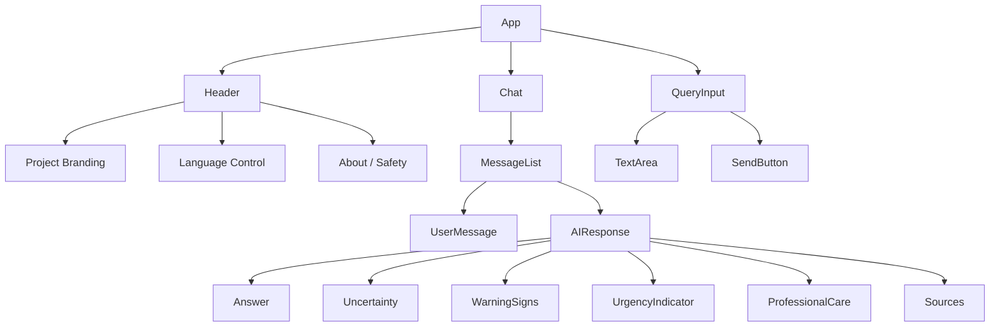
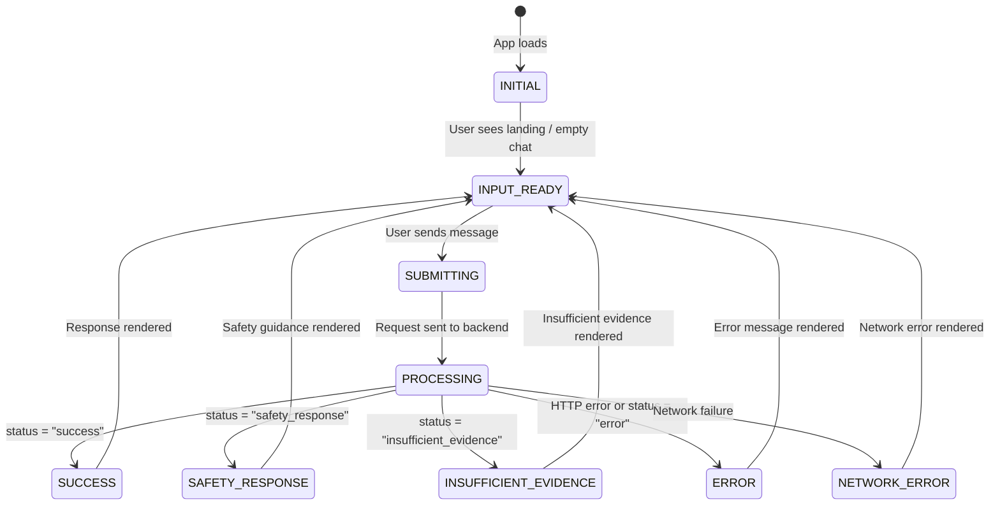

# UI Specification: Dr. Md. Momenul Islam

> **Governing Documents:** This specification is derived from the approved [Project Charter](./00-project-charter.md), [Requirements Specification](./02-requirements.md), [Safety Policy](./03-safety-policy.md), [User Personas](./04-user-personas.md), [User Stories](./05-user-stories.md), [System Architecture](./06-system-architecture.md), and [API Specification](./08-api-specification.md). For current implementation state, see [Current Implementation State](./13-current-implementation-state.md).
>
> **Purpose:** Define the logical user interface for the health-information assistant so that both Track A and Track B implement a functionally equivalent experience.
>
> **Rule:** The UI must prioritize clarity and safety over visual novelty. No features outside the approved scope have been introduced.

> **Classification Key:**
> | Label | Meaning |
> |---|---|
> | **REQUIRED** | Mandatory for the current project |
> | **IMPLEMENTED** | Active in Track A production frontend |
> | **OUT OF SCOPE** | Deliberately excluded |

---

## 1. UI Goals

The interface must:

| Goal | Related Requirements |
|---|---|
| Make health questions easy to ask | FR-01, FR-02, NFR-01 |
| Work in Bangla and English | FR-03, UI-05 |
| Clearly distinguish AI-generated information from medical authority | SR-01, UI-03 |
| Make uncertainty visible | FR-06, UI-04 |
| Make warning signs visible | FR-07, UI-04 |
| Make urgency guidance visible | FR-08, UI-04 |
| Make professional-care recommendations visible | SR-07 |
| Make sources easy to inspect | FR-09, SRC-01–SRC-04 |
| Remain simple enough for a general user under stressful circumstances | NFR-01, NFR-02 |

> **Design Philosophy (Calm Clinical Minimalism):**
> * Minimal cognitive load, maximal clinical clarity.
> * Progressive disclosure: engineering metrics (hashes, chunk IDs, fused scores) are accessible via diagnostics toggles rather than dominating the primary screen.
> * Prominent emergency triage: red-flag alerts are highlighted with high visual urgency in English and Bangla.
> * Restrained visual styling: deep teal primary accent (`#0f766e`), warm stone-50 surfaces, and generous whitespace.

---

## 2. Frontend Technology

| Attribute | Track A Implementation | Status |
|---|---|---|
| **Framework** | React 18.2 + Vite 5.4 | IMPLEMENTED |
| **Language** | TypeScript 5.2 | IMPLEMENTED |
| **Styling** | Tailwind CSS 3.4 (Deep Teal & Warm Neutral palette) | IMPLEMENTED |
| **Icons** | Lucide React | IMPLEMENTED |
| **Build & Deploy** | Vercel Hobby (`https://drmomenul.vercel.app`) | IMPLEMENTED |

> **Track Independence:** While Track B may use standard semantic HTML/CSS/Vanilla JS per initial educational guidelines, Track A utilizes a modern TypeScript/React/Tailwind component architecture with full static type validation.

---

## 3. Core Screens

### Screen A — Landing / Introduction

**Purpose:** Introduce the system and clearly explain what it is and what it is not.

**Required Elements:**

| Element | Description | Status |
|---|---|---|
| Project name | "Dr. Md. Momenul Islam" | REQUIRED |
| Short description | Brief explanation of the health-information assistant | REQUIRED |
| Safety disclaimer | Clear statement that the system is **not** a doctor or substitute for professional care | REQUIRED (UI-03, SR-01) |
| Primary action | Visible control to start asking a health question | REQUIRED |
| Language availability | Indicate Bangla and English support | REQUIRED (UI-05) |

**Constraints:**
* Do not overload the landing page with medical information.
* Do not present the system as a clinical tool.

---

### Screen B — Health Chat Interface

**Purpose:** The main application screen where users ask health questions and receive structured responses.

**Conceptual Layout:**

```
┌──────────────────────────────────────────────┐
│  HEADER                                      │
│  ┌──────────┐  ┌──────────┐  ┌────────────┐ │
│  │ Project  │  │ Language  │  │ Safety /   │ │
│  │ Name     │  │ Control   │  │ About      │ │
│  └──────────┘  └──────────┘  └────────────┘ │
├──────────────────────────────────────────────┤
│                                              │
│  CONVERSATION AREA                           │
│                                              │
│  ┌─ User Message ─────────────────────────┐  │
│  │ "What are the symptoms of dengue?"     │  │
│  └────────────────────────────────────────┘  │
│                                              │
│  ┌─ AI Response ──────────────────────────┐  │
│  │ ┌─ Answer ──────────────────────────┐  │  │
│  │ │ [Health information explanation]   │  │  │
│  │ └──────────────────────────────────┘  │  │
│  │ ┌─ Uncertainty ─────────────────────┐  │  │
│  │ │ [Uncertainty communication]       │  │  │
│  │ └──────────────────────────────────┘  │  │
│  │ ┌─ Warning Signs ──────────────────┐  │  │
│  │ │ • [Warning sign 1]               │  │  │
│  │ │ • [Warning sign 2]               │  │  │
│  │ └──────────────────────────────────┘  │  │
│  │ ┌─ Urgency ────────────────────────┐  │  │
│  │ │ [Urgency level indicator]        │  │  │
│  │ └──────────────────────────────────┘  │  │
│  │ ┌─ Professional Care ──────────────┐  │  │
│  │ │ [Recommendation text]            │  │  │
│  │ └──────────────────────────────────┘  │  │
│  │ ┌─ Sources ────────────────────────┐  │  │
│  │ │ [1] Title — Publisher — Link     │  │  │
│  │ │ [2] Title — Publisher — Link     │  │  │
│  │ └──────────────────────────────────┘  │  │
│  └────────────────────────────────────────┘  │
│                                              │
├──────────────────────────────────────────────┤
│  QUERY INPUT                                 │
│  ┌────────────────────────────────┐ ┌──────┐ │
│  │ Type your health question...  │ │ Send │ │
│  └────────────────────────────────┘ └──────┘ │
└──────────────────────────────────────────────┘
```

> The exact visual layout is **TO BE DECIDED** during visual design.

---

## 4. Chat Input

### Input Requirements

| Requirement | Detail | Status |
|---|---|---|
| Accept Bangla input | Full Unicode/Bangla script support | REQUIRED |
| Accept English input | Standard English text | REQUIRED |
| Accept mixed Bangla/English | Where supported by the backend | REQUIRED |
| Natural-language questions | No medical terminology required | REQUIRED (NFR-01) |
| Visible send control | Clearly identifiable submit button | REQUIRED |
| Prevent blank submissions | Disable or prevent empty message submission | REQUIRED |
| Input-length limit | Visual feedback when approaching maximum | REQUIRED (exact limit TO BE DECIDED) |
| Keyboard interaction | Enter to send (with Shift+Enter for newline) or similar | REQUIRED |
| Mobile usability | Touch-friendly input area and send button | REQUIRED (UI-06) |

**Constraints:**
* The UI must not require users to know medical terminology (NFR-01).
* The UI must not require language selection before every query.

---

## 5. AI Response Structure

The AI response must **NOT** appear as one undifferentiated block of text. Each section must be visually distinct (UI-04).

### 5.1 Response Sections

| Section | Content | Visibility | Requirement |
|---|---|---|---|
| **A. Answer** | Main health-information explanation. | Always visible when present. | FR-05 |
| **B. Uncertainty** | Indication that the answer is uncertain, incomplete, or conditional. | Visible when returned by backend. | FR-06, SP-03 |
| **C. Warning Signs** | Relevant warning signs displayed as a structured list. | Visible when returned by backend. Visually noticeable but not alarmist. | FR-07 |
| **D. Urgency** | General urgency category (not a diagnosis). | Visible when returned by backend. | FR-08 |
| **E. Professional Care** | Recommendation to seek qualified medical attention. | Visible when returned by backend. | SR-07 |
| **F. Sources** | Actual source references from the API response. | Always visible when sources exist. | FR-09, SRC-01–SRC-04 |

### 5.2 Section Rendering Rules

* Each section must be visually distinguishable from the others.
* Sections with `null` or empty content should **not** be rendered (no empty placeholder boxes).
* The UI must **not** invent content for any section — it only renders what the backend returns.
* The UI must **not** reorder or hide safety-critical sections (uncertainty, warning signs, urgency).

---

## 6. Safety / Disclaimer Design

The interface must make the system's limitations clearly visible (UI-03, SR-01).

### Required Disclaimer Content

| Statement | Requirement |
|---|---|
| The system is an informational assistant. | SR-01 |
| It is **not** a doctor. | SR-01, SP-01 |
| It cannot physically examine the user. | SR-01 |
| AI responses can be incomplete or incorrect. | SP-03 |
| Users should seek professional care when appropriate. | SR-07, SP-06 |

### Placement Rules

* Safety disclaimers must appear on the **landing page** (Screen A).
* A condensed safety reminder must remain accessible from the **chat interface** (e.g., in the header or a persistent notice).
* Safety information must **not** be hidden in a tiny footer where users are unlikely to notice it.

| Item | Status |
|---|---|
| Exact disclaimer wording | **TO BE DECIDED** |
| Exact placement and visual treatment | **TO BE DECIDED** |

---

## 7. Urgency Visualization

The interface must distinguish urgency levels visually while avoiding unnecessary alarm.

| Level | Display Concept | Visual Treatment |
|---|---|---|
| **General Information** | Neutral presentation. No special visual emphasis. | Standard styling |
| **Professional Consultation** | Clear recommendation to consider professional medical assessment. | Distinct but calm visual indicator (e.g., informational color, icon) |
| **Urgent Evaluation** | Prominent presentation indicating that prompt medical evaluation may be appropriate. | More prominent visual indicator (e.g., attention color, stronger emphasis) |

**Constraints:**
* Do **not** use visual treatment that implies a confirmed diagnosis (SR-02).
* Do **not** rely only on color to communicate urgency — use text labels and/or icons as well (NFR-02).
* Do **not** create an alarming red-alert interface for every response.

| Item | Status |
|---|---|
| Exact visual styling (colors, icons, borders) | **TO BE DECIDED** |

---

## 8. Warning Sign Display

Warning signs appear in a clearly separated, visually distinct component.

### Conceptual Structure

```
┌─ Important Warning Signs ──────────────────┐
│                                            │
│  • [Warning sign description 1]            │
│  • [Warning sign description 2]            │
│  • [Warning sign description 3]            │
│                                            │
└────────────────────────────────────────────┘
```

**Rules:**
* The UI must **not** invent warning signs. It renders only what the backend returns.
* Warning signs must be visually noticeable but **not** alarmist.
* The component should not appear when `warning_signs` is an empty array.
* Each warning sign is rendered from the `warning_signs[]` array in the API response.

---

## 9. Source Display

Sources must be visible, understandable, and clearly distinguishable from ordinary text.

### Source Information Per Item

| Field | Display | Source |
|---|---|---|
| Title | Displayed prominently | `sources[].title` |
| Publisher | Displayed alongside title | `sources[].publisher` |
| Publication date | Displayed where available | `sources[].publication_date` |
| Source link | Clickable link where available | `sources[].url` |

### Source Display Rules

* The UI must **not** fabricate source information (SRC-03, SP-08).
* Sources should be clearly distinguishable from the answer text.
* Where a URL is available, users should be able to inspect the source directly (clickable link).
* Where a URL is `null`, display the source metadata without a link.
* Sources are rendered from the `sources[]` array in the API response.

---

## 10. Bangla / English Experience

| Requirement | Detail | Status |
|---|---|---|
| Bangla interface text | UI labels, buttons, disclaimers in Bangla | REQUIRED |
| English interface text | UI labels, buttons, disclaimers in English | REQUIRED |
| Bangla user questions | Input accepts Bangla script | REQUIRED |
| English user questions | Input accepts English text | REQUIRED |
| Mixed-language input | Input accepts combined Bangla/English | REQUIRED (where backend supports) |
| Safety meaning preservation | Safety-critical text retains meaning across languages | REQUIRED (SP-03, SP-07) |

**Constraints:**
* Do not assume the user wants to manually select a language before every query.
* The exact language-switching UX (toggle, auto-detect, etc.) is **TO BE DECIDED**.

| Item | Status |
|---|---|
| Language-switching UX pattern | **TO BE DECIDED** |
| Interface translation completeness | **TO BE DECIDED** |

---

## 11. Accessibility

| Consideration | Detail | Requirement |
|---|---|---|
| Readable font sizes | Minimum readable size for body text | REQUIRED (NFR-02) |
| Sufficient contrast | Text-to-background contrast ratio | REQUIRED (NFR-02) |
| Clear visual hierarchy | Headings, sections, and labels create scannable structure | REQUIRED (NFR-02) |
| Keyboard accessibility | All interactive elements reachable via keyboard | REQUIRED (NFR-02) |
| Visible focus states | Focus indicators on interactive elements | REQUIRED (NFR-02) |
| Semantic HTML | Use appropriate HTML elements (`<main>`, `<nav>`, `<button>`, `<label>`, etc.) | REQUIRED (NFR-02) |
| Descriptive labels | Form inputs and interactive elements have descriptive labels | REQUIRED (NFR-02) |
| Not color-only communication | Safety and urgency information uses text/icons in addition to color | REQUIRED (NFR-02) |
| Responsive layout | Works on desktop, tablet, and mobile | REQUIRED (UI-06) |
| Clear error messages | Error states described in understandable language | REQUIRED (NFR-04) |

> **Design consideration:** The UI should remain usable when the user is stressed, tired, or unfamiliar with medical terminology.

| Item | Status |
|---|---|
| Exact accessibility conformance target (e.g., WCAG level) | **TO BE DECIDED** |

---

## 12. Responsive Design

| Device | Support | Status |
|---|---|---|
| Desktop | Full-width layout | REQUIRED (UI-06) |
| Tablet | Adapted layout | REQUIRED (UI-06) |
| Mobile | Mobile-optimized layout | REQUIRED (UI-06) |

**Design Approach:**
* Use a **mobile-first** approach where practical.
* The chat experience must remain fully usable on small screens.
* Input area and send button must be easily tap-accessible on mobile.
* Response sections must stack vertically and remain readable on narrow viewports.

---

## 13. Error States

The UI must have clear, distinct states for each error type. Errors must **never** expose internal system details.

| Error State | Trigger | User-Facing Behavior |
|---|---|---|
| **Invalid Input** | Empty message or message too long | Display inline validation message near the input field. |
| **Safety Response** | Backend returns `status: "safety_response"` | Display the safety guidance clearly using the urgency and professional-care sections. |
| **Insufficient Evidence** | Backend returns `status: "insufficient_evidence"` | Clearly explain that the knowledge base did not contain sufficient information. Do **not** display a normal AI response. |
| **Retrieval Failure** | Backend returns `502`/`503` (upstream error) | Show a temporary service error message. |
| **LLM Failure** | Backend returns `502` (upstream error) | Show a temporary generation error message. |
| **Network Failure** | Frontend cannot reach the backend | Show that the backend could not be reached. Suggest retrying. |
| **Unknown Error** | Unexpected error | Show a generic safe error message. |

**Prohibited in error displays:**

| Prohibited Content | Reason |
|---|---|
| Stack traces | Security |
| API keys | PR-03 |
| Internal error messages | Security |
| Infrastructure details | Security |
| Database information | Security |

---

## 14. Loading State

While a request is being processed:

| Requirement | Detail |
|---|---|
| Show a clear loading indicator | Spinner, progress bar, or animated indicator |
| Prevent duplicate submissions | Disable the send button or input during processing |
| Keep interface responsive | User should be able to scroll or read previous messages |
| Use neutral language | Do **not** imply the system is "thinking like a doctor" |

**Acceptable loading text examples (exact wording TO BE DECIDED):**
* "Searching trusted sources…"
* "Preparing your response…"

**Not acceptable:**
* "Diagnosing…"
* "Doctor is thinking…"
* "Analyzing your symptoms…"

---

## 15. Empty / Initial State

Before the first user message, the chat interface should provide simple, welcoming guidance.

**Acceptable guidance examples:**
* "Ask a health question."
* "Describe symptoms in your own words."
* "You can ask in Bangla or English."

**Constraints:**
* Do **not** display fake medical examples that could be interpreted as actual advice.
* Do **not** pre-populate the chat with simulated conversations.
* Keep the initial state clean and inviting.

---

## 16. Conversation History

| Attribute | Status |
|---|---|
| In-session conversation display | REQUIRED (current session messages visible during the session) |
| Persistent conversation history | **TO BE DECIDED** (FR-11, PR-05) |
| User accounts | **TO BE DECIDED** |
| Long-term profiles | **TO BE DECIDED** |

**Constraints:**
* Do not assume permanent history.
* Do not add accounts or long-term profiles unless requirements later justify them.
* If conversation persistence is later implemented, a separate privacy and deletion design is required.

---

## 17. Frontend Component Model

The following is a **logical** component structure, not a requirement to use a frontend framework.



Each logical component corresponds to a distinct area of responsibility in the HTML/CSS/JS implementation.

---

## 18. API Integration

The frontend communicates exclusively with:

| Endpoint | Method | Purpose |
|---|---|---|
| `/api/query` | `POST` | Submit health questions and receive structured responses |
| `/api/health` | `GET` | Check backend availability (optional, for status indicators) |

### Integration Rules

| Rule | Detail |
|---|---|
| Validate basic input before sending | Empty/whitespace check, length check |
| Send structured JSON request | As defined in [API Specification §4](./08-api-specification.md) |
| Handle loading state | Show indicator, prevent duplicates |
| Handle `status: "success"` | Render all response sections |
| Handle `status: "safety_response"` | Render safety guidance with urgency emphasis |
| Handle `status: "insufficient_evidence"` | Render insufficient-evidence message; do NOT show a normal AI response |
| Handle `status: "error"` | Render user-friendly error message |
| Handle HTTP errors (4xx, 5xx) | Render appropriate error state |
| Handle network failure | Render connection error message |
| Render structured sources | From `sources[]` array, not from answer text |
| Never interpret raw LLM output as trusted medical truth | Rely on the backend's structured response contract |

---

## 19. UI Security

| Rule | Detail | Requirement |
|---|---|---|
| No API keys in frontend | Never embed LLM or database credentials in client-side code | PR-03, NFR-06 |
| No database credentials | Never expose backend database access | PR-03 |
| No privileged secrets | No deployment keys, auth tokens in source | PR-03 |
| Treat backend responses as untrusted data | Sanitize before rendering | Security best practice |
| Safe text rendering | Avoid unsafe `innerHTML` without sanitization | Security best practice |
| No unsafe DOM operations | Avoid XSS vectors | Security best practice |

---

## 20. Track A / Track B UI Compatibility

Both implementations must use the **same logical UI requirements** and API contract.

### Must Be Equivalent

| Aspect | Requirement |
|---|---|
| Core screens (Landing, Chat) | Same screens present |
| Chat interaction flow | Same input → loading → response cycle |
| Response sections displayed | Same 6 sections (answer, uncertainty, warnings, urgency, professional care, sources) |
| Safety disclaimer presence | Same safety information visible |
| Source presentation | Same source fields displayed |
| API request/response handling | Same contract from [API Specification](./08-api-specification.md) |
| Error state handling | Same error types handled |

### May Differ

| Aspect | Allowed Variation |
|---|---|
| Visual styling (colors, spacing, fonts) | May differ if functionally equivalent |
| CSS organization | May differ |
| JavaScript code structure | May differ |
| Animation/transition details | May differ |

> For the final experiment, record meaningful visual/UX differences rather than forcing identical CSS.

---

## 21. UI Requirement Traceability

| UI Area | Traced Requirements |
|---|---|
| Landing page / disclaimer | UI-01, UI-03, SR-01 |
| Chat input | UI-02, FR-01, FR-02, FR-03, NFR-01 |
| Answer display | FR-05, UI-04 |
| Uncertainty display | FR-06, UI-04, SP-03 |
| Warning signs display | FR-07, UI-04 |
| Urgency display | FR-08, UI-04 |
| Professional care display | SR-07 |
| Source display | FR-09, SRC-01, SRC-02, SRC-03, SRC-04 |
| Language support | FR-03, UI-05 |
| Responsive design | UI-06, NFR-02 |
| Accessibility | NFR-02 |
| Error states | NFR-04, BE-08 |
| Loading state | NFR-03 |
| Security (no secrets in frontend) | NFR-06, PR-03 |

> All requirement IDs verified against [`02-requirements.md`](./02-requirements.md).

---

## 22. UI State Model



| State | Description |
|---|---|
| `INITIAL` | App has loaded. Landing page or empty chat is shown. |
| `INPUT_READY` | User can type and submit a health question. |
| `SUBMITTING` | Message is being sent to the backend. Send button is disabled. |
| `PROCESSING` | Waiting for backend response. Loading indicator is visible. |
| `SUCCESS` | Backend returned `status: "success"`. Full response is rendered. |
| `SAFETY_RESPONSE` | Backend returned `status: "safety_response"`. Safety guidance is rendered with urgency. |
| `INSUFFICIENT_EVIDENCE` | Backend returned `status: "insufficient_evidence"`. Insufficient-evidence message is rendered. |
| `ERROR` | Backend returned an error. User-friendly error message is displayed. |
| `NETWORK_ERROR` | Frontend could not reach the backend. Connection error is displayed. |

---

## 23. Visual Design Direction

The design should feel:

| Quality | Description |
|---|---|
| Trustworthy | Professional, reliable appearance |
| Calm | No alarming visuals for routine interactions |
| Professional | Consistent, polished presentation |
| Readable | Clear typography, adequate spacing |
| Modern | Contemporary design sensibility |
| Medically responsible | Does not visually imply clinical authority |

**Avoid:**

| Anti-pattern | Reason |
|---|---|
| Excessive gradients | Visual clutter |
| Unnecessary animations | Distraction, accessibility concerns |
| Gaming-style UI | Inappropriate for health context |
| Alarming red interfaces throughout | Creates unnecessary anxiety |
| Information overload | Users may be stressed; keep it scannable |
| Clutter | Reduces comprehension under stress |

| Item | Status |
|---|---|
| Color palette | **TO BE DECIDED** |
| Typography | **TO BE DECIDED** |
| Spacing system | **TO BE DECIDED** |
| Icon set | **TO BE DECIDED** |
| Component styling details | **TO BE DECIDED** |

---

## 24. Explicit UI Non-Goals

The UI does **NOT** include:

| Excluded Feature | Status |
|---|---|
| Patient dashboards | OUT OF SCOPE |
| Doctor dashboards | OUT OF SCOPE |
| Prescription screens | OUT OF SCOPE |
| Hospital administration | OUT OF SCOPE |
| Emergency dispatch controls | OUT OF SCOPE |
| Medical record management | OUT OF SCOPE |
| Image diagnosis | OUT OF SCOPE |
| Wearable dashboards | OUT OF SCOPE |
| Voice interface | OUT OF SCOPE |
| User profile management | OUT OF SCOPE |
| Billing / payment interfaces | OUT OF SCOPE |
| Disease-probability dashboards | OUT OF SCOPE |
| Medical scorecards implying diagnosis | OUT OF SCOPE |
| "Diagnosis" or "Your disease" labels | OUT OF SCOPE |

---

## Pending Design Decisions Summary

| Item | Section | Status |
|---|---|---|
| Exact visual layout of chat interface | §3 | TO BE DECIDED |
| Input-length limit value | §4 | TO BE DECIDED |
| Safety disclaimer exact wording | §6 | TO BE DECIDED |
| Safety disclaimer placement and visual treatment | §6 | TO BE DECIDED |
| Urgency visual styling (colors, icons, borders) | §7 | TO BE DECIDED |
| Language-switching UX pattern | §10 | TO BE DECIDED |
| Interface translation completeness | §10 | TO BE DECIDED |
| Accessibility conformance target (e.g., WCAG level) | §11 | TO BE DECIDED |
| Loading state exact wording | §14 | TO BE DECIDED |
| Conversation persistence | §16 | TO BE DECIDED (FR-11, PR-05) |
| Color palette | §23 | TO BE DECIDED |
| Typography | §23 | TO BE DECIDED |
| Spacing system | §23 | TO BE DECIDED |
| Icon set | §23 | TO BE DECIDED |
