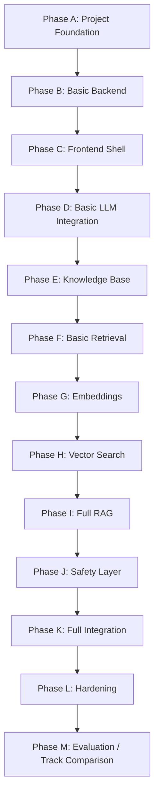
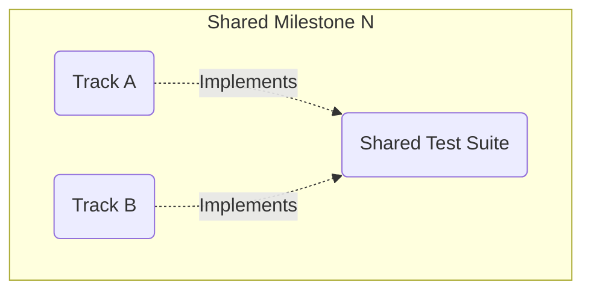

# Development Roadmap: Dr. Md. Momenul Islam

> **Governing Documents:** This roadmap is derived from the approved [Project Charter](file:///d:/my-ai-project/Dr.%20Md.%20Momenul%20Islam/docs/00-project-charter.md), [Problem Statement](file:///d:/my-ai-project/Dr.%20Md.%20Momenul%20Islam/docs/01-problem-statement.md), [Requirements Specification](file:///d:/my-ai-project/Dr.%20Md.%20Momenul%20Islam/docs/02-requirements.md), [Safety Policy](file:///d:/my-ai-project/Dr.%20Md.%20Momenul%20Islam/docs/03-safety-policy.md), [User Personas](file:///d:/my-ai-project/Dr.%20Md.%20Momenul%20Islam/docs/04-user-personas.md), [User Stories](file:///d:/my-ai-project/Dr.%20Md.%20Momenul%20Islam/docs/05-user-stories.md), [System Architecture](file:///d:/my-ai-project/Dr.%20Md.%20Momenul%20Islam/docs/06-system-architecture.md), [RAG Architecture](file:///d:/my-ai-project/Dr.%20Md.%20Momenul%20Islam/docs/07-rag-architecture.md), [API Specification](file:///d:/my-ai-project/Dr.%20Md.%20Momenul%20Islam/docs/08-api-specification.md), [Data Model](file:///d:/my-ai-project/Dr.%20Md.%20Momenul%20Islam/docs/09-data-model.md), [UI Specification](file:///d:/my-ai-project/Dr.%20Md.%20Momenul%20Islam/docs/10-ui-specification.md), and [Testing Strategy](file:///d:/my-ai-project/Dr.%20Md.%20Momenul%20Islam/docs/11-testing-strategy.md).
>
> **Purpose:** Define the complete development and learning roadmap for the project, establishing the framework for both implementation tracks.

---

## 1. Roadmap Objective

This document answers:
* What must be learned before implementation.
* What components are built first and their dependencies.
* What criteria and tests must be satisfied before advancing.
* How Track A and Track B differ in execution but remain functionally identical.
* How the formal comparison between tracks is conducted.
* What constitutes a completed project.

**The roadmap explicitly prevents:**
* Scope creep.
* Premature framework use, RAG complexity, or database complexity.
* Unsafe medical behavior.
* Copying the agent's implementation into the manual track.

---

## 2. Development Rules

| Rule | Description |
|---|---|
| **Rule 1 — Documentation First** | The approved documentation package governs all implementation. |
| **Rule 2 — Same Specification** | Track A and Track B implement the exact same logical system. |
| **Rule 3 — Progressive Learning** | Do not jump directly to full RAG. Progress sequentially through fundamentals. |
| **Rule 4 — Manual Track Must Remain Manual** | The developer must understand Track B's code. Do not copy generated blocks from Track A. |
| **Rule 5 — Agent Track Must Follow Documents** | Antigravity implements the documented architecture, not an invented product. |
| **Rule 6 — Test Before Expansion** | A phase is not complete until its required tests pass. |
| **Rule 7 — Safety Changes Trigger Full Testing** | Any change affecting safety triggers the complete safety test suite. |

---

## 3. Implementation Tracks

### 3.1 Track A — Agent Build

The project is implemented primarily by the AI agent (Antigravity) under the rules defined in `AGENTS.md` and this documentation package.

**The Agent May:** Inspect, create, and modify project files; run tests and development commands; install justified dependencies; debug issues; refactor code; and document the implementation.
**The Agent Must:** Follow requirements and Safety Policy, preserve the API contract and source provenance, run tests, report unresolved decisions, and **not** silently change project scope.

### 3.2 Track B — Manual Build

The developer builds the same system manually with step-by-step guidance, prioritizing learning through manual construction.

**The Developer Must:** Understand each major component before writing it, understand dependencies before installing, write tests alongside functionality, understand RAG before using high-level frameworks, and understand the API contract before implementing endpoints.
**The Developer May Receive:** Conceptual explanations, small examples, debugging guidance, architecture explanations, code review, and targeted corrections. They must **not** reproduce Track A's implementation.

---

## 4. Learning Roadmap (For Track B)

Progressive learning stages that must be completed prior to building full features.

| Stage | Focus | Learnings | Deliverable |
|---|---|---|---|
| **1** | HTTP / API | Client/server, methods, status codes, JSON, APIs, env vars. | Tiny Python script calling an AI API. |
| **2** | LLM Basics | Prompts, context, structured output, model variability/grounding. | Simple CLI health assistant (non-diagnostic, no RAG). |
| **3** | FastAPI | Routes, models, validation, HTTP errors, configuration. | `GET /api/health` and placeholder `POST /api/query`. |
| **4** | FE/BE Connection | JS `fetch`, JSON, async, loading state, CORS. | HTML/JS frontend talking to FastAPI. |
| **5** | Structured Response | Rendering answers, uncertainty, warnings, urgency, sources. | Frontend renders structured backend responses. |
| **6** | Knowledge Sources | Approving sources (WHO, Govt, peer-reviewed, etc.). | Documented, controlled initial knowledge base. (RESEARCH REQUIRED) |
| **7** | Document Processing | Normalization, metadata, chunking, provenance. | Docs transformed to chunks with metadata. |
| **8** | Basic Retrieval | Keyword/text matching without embeddings. | Query → relevant chunks → metadata. |
| **9** | Embeddings | Vector representation, semantic similarity. | Standalone embedding experiment. |
| **10** | Vector Search | Similarity search, ranking, top-k, thresholds. | Query → embedding → search → ranked chunks. |
| **11** | Full RAG | Pipeline assembly (Context + LLM + Validation + Sources). | Functioning evidence-grounded query pipeline. |
| **12** | Response Validation | Schema validation, source validation, safe fallbacks. | Output validated before reaching user. |
| **13** | Safety Integration | Safety routing, refusals, escalation, fail-safes. | Query → safety check → normal path OR safety response. |
| **14** | Testing | Unit, API, RAG, safety, UI, and E2E tests. | Repeatable test suite shared by both tracks. |
| **15** | Evaluation | Running metrics comparison across tracks. | Recorded evaluation metrics for A and B. |

---

## 5. Implementation Roadmap Sequence

Both tracks proceed through these implementation phases, satisfying exit criteria at every step.

### Phase Details

| Phase | Tasks | Exit Criteria |
|---|---|---|
| **A. Foundation** | Repo init, docs validation, `.env.example`, verify `AGENTS.md`. | Project runs locally; no secrets committed. |
| **B. Backend** | FastAPI app, health route, query route contract, validation. | API tests pass; Frontend can call backend. |
| **C. Frontend Shell** | Landing page, chat UI, input, loading, error rendering. | UI tests pass; communicates with backend. |
| **D. LLM Integration** | LLM interface, structured generation, error handling. | LLM tests pass; structured response renders. |
| **E. Knowledge Base** | Source collection, ingestion, cleaning, chunking. | KB tests pass; provenance preserved. |
| **F. Basic Retrieval** | Keyword retrieval implementation. | Returns relevant chunks; no arbitrary sources. |
| **G. Embeddings** | Standalone embedding implementation and testing. | Embeddings work; similarity demonstrated. |
| **H. Vector Retrieval** | Vector index, search, ranking, thresholds. | RAG retrieval tests pass. |
| **I. Full RAG** | Connect Retrieval → Context → LLM → Validation → Sources. | Grounding & attribution tests pass; no-evidence behavior works. |
| **J. Safety Layer** | Safety pre-checks, urgent/unsafe handling, uncertainty. | **Complete safety suite passes.** |
| **K. Full Integration** | Connect Frontend → API → Safety → RAG → Validation. | End-to-end (E2E) suite passes. |
| **L. Hardening** | Security, privacy, accessibility, regression testing. | No unresolved Critical defects; Highs documented. |
| **M. Evaluation** | Freeze dataset, run evaluation suite on Track A & Track B. | Metrics recorded; comparison report produced. |

---

## 6. Track Synchronization & Comparison

Both tracks advance against the identical milestone list.

* **Requirement:** Track A cannot introduce features Track B lacks (and vice versa) unless project docs are formally updated.
* **Comparison Freeze (Phase M):** Before final comparison, the system must freeze: Requirements, API contract, test dataset, core knowledge sources, and evaluation methodology.

---

## 7. Research Checkpoints

External research is required before finalizing:
1. Approved medical source list
2. Emergency/urgent criteria
3. Urgency classification
4. Medication safety boundaries
5. Self-harm/crisis response policy
6. Bangladesh emergency/crisis resources
7. Source-priority hierarchy
8. Appropriate embedding model
9. LLM provider/model
10. Vector database
11. Cross-language retrieval approach

> **Rule:** Do not convert research questions into assumptions.

---

## 8. Definition of Completion

The project is complete when:
* **Functional:** Core requirements, API contract, UI spec, and RAG pipeline are implemented.
* **Safety:** Required behaviors implemented, full safety suite passes, critical safety defects resolved.
* **Evidence:** Approved knowledge base established, provenance preserved, attribution works.
* **Testing:** Shared evaluation completed across both tracks.
* **Documentation:** Governing documents match final implementation; pending decisions are resolved or explicitly documented.
* **Comparison:** Results and metrics for Track A and B are recorded and analyzed.

> **Disclaimer:** The final system is not clinically validated unless actual qualified external validation occurs.

---

## 9. Technology Decision Gates

Decisions must be justified by requirements, learning value, simplicity, and maintainability.

| Gate | Decision Needed |
|---|---|
| **1** | FastAPI + basic LLM interface |
| **2** | Document processing approach |
| **3** | Basic retrieval approach |
| **4** | Embedding model |
| **5** | Vector database |
| **6** | Authentication / Persistence (if adopted) |
| **7** | Deployment architecture |

---

## 10. Roadmap Traceability

| Phase | Maps To |
|---|---|
| **Foundation (A)** | NFR/Security |
| **Backend (B)** | BE / API Specification |
| **Frontend (C)** | UI Specification |
| **Knowledge Base (E)** | KB Requirements |
| **Retrieval (F, G, H)** | FR-04, AI-07 |
| **Full RAG (I)** | FR-05, AI-01–AI-06 |
| **Safety (J)** | SR Requirements, Safety Policy |
| **Testing (L, M)** | NFR-09, Testing Strategy |
| **Evaluation (M)** | Project Charter (Track A/B objective) |

---

## 11. Explicit Roadmap Non-Goals

The following remain **OUT OF SCOPE**:
* Doctor replacement / clinical deployment
* Patient medical records / hospital systems
* Prescription systems / billing interfaces
* Emergency dispatch controls
* Image diagnosis / voice interfaces
* Wearable integrations
* Arbitrary web search
* Foundation-model training

---

## 12. Pending Decisions Summary

| Pending Decision | Required Resolution Phase/Gate |
|---|---|
| Exact medical safety criteria & crisis resources | Gate 2 — Source Research and Safety Evidence Baseline Complete; Final Clinical Rule Formalization Pending. |
| Source-priority hierarchy | Gate 2 — Source Research and Safety Evidence Baseline Complete; Final Clinical Rule Formalization Pending. |
| LLM provider/model | Gate 1 (Basic LLM Integration) |
| Document formats & chunking strategy | Gate 2 (Document Processing) |
| Language processing approach | Gate 2 (Document Processing) |
| Embedding model | Gate 4 (Embeddings) |
| Vector database | Gate 5 (Vector Database) |
| Retrieval parameters | Phase H (Vector Retrieval) |
| Response validation architecture | Phase I (Full RAG) |
| Safety implementation pattern | Phase J (Safety Layer) |
| Persistence & Authentication | Gate 6 (if implemented) |
| Rate limiting & CORS rules | Phase L (Hardening) |
| Deployment infrastructure | Gate 7 (Deployment) |
| Performance targets | Phase L (Hardening) |
