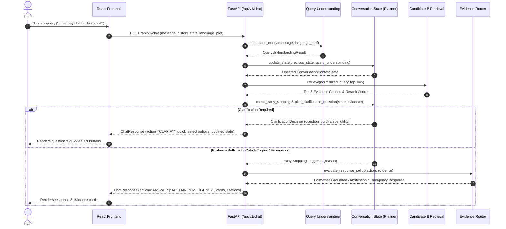

# Application Architecture: Dr. Md. Momenul Islam Conversational Health Intelligence System

## 1. System Overview

**Dr. Md. Momenul Islam** is a Bangladesh-focused conversational, evidence-grounded health assistant prototype. The system processes multi-lingual queries (English, Native Bengali বাংলা, Standard Banglish, and Abbreviated Banglish) to retrieve authoritative clinical evidence from a cryptographically verified corpus of 14 NHS guidance documents (119 chunks).

In **Phase 7C**, the application integrates an **Adaptive Clarification Planner** that scores candidate follow-up questions mathematically and evaluates early stopping rules to minimize unnecessary conversational turns while guaranteeing safe retrieval routing.

```text
   +-------------------------------------------------------------------------+
   |                       REACT + TYPESCRIPT FRONTEND                       |
   |   - Interactive Chat UI with Multi-Turn Message History                 |
   |   - Adaptive Quick-Select Chips (Observable anatomical/trauma options)  |
   |   - Language Selector (Auto-Detect / বাংলা / English)                   |
   |   - Evidence Cards with Provenance Drawer, Section IDs, & NHS Links     |
   |   - Emergency Warning Banners & Honest Abstention Disclaimers           |
   |   - Hosted at: https://drmomenul.vercel.app                             |
   +-------------------------------------------------------------------------+
                                      │  HTTP / REST (JSON API)
                                      ▼
   +-------------------------------------------------------------------------+
   |                             FASTAPI BACKEND                             |
   |                                                                         |
   |  [/api/v1/health]        [/api/v1/corpus]        [/api/v1/retrieve]      |
   |  System Status & Hashes  Corpus Tier Registry    Raw Evidence Retrieval |
   |                                                                         |
   |  [/api/v1/chat]                                                         |
   |  Full Conversational Pipeline (Stateful Chat, Clarification, & RAG)     |
   +-------------------------------------------------------------------------+
                                      │
                ┌─────────────────────┴─────────────────────┐
                ▼                                           ▼
   +---------------------------------------+   +-----------------------------+
   |      QUERY UNDERSTANDING SERVICE      |   | CONVERSATION STATE SERVICE  |
   |  - Multilingual Token Extraction      |   |  - Context Tracking         |
   |  - Anatomical & Sensation Parsing     |   |  - 6-Factor Utility Model   |
   |  - Severity & Age Group Extraction    |   |  - 4 Early Stopping Rules   |
   |  - Emergency Red Flag Heuristics      |   |  - Duplicate Suppression    |
   +---------------------------------------+   +-----------------------------+
                        │                                   │
                        └─────────────────┬─────────────────┘
                                          │
                                          ▼
   +-------------------------------------------------------------------------+
   |             CANDIDATE B RETRIEVAL SERVICE (Phase 6K Freeze)             |
   |  - Track A Normalization & Banglish Mapping                             |
   |  - Dense Bi-Encoder: intfloat/multilingual-e5-small (Top-15)            |
   |  - Neural Cross-Encoder Reranker: BAAI/bge-reranker-v2-m3               |
   |  - 0.85x Overview Debiasing & Dual-Anchor Semantic Fusion               |
   |  - Output: Top-5 Ranked Chunks with Rerank Scores                       |
   +-------------------------------------------------------------------------+
                                          │
                                          ▼
   +-------------------------------------------------------------------------+
   |               EVIDENCE SUFFICIENCY & SAFETY ROUTING LAYER               |
   |  - Top Rerank Score >= 0.65 -> Grounded Answer Generation (Policy C)    |
   |  - Top Rerank Score < 0.40 or Out-of-Corpus -> Honest Abstention        |
   |  - Red Flags Detected -> Emergency Override Action                      |
   +-------------------------------------------------------------------------+
                                          │
                                          ▼
   +-------------------------------------------------------------------------+
   |                       ACTIVE 119-CHUNK CORPUS                           |
   |  - 14 NHS Verified Sources (DOC-NHS-004 through DOC-NHS-017)           |
   |  - Hybrid-600 Semantic Windowing & Fixed Boundaries                     |
   |  - SHA-256 Cryptographic Hash Checksums & Full Provenance               |
   +-------------------------------------------------------------------------+
```

---

## 2. Core Subsystems & Components

### A. Frontend Layer (`frontend/`)
- **Framework:** React 18, TypeScript 5, Vite 5, Tailwind CSS 3.
- **State Management:** Preserves `ConversationContextState` across turns, rendering quick-select chips returned from `clarification_options`.
- **Disclaimers & Disclosures:** User-facing warnings emphasize that the application is a research prototype, not a medical doctor.
- **Deployed URL:** `https://drmomenul.vercel.app`

### B. Backend API Layer (`backend/app/api/endpoints.py`)
- **FastAPI Endpoints:**
  - `GET /api/v1/health`: Returns service health, active strategy name (`CANDIDATE_B_CONTEXT_AWARE_DISAMBIGUATION`), corpus size (119 chunks), and candidate SHA-256 hash.
  - `POST /api/v1/retrieve`: Executes raw neural retrieval without conversational planning.
  - `POST /api/v1/chat`: Multi-turn conversational endpoint coordinating query understanding, structured context, question-utility planning, Candidate B retrieval, and response policy gating.

### C. Conversational & Adaptive Planning Services (`backend/app/services/`)
1. **`QueryUnderstandingService` (`query_understanding_service.py`)**:
   - Parses multilingual queries using regex slot filling and token normalization.
   - Extracts structured attributes: `body_part`, `sub_location`, `duration`, `sensation`, `mechanism`, `age_group`, `severity`.
   - Flags emergency keywords (e.g. crushing chest pain, anaphylaxis, severe bleeding).

2. **`ConversationStateService` (`conversation_state_service.py`)**:
   - Maintains multi-turn conversation state (`ConversationContextState`).
   - Evaluates candidate clarification questions using the 6-factor Question-Utility formula:
     $$\text{Utility}(Q) = G_{\text{retrieval}}(Q) + G_{\text{safety}}(Q) + R_{\text{ambiguity}}(Q) + C_{\text{corpus}}(Q) - P_{\text{redundant}}(Q) - P_{\text{unnecessary}}(Q)$$
   - Evaluates the 4 Early Stopping Rules (`SUFFICIENT_EVIDENCE`, `UNSUPPORTED_TOPIC`, `EMERGENCY_OVERRIDE`, `MAX_TURNS_EXCEEDED`).
   - Prevents duplicate questions by applying a $-1.00$ penalty to already asked dimensions.

3. **`FrozenDualAnchorRetrievalService` (`retrieval_service.py`)**:
   - Implements frozen Candidate B Context-Aware Disambiguation.
   - Dense retrieval with `intfloat/multilingual-e5-small` $\to$ Cross-encoder reranking with `BAAI/bge-reranker-v2-m3` $\to$ 0.85x overview debiasing $\to$ Score fusion with $\lambda=0.10, \alpha=0.03$.

4. **`GenerationService` & `OutputValidator` (`generation_service.py`, `output_validator.py`)**:
   - Formats evidence-grounded responses following Policy C gating rules.
   - Ensures strict citation matching to retrieved chunk IDs.

---

## 3. Data Flow & Execution Sequence



---

## 4. Verification & Testing Standards

- **Unit & Integration Suite:** `backend/tests/test_phase_7c_adaptive_clarification.py` executes 10 comprehensive tests validating utility scoring, duplicate suppression, free-text extraction, stopping rules, and non-diagnostic invariants.
- **Benchmark Evaluation:** `research/phase_7C_adaptive_clarification/evaluate_phase_7C_adaptive_clarification.py` runs a 40-scenario benchmark across 14 evaluation metrics.
- **Frontend Type Safety:** `frontend/src/types/index.ts` enforces 100% type alignment with Pydantic API schemas.
