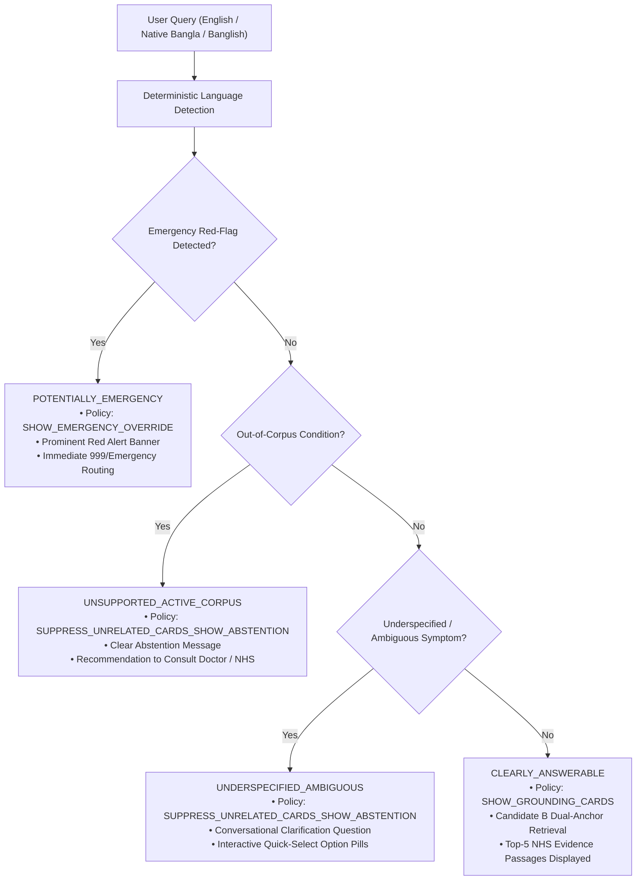
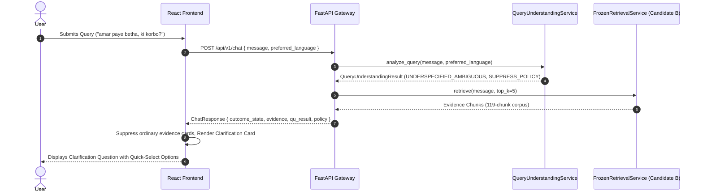

# Phase 7A — Query Understanding, Evidence Presentation Policy & Clarification Architecture

**Project:** Dr. Md. Momenul Islam Health Intelligence  
**Author:** Google DeepMind / Antigravity Engineering  
**Status:** ACTIVE / PRODUCTION  
**Corpus Version:** Active 14 NHS Conditions (119 Chunks)  
**Retrieval Engine:** Promoted Candidate B — Context-Aware Compound Disambiguation  

---

## 1. Executive Summary & Clinical Rationale

In Phase 6K, Candidate B was validated as the superior multilingual retrieval candidate (+2.78pp Recall@5 over baseline, 0% language regression). However, in end-user interactions, a critical clinical intelligence limitation was identified:

> **Problem Statement:** When an end user submits an underspecified or out-of-corpus query (e.g., *"amar paye betha, ki korbo?"*), the retrieval engine returns the mathematical nearest neighbors (e.g., Meningitis, Burns, Sepsis, Cuts). If displayed directly without contextual qualification, the UI presents irrelevant clinical advice as though it is supporting evidence.

Phase 7A Track B introduces a **Deterministic Query Understanding & Evidence Presentation Policy Layer** that acts as an intelligent safety and clarification gateway upstream of evidence presentation, while strictly maintaining the zero-hallucination, non-diagnostic guardrails.

---

## 2. 4-Tier Intent & Evidence Sufficiency Taxonomy

Every user query is deterministically classified across 4 clinical intent tiers:

### Tier Definitions

1. **`POTENTIALLY_EMERGENCY` (Emergency Red-Flag Routing):**
   - **Clinical Trigger:** Symptoms indicating acute life-threatening situations (e.g., chest pain with left arm radiation, acute dyspnea, leg swelling with shortness of breath [DVT/PE], airway obstruction/anaphylaxis, stroke FAST signs).
   - **Action:** Overrides standard presentation with high-visibility bilingual emergency advice and 999 contact directions.
   - **Presentation Policy:** `SHOW_EMERGENCY_OVERRIDE`.

2. **`UNSUPPORTED_ACTIVE_CORPUS` (Explicit Out-of-Scope Topics):**
   - **Clinical Trigger:** User explicitly asks about a medical topic outside the 14 active NHS conditions (e.g., Diabetes, Cancer, Pregnancy, Toothache, Piles, Chickenpox).
   - **Action:** Abstains with structured explanation and provides clear guidance to consult official clinical resources.
   - **Presentation Policy:** `SUPPRESS_UNRELATED_CARDS_SHOW_ABSTENTION`.

3. **`UNDERSPECIFIED_AMBIGUOUS` (Insufficient Context / Ambiguous Site):**
   - **Clinical Trigger:** Queries mentioning vague body pain or malaise without mechanism of injury or context (e.g., *"amar paye betha"*, *"matha betha ki korbo"*).
   - **Action:** Generates targeted bilingual clarification questions with clickable interactive options (e.g., injury/sprain, cut/bleeding, burn, insect bite).
   - **Presentation Policy:** `SUPPRESS_UNRELATED_CARDS_SHOW_ABSTENTION` (raw candidate passages collapsed by default under technical inspection).

4. **`CLEARLY_ANSWERABLE` (Supported In-Corpus Inquiries):**
   - **Clinical Trigger:** Specific symptom queries with sufficient context matching active 14 NHS conditions.
   - **Action:** Executes Promoted Candidate B Dual-Anchor retrieval and presents grounding evidence cards.
   - **Presentation Policy:** `SHOW_GROUNDING_CARDS`.

---

## 3. Language Selection & Multilingual Parity

The application provides a 3-way language preference toggle:
- `[ Auto ]`: Automatically detects input script (English $\to$ English, Native Bangla $\to$ Bangla, Banglish $\to$ Bangla).
- `[ বাংলা ]`: Forces all UI labels, disclaimers, and clarification questions into Bengali.
- `[ English ]`: Forces all UI labels, disclaimers, and clarification questions into English.

**Critical Retrieval Invariant:** The selected response language does **NOT** alter the underlying retrieved NHS evidence passages. Multilingual grounding remains strictly identical regardless of interface language.

---

## 4. Architectural Separation of Concerns

---

## 5. Safety & Regulatory Boundaries

1. **Non-Diagnostic Constraint:** The clarification architecture does **NOT** perform autonomous medical diagnosis, triage risk scoring, or disease probability estimations.
2. **Grounding Integrity:** The LLM is restricted to synthesizing retrieved evidence only. When evidence is insufficient or the query is ambiguous, the system explicitly abstains rather than extrapolating unverified medical advice.
3. **Auditability:** All query understanding decisions, intent classifications, detected red flags, and presentation policies are included in structured JSON responses for runtime logging and clinical auditability.
