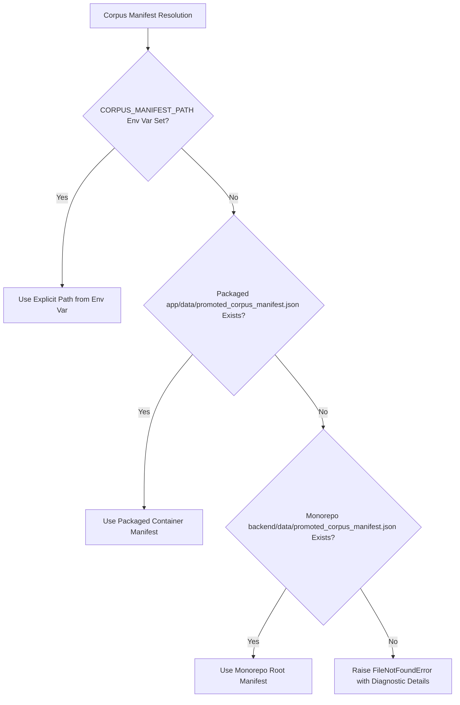

# Architecture Specification: Phase 8A — Production Backend Deployment Preparation

**Status:** APPROVED / READY_FOR_RENDER_DEPLOYMENT  
**Phase:** 8A  
**Date:** August 2026  
**Component:** Backend Containerization, Environment Portability, Infrastructure-as-Code

---

## 1. Executive Summary

Phase 8A prepares the **Dr. Md. Momenul Islam Clinical Health Intelligence** backend for cloud deployment onto Render's container platform without modifying frozen retrieval semantics, without altering Candidate B parameters, without running locked research benchmarks, and without changing the live Vercel frontend until Phase 8B integration.

The backend is packaged as an autonomous container using a lightweight Debian-based Python 3.10 slim runtime (`python:3.10-slim`) with CPU-optimized PyTorch wheels, a self-contained authoritative 119-chunk corpus manifest, dynamic multi-tier manifest path resolution, environment-driven CORS security, and comprehensive health monitoring.

---

## 2. Frozen Configuration & Cryptographic Invariants

All core clinical retrieval models and parameters remain strictly unchanged from their validated frozen states:

| Parameter / Asset | Frozen Value | Verification Hash (SHA-256) |
| :--- | :--- | :--- |
| **Active Candidate** | `CANDIDATE_B_CONTEXT_AWARE_DISAMBIGUATION` | `92224DC6CB0F81C92B8A2869AC562D6CC63B291E36D373F6FE22B524F594EC8A` |
| **Parent Strategy** | `STRATEGY_5_DUAL_TOPICAL_LEXICAL_ANCHOR` | `1cc216db046264d52bb05616e20123c71b77b56623b17a14c018d0e743ad86ae` |
| **Active Corpus** | 119 chunks across 14 NHS sources (`DOC-NHS-004` to `DOC-NHS-017`) | `44D0602F730D6460E6FEFA431BD5C09005B48CE92B47D02832532E5868D4AA58` |
| **Dense Bi-Encoder** | `intfloat/multilingual-e5-small` | CPU inference |
| **Cross-Encoder Reranker**| `BAAI/bge-reranker-v2-m3` | CPU inference |
| **Retrieval Depth** | Dense $K=15$, Final Top-$K=5$ | Unchanged |
| **Scoring Weights** | $\lambda = 0.10, lpha = 0.03, 	ext{Overview Debiasing} = 0.85$ | Unchanged |
| **Generation Mode** | `False` (LLM Generation disabled by protocol) | Unchanged |

---

## 3. Container & Runtime Architecture

### 3.1 Docker Packaging Strategy (`backend/Dockerfile`)
```dockerfile
FROM python:3.10-slim

ENV PYTHONUNBUFFERED=1 \
    PYTHONDONTWRITEBYTECODE=1 \
    PORT=8000 \
  HOST=0.0.0.0 \
  ENVIRONMENT=production

WORKDIR /app

RUN apt-get update && apt-get install -y --no-install-recommends \
  curl \
    && rm -rf /var/lib/apt/lists/*

COPY requirements.txt .
RUN pip install --no-cache-dir --index-url https://download.pytorch.org/whl/cpu torch==2.14.0+cpu && \
  pip install --no-cache-dir --extra-index-url https://download.pytorch.org/whl/cpu -r requirements.txt

COPY app/ ./app/

HEALTHCHECK --interval=30s --timeout=10s --start-period=60s --retries=3 \
    CMD curl -f http://localhost:${PORT}/api/v1/health || exit 1

EXPOSE 8000

CMD ["sh", "-c", "uvicorn app.main:app --host 0.0.0.0 --port ${PORT:-8000}"]
```

### 3.2 Key Packaging Decisions
1. **CPU PyTorch Pre-installation:** Installing CPU-only wheels directly prevents downloading multi-gigabyte CUDA/CUDNN binaries, keeping container image size under 1.8GB.
2. **Single Worker Concurrency (`workers=1`):** `BAAI/bge-reranker-v2-m3` is a 570M parameter Transformer model requiring ~1.15GB RAM in memory. Running multiple Uvicorn workers would cause linear RAM multiplication and trigger Out-Of-Memory (OOM) killer terminations on 2GB/4GB instance tiers.
3. **Corpus Packaged Inside Container:** The 119-chunk active manifest is copied directly to `/app/app/data/promoted_corpus_manifest.json`, ensuring the container starts with zero external network or volume dependencies.

---

## 4. Multi-Tier Corpus Manifest Resolution

To support seamless operation across containerized production, isolated Docker testing, and monorepo local development, `backend/app/core/config.py` implements a 3-tier fallback resolution hierarchy:



---

## 5. Memory & Sizing Analysis for Render

| Component | Resident Memory Footprint | Description |
| :--- | :--- | :--- |
| **Python Runtime + FastAPI/Uvicorn** | ~150 MB | Base web framework & ASGI server |
| **Dense Embeddings (`multilingual-e5-small`)** | ~470 MB | 118M parameter multilingual bi-encoder |
| **Cross-Encoder (`bge-reranker-v2-m3`)** | ~1,150 MB | 570M parameter multilingual cross-encoder |
| **Pre-computed 119 Chunk Tensor Embeddings** | ~10 MB | In-memory float32 tensor index |
| **PyTorch Execution Headroom** | ~200 MB | Working scratch buffers during forward pass |
| **Total Estimated Footprint** | **~1.98 GB** | Peak steady-state memory utilization |

### Recommended Render Service Tier:
- **Minimum Tier:** **Standard (2 GB RAM / 1 vCPU)** — viable under single worker with modest concurrency.
- **Recommended Production Tier:** **Pro (4 GB RAM / 2 vCPU)** — provides robust headroom against OOM spikes during simultaneous reranking requests and eliminates latency bottlenecks.
- **Starter Plan (512 MB):** **INSUFFICIENT (OOM Killer will terminate process during model weight loading).**

---

## 6. Infrastructure-as-Code: Render Blueprint (`render.yaml`)

```yaml
services:
  - type: web
    name: dr-md-momenul-islam-api
    runtime: docker
    dockerfilePath: ./backend/Dockerfile
    dockerContext: ./backend
    plan: standard
    region: frankfurt # Low latency to Europe / South Asia
    envVars:
      - key: PORT
        value: 8000
      - key: HOST
        value: 0.0.0.0
      - key: CORS_ORIGINS
        value: "https://drmomenul.vercel.app,http://localhost:5173,http://127.0.0.1:5173"
      - key: RETRIEVAL_CANDIDATE
        value: CANDIDATE_B_CONTEXT_AWARE_DISAMBIGUATION
      - key: GENERATION_ENABLED
        value: "false"
    healthCheckPath: /api/v1/health
    autoDeploy: false
```

---

## 7. Frontend Integration Contract (`frontend/src/services/api.ts`)

The frontend has been updated to dynamically read `VITE_API_BASE_URL` with backward compatibility:
- **Local Development / Vite Proxy:** `VITE_API_BASE_URL=""` $	o$ `/api/v1` (forwarded via Vite dev proxy).
- **Production on Vercel:** `VITE_API_BASE_URL="https://dr-md-momenul-islam-api.onrender.com/api/v1"` $	o$ direct CORS requests to Render backend.

---

## 8. Verification & Test Evidence

All 9 deployment readiness tests in `backend/tests/test_deployment_readiness.py` pass:
- `test_packaged_corpus_manifest_integrity`: Packaged corpus SHA-256 verified.
- `test_health_endpoint_contract`: Returns 119 chunks, 0 staged chunks, Candidate B hash.
- `test_corpus_lifecycle_endpoint`: Active corpus `NHS_14_CONDITIONS` with 14 docs.
- `test_cors_preflight_for_vercel_frontend`: Allows `https://drmomenul.vercel.app`.
- `test_cors_preflight_for_local_dev`: Allows `http://localhost:5173`.
- `test_query_understanding_endpoint`: Correctly classifies query modalities and intent.
- `test_chat_endpoint_multilingual_flow`: End-to-end retrieval for EN, Bangla, and Banglish.
- `test_chat_emergency_routing`: Immediate emergency escalation on red flag symptoms.
- `test_chat_unsupported_out_of_corpus`: Abstention and evidence suppression for out-of-corpus queries.

Frontend build (`npm --prefix frontend run build`) compiles with 0 errors.
