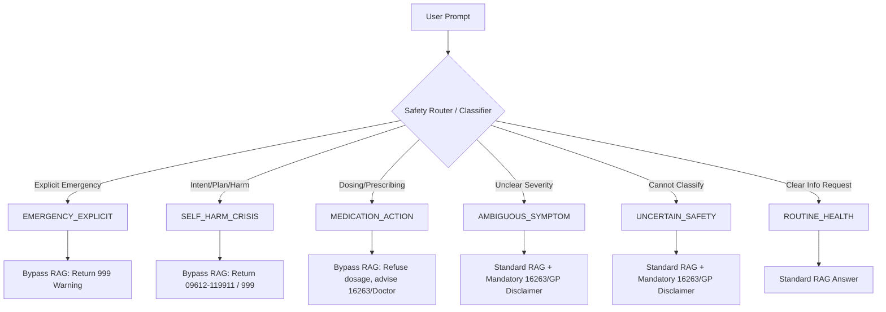

# Gate 3.1: Safety Architecture Refinement

> **Status:** RESEARCH & ARCHITECTURE PACKAGE
> **Purpose:** Translate the clinical evidence gaps identified in Gate 3 into a conservative, deterministic engineering architecture.
> **Note:** Do not implement until approved. Governing documents remain unchanged.

## 1. The Problem Exposed by Gate 3
Gate 3 revealed critical gaps between clinical reality and AI engineering assumptions:
1. **Algorithmic Triage is Unsafe:** LLMs and naive keyword matchers cannot perform clinical triage (e.g., distinguishing "chest hurts from coughing" from "cardiac chest pain") because they cannot observe patients or ask safe, sequential clarifying questions.
2. **Text Ambiguity:** NLP cannot reliably distinguish passive death-related thoughts from imminent suicidal intent.
3. **LLMs Cannot Resolve Evidence Conflicts:** Asking an LLM to apply rigorous WHO Evidence-to-Decision (EtD) frameworks dynamically in a context window is unsafe and highly prone to hallucination. 

## 2. Clinical Evidence vs. Engineering Interpretation
We must explicitly decouple what clinical guidelines *say* from what the system *does*.

*   **Clinical Evidence:** NHS guidelines state that "loss of consciousness" or "severe chest pain" require calling 999.
*   **Engineering Interpretation:** The system detects semantic clusters related to these symptoms and forcefully routes the user to a safety protocol.
*   **The Gap:** The system is *not* diagnosing an emergency; it is detecting *high-risk text patterns* and triggering a conservative failsafe to prevent the AI from offering casual advice to a potentially dying user.

## 3. Proposed Safety Routing Architecture
To prevent the LLM from independently deciding a user's urgency level, the architecture introduces a **Deterministic Safety Router** that intercepts the prompt *before* RAG retrieval.

### States
1.  **`EMERGENCY_EXPLICIT`**: Clear, explicit matches for NHS life-threatening conditions (e.g., "I am bleeding heavily and can't stop it").
2.  **`SELF_HARM_CRISIS`**: Explicit mentions of suicidal intent, plan, recent harm, or overdose.
3.  **`MEDICATION_ACTION`**: Requests for dosage, prescribing, changing, or stopping medication.
4.  **`AMBIGUOUS_SYMPTOM`**: Mentions of severe pain, prolonged fever, or unclear severity.
5.  **`ROUTINE_HEALTH`**: General information requests (e.g., "What is dengue fever?").
6.  **`UNCERTAIN_SAFETY`**: *First-class state.* The router cannot confidently classify the prompt.

### State/Flow Diagram

## 4. Uncertainty as a First-Class System State
If the Safety Router cannot confidently classify a prompt, it defaults to **`UNCERTAIN_SAFETY`**.
*   **Rule:** We do *not* force uncertain cases into `EMERGENCY` (which causes alarm fatigue) or `ROUTINE` (which risks harm).
*   **Behavior:** The system retrieves general knowledge but enforces a strict conversational template: *"I cannot determine the severity of your situation from text. Here is general information about [Topic], but if you are feeling very unwell, please call 16263 to speak with a doctor."*

## 5. Refining Emergency Handling
Naive keyword blocklists (e.g., `chest pain -> emergency`) are rejected.
*   **Strategy:** The classifier must evaluate the *intent* of the utterance using few-shot semantic classification, not just grep/regex.
*   **Distinctions:**
    *   *Explicit High-Risk:* "I think I am having a heart attack." (Routes to `EMERGENCY_EXPLICIT`).
    *   *Contextual/Ambiguous:* "My chest hurts when I cough from this cold." (Routes to `AMBIGUOUS_SYMPTOM`).
*   **Documented Limitation:** Automated distinction is inherently flawed. When the classifier hesitates, it falls back to `UNCERTAIN_SAFETY`. The system is expressly *not* a medical triage device.

## 6. Refining Self-Harm Handling
Text-based distinction of psychiatric emergencies is highly error-prone.
*   **Categories & Routing:**
    *   *Emotional Distress (e.g., "I am very sad/stressed")* → `ROUTINE_HEALTH` + gentle support + standard RAG (e.g., NHS mental health resources).
    *   *Passive death-related thoughts (e.g., "I wish I wasn't here")* → `UNCERTAIN_SAFETY` + gentle check-in + Kaan Pete Roi info.
    *   *Suicidal thoughts/Intent/Stated plan/Recent harm/Overdose* → `SELF_HARM_CRISIS` (Immediate bypass).
*   **Documented Limitation:** We cannot claim reliable automated detection of "intent" vs. "passive thoughts." Therefore, any mention of self-harm vocabulary heavily biases the router toward `SELF_HARM_CRISIS` to fail safely.

## 7. Redesigning Medication Safety Boundaries
Because we lack an authoritative Bangladesh OTC whitelist, we abandon the "OTC vs Prescription" model in favor of an **Action-Based** model.
*   **General Medication Information:** (Allowed) "What is paracetamol used for?"
*   **Explanation of Side Effects:** (Allowed) "What are the side effects of amoxicillin?"
*   **Dosage Requests:** (Refused / `MEDICATION_ACTION`) "How much ibuprofen should I give my child?"
*   **Starting/Stopping/Changing:** (Refused / `MEDICATION_ACTION`) "Can I stop taking my blood pressure pills?"
*   **Interactions/Contraindications:** (Refused / `MEDICATION_ACTION`) "Can I take X with Y?"
*   **Rule:** If a user asks *how* to take a drug, the system redirects to a pharmacist or 16263, regardless of whether the drug is technically OTC.

## 8. Deterministic Source Conflict Handling
We remove the LLM's burden of adjudicating clinical truth.
*   **Architecture:** We use deterministic Metadata Filtering at the vector database level.
*   **Metadata Fields:** `jurisdiction` (e.g., BD, Global, UK), `topic`, `authority_tier` (1: DGHS, 2: WHO, 3: NHS), `publication_date`.
*   **Conflict Policy:**
    1. The vector search applies a filter prioritizing the user's jurisdiction (BD).
    2. If top-k results return conflicting chunks (e.g., a chunk from DGHS and a chunk from NHS), the context builder feeds *both* to the LLM.
    3. The LLM System Prompt strictly enforces: *"Do not choose which source is correct. State clearly that different guidelines exist. E.g., 'According to DGHS [Fact A], however, the NHS states [Fact B].'"*
    4. **Uncertainty is preserved.** The system explicitly exposes the conflict to the user rather than hiding it.

## 9. Unresolved Research Questions
*   What specific ML classification model (or LLM-as-a-judge prompt) can accurately power the Safety Router without introducing excessive latency?
*   How frequently do actual users blur the lines between `AMBIGUOUS_SYMPTOM` and `EMERGENCY_EXPLICIT` in real-world chat logs?
