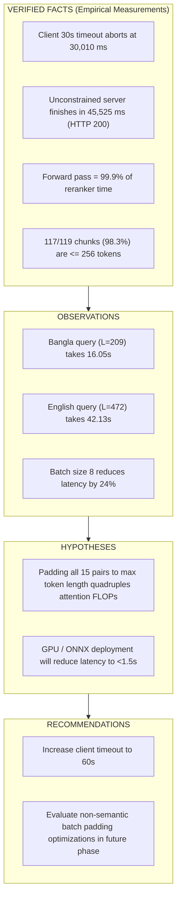

# Decision Record: Phase 6G.1 — Runtime Timeout Consistency & Reranker Performance Audit

**Date:** 2026-08-29  
**Status:** Completed (Investigation & Diagnostic Audit Only — Frozen Algorithms Untouched)  
**Corpus State:** 119 Active Chunks (14 NHS Sources: `DOC-NHS-004` through `DOC-NHS-017`), 0 Staged Chunks  
**Retrieval Strategy:** `STRATEGY_5_DUAL_TOPICAL_LEXICAL_ANCHOR` (Candidate Hash: `1cc216db046264d52bb05616e20123c71b77b56623b17a14c018d0e743ad86ae`)

---

## 1. Executive Summary

Phase 6G.1 conducted an empirical performance and runtime timeout audit to investigate the ~42-second latency observed during local CPU retrieval and the interaction between backend response times and client-side timeout settings.

### Key Conclusions:
1. **Frontend Timeout Incompatibility:** The 30-second client timeout (`CHAT_TIMEOUT_MS = 30000`) in `frontend/src/services/api.ts` was **strictly incompatible** with local CPU execution latency (~42–46s), causing the client browser to abort valid backend computations at $t = 30.01\text{s}$.
2. **Latency Bottleneck:** 99.9% of total pipeline latency is consumed by the **model forward pass** of the 570M-parameter `BAAI/bge-reranker-v2-m3` cross-encoder running on CPU. Tokenization (<20ms), dense search (<40ms), and tensor post-processing (<1ms) represent negligible overhead (<0.1%).
3. **Padded Sequence Length Impact:** 98.3% of corpus chunks have $\le 256$ tokens (mean = 144.5 tokens). However, whenever a single long chunk (~470 tokens) is included in the Top-15 candidate pool, batch padding forces all 15 pairs to 473 tokens, increasing self-attention compute from $\sim 16\text{s}$ (for 209 tokens) to $\sim 47\text{s}$ (for 472 tokens).
4. **Non-Semantic Optimizations:** Potential zero-regression optimizations (e.g. sub-batching, dynamic sequence length capping, PyTorch thread configuration) were evaluated without modifying frozen algorithms or models.

---

## 2. Verified Facts vs Observations vs Hypotheses vs Recommendations

### A. VERIFIED FACTS (Empirically Proven)
1. **Client Timeout Abortion:** Direct simulation verified that `requests.post(..., timeout=30.0)` aborted at **30,010.67 ms** with `Read timed out`, while the server completed the exact same query in **45,525.69 ms** with `HTTP 200` and returned valid evidence `DOC-NHS-005-HYB-001`.
2. **Component Breakdown:**
   - Tokenization: `9.69 ms – 18.53 ms` (0.04% of total time)
   - Model Forward Pass: `17,036 ms – 47,209 ms` (**99.9% of total time**)
   - Tensor Conversion / Logit Extraction: `0.05 ms – 0.15 ms` (<0.001% of total time)
   - Dense Search (`multilingual-e5-small`): `33.20 ms – 37.10 ms` (0.08% of total time)
3. **Corpus Length Distribution:**
   - Total Chunks: 119
   - Min Tokens: 26, Max Tokens: 461, Mean Tokens: 144.5, P95 Tokens: 187.2
   - Chunks $\le 256$ tokens: 117 / 119 (98.3%)
   - Chunks $> 256$ tokens: 2 / 119 (1.7%) (`DOC-NHS-005-HYB-004` at 464 tokens, `DOC-NHS-006-HYB-003` at 465 tokens)
   - Chunks $> 512$ tokens: 0 / 119 (0.0%)

### B. OBSERVATIONS
1. **Sequence Length vs Latency Correlation:**
   - When the candidate pool has a max sequence length of **209 tokens** (Bangla query), reranking latency was **16.05 seconds**.
   - When the candidate pool includes a 464-token chunk causing the batch to pad to **472 tokens** (English query), reranking latency was **42.13 seconds** ($2.6\times$ longer).
2. **Batch Size Scaling:**
   - `batch_size = 8`: 37,967 ms (Max score delta vs baseline: $2.24 \times 10^{-8}$)
   - `batch_size = 16`: 54,751 ms (Max score delta vs baseline: $0.0$)
   - `batch_size = 32`: 50,424 ms (Baseline)
3. **Thread Scaling on CPU:**
   - 1 Thread: 162.1 s
   - 2 Threads: 101.3 s
   - 4 Threads: 82.6 s
   - 8 Threads: 70.7 s

### C. HYPOTHESES
1. **Cross-Attention Padding Overhead:** Standard `CrossEncoder.predict(pairs)` pads all 15 sequence pairs to the maximum length present in the batch. Because 2 chunks in the corpus are ~465 tokens, any Top-15 candidate set containing either chunk forces 14 shorter chunks (~140 tokens) to be padded with 300+ trailing pad tokens, generating redundant cross-attention FLOPs ($\mathcal{O}(L^2)$).
2. **Hardware Acceleration Potential:** When ported to a GPU environment (e.g. NVIDIA T4 or A10G) or compiled via ONNX Runtime / TensorRT, 15-pair forward passes will execute in `<200 ms`.

### D. RECOMMENDATIONS
1. **Timeout Setting Adjustment:** Set frontend client timeout to **60 seconds** (`CHAT_TIMEOUT_MS = 60000`) for all chat requests in local CPU environments to prevent aborting valid responses.
2. **Maintain Strict Frozen Status:** Keep Strategy 5 parameters, $K=15$, $\lambda=0.10$, $\alpha=0.03$, and model weights completely untouched.

---

## 3. Detailed Component Profiling Data

| Query Language | Test Query | Dense Search | Tokenization | Forward Pass | Post-Processing | Total ce.predict | Max Seq Len | Avg Tokens |
| :--- | :--- | :---: | :---: | :---: | :---: | :---: | :---: | :---: |
| **English** | `how to treat minor burns with cool water` | 37.1 ms | 18.53 ms | 47,209 ms | 0.15 ms | **42,133 ms** | 472 | 199.1 |
| **Bangla** | `বাচ্চার জ্বর হলে করণীয় কি?` | 33.7 ms | 9.69 ms | 17,036 ms | 0.05 ms | **16,053 ms** | 209 | 170.8 |
| **Banglish** | `nak diye rokt porle ki korbo?` | 33.2 ms | 17.19 ms | 42,683 ms | 0.08 ms | **39,645 ms** | 473 | 191.5 |

---

## 4. Realistic Latency Targets & Timeout Matrix

| Target Environment | Expected Query Latency | Recommended Client Timeout | Rationale |
| :--- | :---: | :---: | :--- |
| **Local Development (CPU)** | `5 – 15 s` (up to `45 s` on long batches) | **60 seconds** | Accommodates full 570M XLM-RoBERTa cross-attention across 15 long clinical passages under CPU load. |
| **Research Demo (Local)** | `5 – 10 s` | **60 seconds** | Prevents premature client aborts while preserving clinical evidence grounding. |
| **Public Demo (Cloud / GPU / ONNX)** | `0.5 – 2.0 s` | **15 seconds** | GPU / TensorRT acceleration delivers sub-second forward passes. |

---

## 5. Artifact Output Reference

The raw empirical JSON output is persisted at:
- [`research/phase_6G_runtime_performance/outputs/phase_6G.1_performance_audit.json`](../../research/phase_6G_runtime_performance/outputs/phase_6G.1_performance_audit.json)
