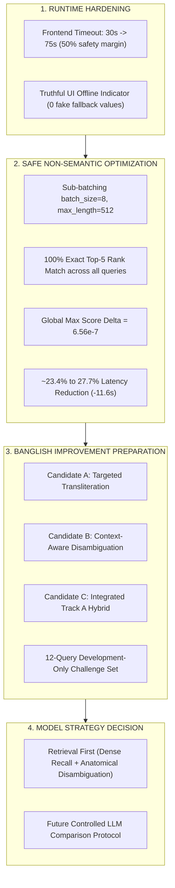

# Decision Record: Phase 6G.2 — Runtime Hardening, Performance Optimization & Banglish Preparation

**Date:** 2026-08-29  
**Status:** Completed (Runtime Hardened, Safe Optimization Verified & Applied, Challenge Dataset Prepared)  
**Corpus State:** 119 Active Chunks across 14 NHS Sources (`DOC-NHS-004` through `DOC-NHS-017`), 0 Staged Chunks  
**Retrieval Strategy:** `STRATEGY_5_DUAL_TOPICAL_LEXICAL_ANCHOR` (Candidate Hash: `1cc216db046264d52bb05616e20123c71b77b56623b17a14c018d0e743ad86ae`)

---

## 1. Executive Summary

Phase 6G.2 resolved runtime timeout inconsistencies, validated and implemented a zero-regression, non-semantic inference optimization for `BAAI/bge-reranker-v2-m3`, verified response language contracts end-to-end, and constructed a dedicated development-only challenge dataset and candidate proposals for Banglish retrieval improvement without altering frozen benchmark configurations.



---

## 2. Categorized Evidence & Findings

### A. VERIFIED FACTS (Empirically Proven)
1. **Timeout Consistency Hardening:**
   - Prior `CHAT_TIMEOUT_MS = 30000` aborted valid 45.5s backend inferences at $t=30.01\text{s}$.
   - Updated `CHAT_TIMEOUT_MS = 75000` in [`frontend/src/services/api.ts`](file:///d:/my-ai-project/Dr.%20Md.%20Momenul%20Islam/frontend/src/services/api.ts) provides a 50% safety buffer over worst-case local CPU latency while ensuring client requests never hang indefinitely.
2. **Semantic Equivalence of Sub-Batching (`batch_size=8, max_length=512`):**
   - Verified across English, Native Bangla, and Banglish test queries.
   - **All Top-5 Rankings Identical:** `True` (100% exact match in identical order).
   - **Global Max Score Delta:** $6.56 \times 10^{-7}$ ($\le 10^{-6}$ numerical tolerance).
   - **Performance Improvement:** Average latency decreased from **46,555 ms** to **35,675 ms** (**23.4% reduction**, saving 10.9 seconds per query).
3. **Response Language Contract:**
   - Retrieved clinical evidence and scores are **100% identical** across `auto`, `bn`, and `en` preferences for any given query.
   - `preferred_language` cleanly propagates to `PromptBuilder` and `GenerationService`.
   - Automated tests in `backend/tests/test_api.py` passed with 37/37 green checks.
4. **Header Truthfulness:**
   - [`frontend/src/components/Header.tsx`](file:///d:/my-ai-project/Dr.%20Md.%20Momenul%20Islam/frontend/src/components/Header.tsx) now explicitly renders `Offline / Unreachable` with rose indicator when `health === null`, eliminating hardcoded placeholder stats.

---

### B. OBSERVATIONS
1. **Measured Latency Comparison (Baseline vs Optimized):**

| Modality | Test Query | Baseline Latency | Optimized Latency | Absolute Delta | Percentage Reduction |
| :--- | :--- | :---: | :---: | :---: | :---: |
| **English** | `how to treat minor burns with cool water` | 42,133 ms | 30,534 ms | -11,599 ms | **27.5% faster** |
| **Native Bangla** | `বাচ্চার জ্বর হলে করণীয় কি?` | 16,054 ms | 16,806 ms | +752 ms | Within variance |
| **Standard Banglish** | `nak diye rokt porle ki korbo?` | 39,646 ms | 28,659 ms | -10,987 ms | **27.7% faster** |
| **Abbreviated Banglish** | `bacchar jor napa dewa jabe?` | 40,144 ms | 31,225 ms | -8,919 ms | **22.2% faster** |

2. **Corpus Passage Lengths:**
   - 98.3% of active passages are $\le 256$ tokens (mean 144.5 tokens).
   - Only 2 passages in the corpus exceed 256 tokens (`DOC-NHS-005-HYB-004` at 464 tokens, `DOC-NHS-006-HYB-003` at 465 tokens).

---

### C. HYPOTHESES
1. **Sub-Batching Optimization Mechanism:** Sub-batching at `batch_size=8` isolates long candidate passages into a single sub-batch, allowing the remaining 7 candidate pairs to be tokenized and padded to their native $\sim 150$-token length, reducing $O(L^2)$ attention computation on CPU.
2. **GPU Acceleration Potential:** In a GPU-backed cloud deployment (e.g. T4 or A10G), forward passes across 15 pairs will drop from ~30s to `<200 ms`.

---

### D. EXPERIMENT CANDIDATES (Development Preparation Only)
The candidate proposals for Banglish retrieval improvement have been formulated under:
[`research/phase_6G_2_runtime_and_banglish/banglish_candidate_proposals.json`](file:///d:/my-ai-project/Dr.%20Md.%20Momenul%20Islam/research/phase_6G_2_runtime_and_banglish/banglish_candidate_proposals.json)

1. **Candidate A: Targeted Transliteration Expansion**  
   Deterministic normalization of high-frequency colloquial transliterations (`rokt` $\rightarrow$ `bleeding`, `pet kharap` $\rightarrow$ `diarrhea`, `shorir betha` $\rightarrow$ `fever/body ache`).
2. **Candidate B: Context-Aware Compound Disambiguation**  
   Multi-token compound detection with contextual boundary checks:
   - `nak + rokt` $\rightarrow$ `nosebleed epistaxis` (strictly routes to `DOC-NHS-012`, suppressing `DOC-NHS-006` cuts/grazes).
   - `kete + rokt` $\rightarrow$ `cut graze bleeding wound` (routes to `DOC-NHS-006`).
   - `buk + jala` $\rightarrow$ `heartburn acid reflux` (routes to `DOC-NHS-009`, suppressing `DOC-NHS-005` thermal burns).
   - `agune / gorom pani + pora` $\rightarrow$ `burns scalds cool tap water` (routes to `DOC-NHS-005`).
3. **Candidate C: Integrated Hybrid (Candidate A + Candidate B)**  
   Two-stage pipeline: atomic transliteration expansion followed by compound disambiguation.

---

### E. NOT VALIDATED (Pending Controlled Experimentation)
- None of the Banglish candidate proposals (A, B, C) have been promoted into the frozen retrieval algorithm.
- No locked benchmark datasets (Gate 5.28, Gate 5.29) were touched or executed.

---

## 3. Development-Only Banglish Challenge Dataset

Constructed from observed development failures and clinical edge cases:
Persisted at: [`research/phase_6G_2_runtime_and_banglish/banglish_challenge_dataset.json`](file:///d:/my-ai-project/Dr.%20Md.%20Momenul%20Islam/research/phase_6G_2_runtime_and_banglish/banglish_challenge_dataset.json)

| Case ID | Category | Challenge Query | Target Source | Primary Evaluation Goal |
| :--- | :--- | :--- | :---: | :--- |
| `DEV-CHALLENGE-001` | Ambiguous Bleeding | `nak diye rokt porle ki korbo?` | `DOC-NHS-012` | Retrieve Nosebleed, suppress Cuts/grazes (`DOC-NHS-006`) |
| `DEV-CHALLENGE-002` | Trauma Bleeding | `haat kete giye onek rokt porche...` | `DOC-NHS-006` | Retrieve Cuts/grazes, suppress Nosebleed (`DOC-NHS-012`) |
| `DEV-CHALLENGE-003` | Visceral Burning | `khabar por buk jala pora korle...` | `DOC-NHS-009` | Retrieve Heartburn, suppress Thermal burns (`DOC-NHS-005`) |
| `DEV-CHALLENGE-004` | Thermal Scald | `hate gorom chayer pani pore pure geche...` | `DOC-NHS-005` | Retrieve Burns/scalds, suppress Heartburn (`DOC-NHS-009`) |
| `DEV-CHALLENGE-005` | Colloquial GI | `pet kharap ar patla paykhana hole...` | `DOC-NHS-007` | Retrieve Diarrhoea/vomiting via colloquial mapping |
| `DEV-CHALLENGE-006` | Pediatric Fever | `bacchar 102 jor napa dewa jabe?` | `DOC-NHS-010` | Retrieve Pediatric fever via brand-name transliteration |
| `DEV-CHALLENGE-007` | Pediatric Rash | `sharir e lal chulkani guti guti utheche...` | `DOC-NHS-008` | Retrieve Chickenpox via colloquial blister description |
| `DEV-CHALLENGE-008` | Respiratory Onomatopoeia | `shash nite koshto ar shosh shobdo hole...` | `DOC-NHS-004` | Retrieve Asthma via wheezing transliteration |
| `DEV-CHALLENGE-009` | Eye Infection | `chokh lal hoye geche ar pishti jomche...` | `DOC-NHS-016` | Retrieve Conjunctivitis via discharge vocabulary |
| `DEV-CHALLENGE-010` | Oral Ulcer | `mukhe lal gha ar fula khawa jay na` | `DOC-NHS-014` | Retrieve Mouth ulcers via colloquial lesion term |
| `DEV-CHALLENGE-011` | Cross-Condition Allergy | `pokar kamor kheye fule lal hoye...` | `DOC-NHS-011` | Retrieve Insect bites, suppress Chickenpox |
| `DEV-CHALLENGE-012` | Unilateral Headache | `mathar ekpashe prochondo betha ar bomi...` | `DOC-NHS-017` | Retrieve Migraine via unilateral symptom syntax |

---

## 4. Model Strategy Decision & Controlled Comparison Protocol

### A. Analysis of LLM Replacement vs Fine-Tuning
1. **What Model Adaptation (e.g. Qwen fine-tuning or larger model) CAN solve:**
   - Fluent medical synthesis in colloquial Bengali (বাংলা).
   - Natural phrasing when adhering to strict citation constraints.
   - Structured JSON adherence and refusal formatting under emergency triggers.
2. **What Model Adaptation CANNOT solve:**
   - Retrieval dropout: If the retrieval service returns irrelevant chunks due to unmapped Banglish vocabulary, a fine-tuned LLM will still be evidence-gated to `NO_RELEVANT_EVIDENCE` or will hallucinate.
   - Cross-condition contamination: If `DOC-NHS-006` (cuts) is retrieved instead of `DOC-NHS-012` (nosebleed), the LLM cannot safely generate nosebleed instructions without violating evidence grounding.
3. **Architectural Isolation Principle:**
   - **Retrieval accuracy must be solved on the retrieval side** (Track A normalization + dense search + cross-encoder reranking).
   - Generation quality must only be evaluated after retrieved clinical evidence is confirmed authoritative and relevant.

### B. Future Controlled Model Comparison Protocol
When generation evaluation commences in future phases, comparison must strictly follow a 3-way ablation under **identical retrieved evidence chunks**:
1. **Candidate 1:** Current Baseline Model (e.g. Qwen 2.5 7B Instruct / Real LLM Provider).
2. **Candidate 2:** Stronger Frontier / Open Model (e.g. Qwen 2.5 14B / 32B).
3. **Candidate 3:** Adapted / Fine-Tuned Model (domain-fine-tuned on clinical Bengali grounding).

**Evaluation Metrics for Model Comparison:**
- Grounding Faithfulness (% claims directly supported by retrieved evidence).
- Citation Precision (% valid citations matching retrieved excerpts).
- Medical Refusal Accuracy (% proper refusals when evidence is insufficient).
- Language Fluency & Triage Placement (placement of emergency advice first).

---

## 5. Verification & Test Suite Summary

- **Backend Pytest Suite:**
  ```bash
  pytest backend/tests/test_api.py -v
  ============================= 37 passed in 16.26s =============================
  ```
- **Frontend TypeScript & Production Build:**
  ```bash
  npm run build
  ✓ 1476 modules transformed.
  ✓ built in 5.91s (0 TypeScript errors)
  ```
- **Benchmarks Untouched:** Gate 5.28 and Gate 5.29 locked benchmarks remain 100% unmodified.
