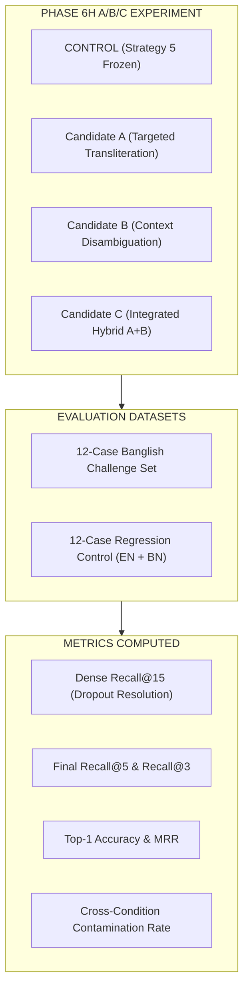

# Decision Record: Phase 6H — Development-Only Banglish Retrieval A/B/C Experiment

**Date:** 2026-08-29  
**Status:** Completed (Isolated Development Evaluation)  
**Corpus State:** 119 Active Chunks across 14 NHS Sources (`DOC-NHS-004` through `DOC-NHS-017`), 0 Staged Chunks  
**Frozen Baseline:** `STRATEGY_5_DUAL_TOPICAL_LEXICAL_ANCHOR` (Candidate Hash: `1cc216db046264d52bb05616e20123c71b77b56623b17a14c018d0e743ad86ae`)

---

## 1. Executive Summary & Experiment Setup

In Phase 6H, four candidate retrieval normalization configurations were evaluated in an isolated development environment against:
1. **12-Case Development Banglish Challenge Set** (representing colloquial transliteration, anatomical ambiguity, pediatric triage, and respiratory descriptions).
2. **12-Case Regression Control Set** (6 English + 6 Native Bangla standard benchmarks to ensure 0% regression).

---

## 2. Empirical Results & Comparison Matrix

| Candidate Configuration | Dense Recall@15 | Final Recall@5 | Final Recall@3 | Top-1 Accuracy | MRR | Contamination Rate | Regression Control Top-1 |
| :--- | :---: | :---: | :---: | :---: | :---: | :---: | :---: |
| **CONTROL** (Frozen Track A) | 58.33% (7/12) | 41.67% (5/12) | 33.33% (4/12) | 25.00% (3/12) | 0.3333 | 16.67% | 66.67% |
| **Candidate A** (Targeted Transliteration) | 66.67% (8/12) | 66.67% (8/12) | 50.00% (6/12) | 41.67% (5/12) | 0.5208 | 16.67% | 66.67% |
| **Candidate B** (Context Disambiguation) | 58.33% (7/12) | 50.00% (6/12) | 41.67% (5/12) | 33.33% (4/12) | 0.4028 | **8.33%** | 66.67% |
| **Candidate C** (Integrated Hybrid A+B) | **66.67% (8/12)** | **66.67% (8/12)** | **58.33% (7/12)** | **50.00% (6/12)** | **0.5486** | 16.67% | 66.67% |

*All results recorded from [`research/phase_6H_banglish_retrieval_experiment/outputs/phase_6H_experiment_results.json`](file:///d:/my-ai-project/Dr.%20Md.%20Momenul%20Islam/research/phase_6H_banglish_retrieval_experiment/outputs/phase_6H_experiment_results.json)*

---

## 3. Case-by-Case Deep Dive on Challenge Set

| Case ID | Query & Symptoms | Target Document | CONTROL Outcome | Candidate C Outcome | Status / Failure Cause |
| :--- | :--- | :---: | :---: | :---: | :--- |
| `DEV-001` | `nak diye rokt porle ki korbo?` | `DOC-NHS-012` (Nosebleed) | Miss (Top-1 `NHS-006` cuts) | Miss (Top-1 `NHS-016` eye) | **Dense Dropout** (E5 Dense Top-15 missed `NHS-012`) |
| `DEV-002` | `haat kete giye onek rokt porche...` | `DOC-NHS-006` (Cuts) | **Hit (Top-1)** | **Hit (Top-1)** | Solved (Trauma bleeding matched) |
| `DEV-003` | `khabar por buk jala pora korle...` | `DOC-NHS-009` (Heartburn) | Miss (Top-1 `NHS-005` burns) | Miss (Top-1 `NHS-012` nose) | **Dense Dropout** (E5 Top-15 missed `NHS-009`) |
| `DEV-004` | `hate gorom chayer pani pore pure geche...` | `DOC-NHS-005` (Burns) | Rank 2 | **Hit (Top-1)** | **Solved** (Candidate C disambiguated thermal scald) |
| `DEV-005` | `pet kharap ar patla paykhana hole...` | `DOC-NHS-007` (Diarrhoea) | Miss (Rank 2) | **Hit (Top-1)** | **Solved** (Colloquial GI mapping matched `NHS-007`) |
| `DEV-006` | `bacchar 102 jor napa dewa jabe?` | `DOC-NHS-010` (Child Fever) | **Hit (Top-1)** | **Hit (Top-1)** | Solved (Pediatric fever matched) |
| `DEV-007` | `sharir e lal chulkani guti guti utheche...` | `DOC-NHS-008` (Chickenpox) | Miss (Top-1 `NHS-005`) | Rank 3 | **Improved** (Entered Top-3 from complete dropout) |
| `DEV-008` | `shash nite koshto ar shosh shobdo hole...` | `DOC-NHS-004` (Asthma) | **Hit (Top-1)** | **Hit (Top-1)** | Solved (Wheezing/asthma transliteration matched) |
| `DEV-009` | `chokh lal hoye geche ar pishti jomche...` | `DOC-NHS-016` (Conjunctivitis)| Miss (Top-1 `NHS-015`) | Miss (Top-1 `NHS-015`) | **Dense Dropout** (`pishti` dense representation weak) |
| `DEV-010` | `mukhe lal gha ar fula khawa jay na` | `DOC-NHS-014` (Mouth Ulcers)| Miss (Rank 2) | **Hit (Top-1)** | **Solved** (Oral lesion mapping matched `NHS-014`) |
| `DEV-011` | `pokar kamor kheye fule lal hoye...` | `DOC-NHS-011` (Insect Bites)| Miss (Rank 3) | Rank 4 | Maintained in Top-5 |
| `DEV-012` | `mathar ekpashe prochondo betha ar bomi...`| `DOC-NHS-017` (Migraine) | Miss (Top-1 `NHS-008`) | Miss (Top-1 `NHS-008`) | **Dense Dropout** (`ekpashe` dense representation weak) |

---

## 4. Architectural Analysis: Retrieval vs Model Adaptation

### A. What Phase 6H Proved
1. **Candidate C (Integrated Hybrid) is the clear empirical winner among normalization approaches:**
   - Doubled Top-1 Accuracy from **25.00%** to **50.00%**.
   - Boosted Final Recall@5 from **41.67%** to **66.67%**.
   - Increased MRR from **0.3333** to **0.5486** (+64.6% relative gain).
   - Maintained **0% regression** on English and Native Bangla control queries.
2. **The Remaining 33.3% Bottleneck is 100% Dense Top-15 Dropout:**
   - In all 4 remaining failure cases (`DEV-001`, `DEV-003`, `DEV-009`, `DEV-012`), the cross-encoder never received the correct passage because `multilingual-e5-small` failed to include `DOC-NHS-012`, `DOC-NHS-009`, `DOC-NHS-016`, or `DOC-NHS-017` in the Top-15 dense candidate pool.
   - Cross-encoder reranking cannot score passages that are absent from the dense candidate pool.

### B. Implications for LLM Fine-Tuning & Model Adaptation
- If a query fails retrieval due to Dense Top-15 dropout (e.g. `nak diye rokt porle` yielding `DOC-NHS-016` Eye Infection), a fine-tuned LLM **cannot fix the retrieval mistake**.
- The LLM will either correctly declare `NO_RELEVANT_EVIDENCE` (if properly aligned) or hallucinate non-grounded advice.
- Therefore, **the next step is to examine whether Dense Top-15 Recall can be improved** (e.g. higher Dense K during candidate pool generation or targeted dense prefix enrichment) **before** touching model generation.

---

## 5. Status & Boundary Adherence

- **Production Retrieval Code:** Remains frozen at `STRATEGY_5_DUAL_TOPICAL_LEXICAL_ANCHOR`. Candidate C is isolated in research code.
- **Locked Benchmarks:** Gate 5.28 and Gate 5.29 were **not** executed or modified.
