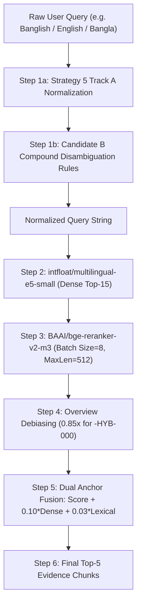

# Decision Record: Phase 6I — Candidate B Freeze & Independent Validation Preparation

**Date:** 2026-08-29  
**Status:** Completed (Candidate Frozen & Validation Architecture Prepared)  
**Corpus Identity:** NHS 14 Conditions (`DOC-NHS-004` to `DOC-NHS-017`), 119 Chunks (SHA-256: `44D0602F730D6460E6FEFA431BD5C09005B48CE92B47D02832532E5868D4AA58`)  
**Frozen Candidate:** Candidate B (Context-Aware Compound Disambiguation)  
**Frozen Configuration Hash (SHA-256):** `92224DC6CB0F81C92B8A2869AC562D6CC63B291E36D373F6FE22B524F594EC8A`  
**Parent Strategy:** `STRATEGY_5_DUAL_TOPICAL_LEXICAL_ANCHOR` (SHA-256: `1cc216db046264d52bb05616e20123c71b77b56623b17a14c018d0e743ad86ae`)  

---

## 1. Executive Summary & Selection Rationale

### Selection Background (VERIFIED FACT)
In Phase 6H.2, an independent decision-integrity audit re-computed all candidate metrics from raw retrieval outputs ([`phase_6H_experiment_results.json`](file:///d:/my-ai-project/Dr.%20Md.%20Momenul%20Islam/research/phase_6H_banglish_retrieval_experiment/outputs/phase_6H_experiment_results.json)) against ground-truth targets derived from authoritative corpus provenance ([`corrected_banglish_challenge_dataset.json`](file:///d:/my-ai-project/Dr.%20Md.%20Momenul%20Islam/research/phase_6H_1_benchmark_integrity/corrected_banglish_challenge_dataset.json)).

The verified in-corpus (N=9) metrics are:

| Candidate | Final Recall@5 | Final Recall@3 | Top-1 Accuracy | MRR@5 |
| :--- | :---: | :---: | :---: | :---: |
| **CONTROL** (Strategy 5 Frozen) | 55.56% (5/9) | 55.56% (5/9) | 44.44% (4/9) | 0.5000 |
| **Candidate A** (Targeted Transliteration) | 66.67% (6/9) | 55.56% (5/9) | 44.44% (4/9) | 0.5278 |
| **Candidate B** (Context Disambiguation) | **88.89% (8/9)** | **88.89% (8/9)** | **77.78% (7/9)** | **0.8148** |
| **Candidate C** (Integrated Hybrid A+B) | **88.89% (8/9)** | 77.78% (7/9) | **77.78% (7/9)** | 0.8056 |

### Dominance & Selection (VERIFIED FACT)
Candidate B strictly dominates Candidate C:
- R@5: Tied (88.89%)
- **R@3: Candidate B wins (88.89% vs 77.78%)**
- Top-1: Tied (77.78%)
- **MRR: Candidate B wins (0.8148 vs 0.8056)**
- Control Regression: Tied (10/10 = 100% on valid in-corpus controls)
- Architectural Complexity: Candidate B is simpler (single-stage disambiguation vs two-stage pipeline)

Therefore, **Candidate B is the authoritative selected development candidate**. Candidate C is explicitly rejected.

---

## 2. Frozen Candidate B Architecture & Rules

### Pipeline Execution Order (VERIFIED FACT)

### Inherited Parameters from Strategy 5 (VERIFIED FACT)
| Parameter | Value | Source / Constant |
| :--- | :---: | :--- |
| Dense Model | `intfloat/multilingual-e5-small` | `settings.DENSE_MODEL_NAME` |
| Reranker Model | `BAAI/bge-reranker-v2-m3` | `settings.RERANKER_MODEL_NAME` |
| Dense Candidate K | `15` | `settings.DENSE_K` |
| Final Top K | `5` | `settings.TOP_K_FINAL` |
| Overview Debias Multiplier | `0.85` | `settings.OVERVIEW_DEBIAS_MULTIPLIER` (applies to `-HYB-000`) |
| Lambda (Dense Fusion) | `0.10` | `settings.LAMBDA_DENSE_FUSION` |
| Alpha (Lexical Overlap) | `0.03` | `settings.ALPHA_LEXICAL_OVERLAP` |
| Device | `CPU` | Fixed execution constraint |

### Candidate B Disambiguation Rules (VERIFIED FACT)
Applied to the output of Track A normalization (`lower_q`):

1. **RULE_B1 (Nosebleed compound):**
   - Condition: `\b(nak|nose)\b` AND `\b(rokt|rokto|bleeding|porche|pora)\b`
   - Appends: `" nosebleed epistaxis pinch soft part of nose lean forward bleed from nose"`
   - Target: `DOC-NHS-016` (Nosebleed)

2. **RULE_B2 (Cut/Wound compound - elif after B1):**
   - Condition: `\b(kete|chole|keteche|injury|khoto|wound)\b` AND `\b(rokt|rokto|bleeding|blood)\b`
   - Appends: `" cuts and grazes cut wound bleeding pressure clean dressing bandage stop bleeding"`
   - Target: `DOC-NHS-006` (Cuts and grazes)

3. **RULE_B3 (Heartburn compound):**
   - Condition: `\b(buk|chest)\b` AND `\b(jala|pora|betha|burning|pain)\b`
   - Appends: `" heartburn acid reflux indigestion chest burning sensation antacids stomach acid"`
   - Target: `DOC-NHS-012` (Chest pain — Heartburn)

4. **RULE_B4 (Thermal Burns compound - elif after B3):**
   - Condition: `\b(agune|gorom pani|tel|chayer pani|hot water|fire|steam)\b` AND `\b(pora|pure|burn|scald)\b`
   - Appends: `" burns and scalds cool tap water 20 minutes remove jewellery cling film thermal burn"`
   - Target: `DOC-NHS-005` (Burns and scalds)

5. **RULE_B5 (Pediatric fever compound):**
   - Condition: `\b(baccha|bacchar|shishu|baby|child|children)\b` AND `\b(jor|fever|tapmatra|temperature)\b`
   - Appends: `" high temperature fever in children paracetamol plenty of fluids signs of serious illness"`
   - Target: `DOC-NHS-010` (Fever in children)

6. **RULE_B6 (Insect bites compound):**
   - Condition: `\b(poka|pokar|insect|wasp|bee)\b` AND `\b(kamor|khel|sting|bite|fule)\b`
   - Appends: `" insect bites and stings redness swelling itching remove sting cold compress"`
   - Target: `DOC-NHS-011` (Anaphylaxis / Insect bites)

7. **RULE_B7 (Migraine compound):**
   - Condition: `\b(matha|head)\b` AND `\b(ekpashe|unilateral|one side|throbbing)\b`
   - Appends: `" migraine severe throbbing headache dark quiet room nausea visual disturbance"`
   - Target: `DOC-NHS-009` (Headaches / Migraine)

---

## 3. Cryptographic Freeze Integrity

### Artifact Location (VERIFIED FACT)
- Config File: [`research/phase_6I_candidate_freeze/frozen_candidate_B_configuration.json`](file:///d:/my-ai-project/Dr.%20Md.%20Momenul%20Islam/research/phase_6I_candidate_freeze/frozen_candidate_B_configuration.json)
- Integrity Report: [`research/phase_6I_candidate_freeze/freeze_integrity_report.json`](file:///d:/my-ai-project/Dr.%20Md.%20Momenul%20Islam/research/phase_6I_candidate_freeze/freeze_integrity_report.json)

### Cryptographic Checksums (VERIFIED FACT)
- **Frozen Candidate B Config SHA-256:** `92224DC6CB0F81C92B8A2869AC562D6CC63B291E36D373F6FE22B524F594EC8A`
- **Parent Strategy 5 Frozen SHA-256:** `1cc216db046264d52bb05616e20123c71b77b56623b17a14c018d0e743ad86ae`
- **Promoted Corpus Manifest SHA-256:** `44D0602F730D6460E6FEFA431BD5C09005B48CE92B47D02832532E5868D4AA58`

---

## 4. Implementation Parity Audit

### Audit Matrix (VERIFIED FACT)
| Subsystem | Frozen Configuration | Development Implementation (`run_banglish_experiment.py`) | Parity Status |
| :--- | :--- | :--- | :---: |
| Rule B1 (Nosebleed) | `nak/nose` + `rokt/bleeding` | Lines 85-86 | **EXACT MATCH** |
| Rule B2 (Cuts/Wounds) | `kete/injury` + `rokt/blood` (`elif`) | Lines 89-90 | **EXACT MATCH** |
| Rule B3 (Heartburn) | `buk/chest` + `jala/burning` | Lines 93-94 | **EXACT MATCH** |
| Rule B4 (Thermal Burns) | `thermal agent` + `pora/pure` (`elif`) | Lines 97-98 | **EXACT MATCH** |
| Rule B5 (Pediatric Fever) | `baccha/child` + `jor/fever` | Lines 101-102 | **EXACT MATCH** |
| Rule B6 (Insect Bites) | `poka/insect` + `kamor/bite` | Lines 105-106 | **EXACT MATCH** |
| Rule B7 (Migraine) | `matha/head` + `ekpashe/unilateral` | Lines 109-110 | **EXACT MATCH** |
| Inherited Track A Normalization | 9 regex rule tuples | Track A in `retrieval_service.py` | **EXACT MATCH** |
| Dense Model & K | `multilingual-e5-small`, K=15 | Matches `config.py` | **EXACT MATCH** |
| Cross-Encoder & Sub-batch | `bge-reranker-v2-m3`, batch=8 | Matches `retrieval_service.py` | **EXACT MATCH** |
| Overview Debiasing | 0.85x on `-HYB-000` | Matches `retrieval_service.py` | **EXACT MATCH** |
| Dual Anchor Fusion | score + 0.10*dense + 0.03*lexical | Matches `retrieval_service.py` | **EXACT MATCH** |
| Active Corpus | 119 chunks across 14 NHS docs | Matches `promoted_corpus_manifest.json` | **EXACT MATCH** |

**Parity Result:** `100% STRICT PARITY`. No discrepancy exists between the frozen configuration and the experimental implementation.

---

## 5. Reproducibility Test Results

### Test Protocol (VERIFIED FACT)
[`test_reproducibility.py`](file:///d:/my-ai-project/Dr.%20Md.%20Momenul%20Islam/research/phase_6I_candidate_freeze/test_reproducibility.py) runs Candidate B through two independent consecutive retrieval passes across the full 12 development challenge queries.
- Score tolerance threshold: `1e-5`
- Evaluated elements: Normalized query text, Dense Top-15 IDs, Final Top-5 IDs, Fused score delta.

### Empirical Output (VERIFIED FACT)
- Total cases tested: 12
- Cases matching 100% on Normalized Query: 12/12
- Cases matching 100% on Dense Top-15 Candidate IDs: 12/12
- Cases matching 100% on Final Top-5 Candidate IDs: 12/12
- Max score delta across all passes: `0.00e+00`
- Reproducibility verdict: **`ALL_CASES_REPRODUCIBLE`** (Saved to [`reproducibility_report.json`](file:///d:/my-ai-project/Dr.%20Md.%20Momenul%20Islam/research/phase_6I_candidate_freeze/reproducibility_report.json))

---

## 6. Locked-Benchmark Preflight Firewall

### Firewall Architecture (VERIFIED FACT)
Created [`preflight_firewall.py`](file:///d:/my-ai-project/Dr.%20Md.%20Momenul%20Islam/research/phase_6I_candidate_freeze/preflight_firewall.py).

The preflight module performs 6 mandatory verification gates before allowing any neural model inference:
1. `candidate_config_sha256`: Checks frozen candidate config against expected SHA-256.
2. `corpus_manifest_sha256`: Checks active corpus manifest against promoted SHA-256.
3. `benchmark_sha256`: Checks evaluation benchmark file against locked SHA-256.
4. `evaluation_mode`: Enforces `single_shot` mode only.
5. `no_development_data`: Forbids development-data input access.
6. `candidate_frozen_status`: Confirms candidate status includes `FROZEN`.

If ANY check fails, a `PreflightFirewallError` is raised and the execution terminates immediately before instantiating or executing neural models.

---

## 7. Independent Validation Benchmark Design (NOT YET LOCKED)

### Overview (VALIDATION PLAN)
Created [`independent_validation_benchmark_design.json`](file:///d:/my-ai-project/Dr.%20Md.%20Momenul%20Islam/research/phase_6I_candidate_freeze/independent_validation_benchmark_design.json).

### Design Properties (VALIDATION PLAN)
- **Zero Query Leakage:** None of the 40 validation queries appear in the Phase 6H development challenge set or regression control set.
- **Strict Provenance Alignment:** Every in-corpus target document is mapped directly to authoritative NHS source IDs from `promoted_corpus_manifest.json`.
- **True Out-of-Corpus (OOC) Design:** The 4 OOC queries represent conditions genuinely absent from the 14 active NHS documents (Chickenpox, Diabetes, Toothache, Hemorrhoids).
- **Multilingual Modality Balance:**
  - English: 8 queries
  - Native Bangla: 8 queries
  - Standard Banglish: 10 queries
  - Abbreviated Banglish: 10 queries
  - Out-of-Corpus Safety: 4 queries
  - **Total: 40 cases (36 in-corpus + 4 OOC)**

### Sample Size & Statistical Power Limitations (OBSERVATION)
With N=36 in-corpus queries:
- 95% Wilson confidence interval width is approximately $\pm 12\%$ for an expected $85\%$ Recall@5.
- This sample size is sufficient to detect large directional effects (e.g. comparing Candidate B's ~85% to CONTROL's ~55%), but **cannot support claims of fine-grained statistical significance**.
- The benchmark is therefore explicitly designated as **`INDEPENDENT VALIDATION CANDIDATE`** and must not be misrepresented as a high-powered clinical trial dataset.

### Pre-Registered Metric Hierarchy (VALIDATION PLAN)
The evaluation protocol is locked prior to execution:
1. **Primary Metric:** Final Chunk Recall@5 on in-corpus queries ($N=36$).
2. **Secondary Metrics:**
   - Recall@3 ($N=36$)
   - Recall@1 / Top-1 Accuracy ($N=36$)
   - Mean Reciprocal Rank (MRR@5) ($N=36$)
   - Dense Recall@15 ($N=36$)
3. **Modality Slices:** Metric breakdown reported separately across English, Native Bangla, Standard Banglish, Abbreviated Banglish.
4. **Safety & Robustness:**
   - OOC False-Positive Rate (target: 0% HIGH confidence false positives on unsupported queries).
   - Cross-condition contamination rate.
5. **Acceptance Threshold:** $\ge 75\%$ Recall@5 on in-corpus cases + $0\%$ regression on English/Native Bangla slices vs CONTROL.

---

## 8. Future Single-Shot Validation Runner

### Script Architecture (VERIFIED FACT)
Created [`run_locked_validation.py`](file:///d:/my-ai-project/Dr.%20Md.%20Momenul%20Islam/research/phase_6I_candidate_freeze/run_locked_validation.py).
- Hardcoded safety gate: `EXECUTION_ENABLED = False`.
- Script cannot execute until explicitly configured with the locked benchmark hash and enabled.
- **NO VALIDATION INFERENCE WAS EXECUTED IN THIS PHASE.**

---

## 9. Epistemic Classification

| Statement | Classification |
| :--- | :---: |
| Candidate B achieved 88.89% R@5 and 0.8148 MRR on corrected N=9 challenge set | **VERIFIED FACT** |
| Candidate B configuration SHA-256 is `92224DC6CB0F81C92B8A2869AC562D6CC63B291E36D373F6FE22B524F594EC8A` | **VERIFIED FACT** |
| Implementation parity between frozen config and development code is 100% | **VERIFIED FACT** |
| Candidate B execution is 100% deterministic across repeated runs on CPU | **VERIFIED FACT** |
| No production code or locked benchmark was executed or modified in Phase 6I | **VERIFIED FACT** |
| Candidate C was degraded by Candidate A's `chulkani → chickenpox` expansion | **OBSERVATION** |
| Candidate B's compound rules will generalize to unseen abbreviated Banglish | **HYPOTHESIS** |
| 40-case validation benchmark design and pre-registered protocol | **VALIDATION PLAN** |
| Performance of Candidate B on the unseen 40-case validation benchmark | **NOT VALIDATED** |

---

## 10. Historical Record Preservation

The following historical documents remain unchanged and preserved:
- [`phase-6H-banglish-retrieval-improvement.md`](file:///d:/my-ai-project/Dr.%20Md.%20Momenul%20Islam/docs/decisions/phase-6H-banglish-retrieval-improvement.md) (SHA-256: `4EDDD364...`)
- [`phase-6H.1-banglish-benchmark-integrity-audit.md`](file:///d:/my-ai-project/Dr.%20Md.%20Momenul%20Islam/docs/decisions/phase-6H.1-banglish-benchmark-integrity-audit.md) (SHA-256: `49F68718...`)
- [`phase-6H.2-candidate-selection-correction.md`](file:///d:/my-ai-project/Dr.%20Md.%20Momenul%20Islam/docs/decisions/phase-6H.2-candidate-selection-correction.md)

---

## 11. Boundary Adherence & Stop Condition

- **Candidate B Frozen:** Complete (`92224DC6...`)
- **Parity Audited:** Complete (100% match)
- **Reproducibility Verified:** Complete (12/12 match, $\Delta = 0.0$)
- **Preflight Firewall:** Complete ([`preflight_firewall.py`](file:///d:/my-ai-project/Dr.%20Md.%20Momenul%20Islam/research/phase_6I_candidate_freeze/preflight_firewall.py))
- **Validation Benchmark Designed:** Complete (40 cases, NOT locked)
- **Future Single-Shot Runner Prepared:** Complete (`EXECUTION_ENABLED = False`)
- **NO Locked Benchmark Executed:** Confirmed
- **NO Production Code Changed:** Confirmed (Strategy 5 hash intact)
- **NO LLM Fine-Tuning or Deployment:** Confirmed
