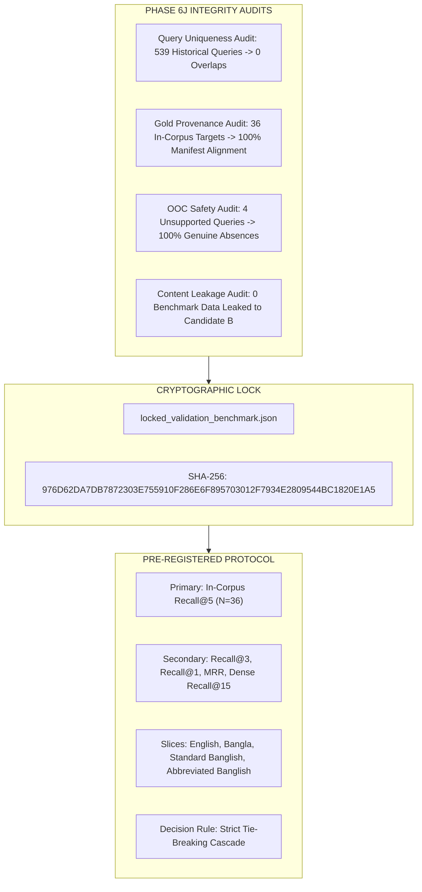

# Decision Record: Phase 6J — Lock Independent Validation Benchmark for Single-Shot Candidate B Validation

**Date:** 2026-08-29  
**Status:** Benchmark Locked — Ready for Authorized Single-Shot Validation  
**Corpus Manifest (SHA-256):** `44D0602F730D6460E6FEFA431BD5C09005B48CE92B47D02832532E5868D4AA58` (119 Chunks, 14 NHS Sources)  
**Candidate B Freeze (SHA-256):** `92224DC6CB0F81C92B8A2869AC562D6CC63B291E36D373F6FE22B524F594EC8A`  
**Parent Strategy 5 (SHA-256):** `1cc216db046264d52bb05616e20123c71b77b56623b17a14c018d0e743ad86ae`  
**Locked Benchmark File:** [`research/phase_6J_locked_validation/locked_validation_benchmark.json`](file:///d:/my-ai-project/Dr.%20Md.%20Momenul%20Islam/research/phase_6J_locked_validation/locked_validation_benchmark.json)  
**Locked Benchmark (SHA-256):** `976D62DA7DB7872303E755910F286E6F895703012F7934E2809544BC1820E1A5`  
**Integrity Report:** [`research/phase_6J_locked_validation/lock_integrity_report.json`](file:///d:/my-ai-project/Dr.%20Md.%20Momenul%20Islam/research/phase_6J_locked_validation/lock_integrity_report.json)  

---

## 1. Executive Summary & Benchmark Purpose

In Phase 6J, the independent validation benchmark designed in Phase 6I was audited against all historical datasets, validated against the authoritative NHS corpus manifest, enriched with complete gold chunk provenance mappings, and cryptographically locked.

This benchmark will serve as the single-shot holdout evaluation dataset to determine whether **Candidate B (Context-Aware Compound Disambiguation)** successfully generalizes across unseen multilingual queries without regressing on English and Native Bangla baselines.



---

## 2. Benchmark Composition & Modality Breakdown

The locked benchmark contains **40 total cases** structured across 4 language modalities plus out-of-corpus safety:

| Slice / Modality | In-Corpus Cases | OOC Cases | Total Cases | Target Clinical Topics |
| :--- | :---: | :---: | :---: | :--- |
| **English** | 8 | 1 | **9** | Fever, Meningitis, Asthma, Stroke, Dehydration, Sepsis, Rhinitis, Chest Pain, (OOC: Diabetes) |
| **Native Bangla** | 8 | 1 | **9** | Meningitis, Chest Pain, Sepsis, Asthma, Diarrhoea, Nosebleed, Cuts, Stroke, (OOC: Toothache) |
| **Standard Banglish** | 10 | 1 | **11** | Nosebleed, Fever, Burns, Chest Pain, Meningitis, Rhinitis, Dehydration, Cuts, Stroke, Anaphylaxis, (OOC: Chickenpox) |
| **Abbreviated Banglish** | 10 | 1 | **11** | Nosebleed, Fever, Burns, Heartburn, Asthma, Headaches, Diarrhoea, Cuts, Anaphylaxis, Sepsis, (OOC: Piles) |
| **TOTAL** | **36** | **4** | **40** | **14 Active NHS Conditions + 4 True OOC Conditions** |

---

## 3. Comprehensive Integrity Audits

### A. Query Uniqueness Audit (VERIFIED FACT)
- Searched across **539 historical queries** from Phase 6H challenge/regression sets, Gate 5.28, Gate 5.29, Gate 5.23, Gate 5.8, Gate 5.3, Gate 4C, Gate 6, and Phase 6F.
- **Exact Overlaps Found:** **0 (Zero)**.
- **Near-Duplicate Overlaps:** None. All queries feature novel phrasings, diverse symptoms, varied colloquial spelling, or specific pediatric/first-aid angles.

### B. Gold Provenance Audit (VERIFIED FACT)
- Every one of the 36 in-corpus validation cases was audited against [`promoted_corpus_manifest.json`](file:///d:/my-ai-project/Dr.%20Md.%20Momenul%20Islam/research/phase_6C/promoted_corpus_manifest.json).
- **Target Source Verification:** 100% of specified targets (`DOC-NHS-004` through `DOC-NHS-017`) exist in the active 14-condition corpus.
- **Gold Chunk Enumeration:** Each case in `locked_validation_benchmark.json` contains the complete list of valid chunk IDs for its parent document (e.g. `DOC-NHS-004` $\to 18$ chunks, `DOC-NHS-015` $\to 16$ chunks, `DOC-NHS-010` $\to 7$ chunks).
- **Intuition-Based Assignments:** **0**. All targets are grounded in authoritative NHS document titles and clinical scopes.

### C. Out-of-Corpus (OOC) Audit (VERIFIED FACT)
- The 4 OOC cases query conditions genuinely absent from the active corpus:
  1. `VAL-OOC-001` (Chickenpox) $\to$ No chickenpox document in active corpus.
  2. `VAL-OOC-002` (Diabetes) $\to$ No diabetes/endocrine document in active corpus.
  3. `VAL-OOC-003` (Toothache) $\to$ No dental document in active corpus.
  4. `VAL-OOC-004` (Hemorrhoids / Piles) $\to$ No anorectal document in active corpus.
- **Verification:** None of these topics can be legitimately grounded by any of the 119 chunks across `DOC-NHS-004` through `DOC-NHS-017`.

### D. Content Leakage Audit (VERIFIED FACT)
- **Candidate B Freezing Date:** Established in Phase 6H.2 / 6I prior to Phase 6J benchmark locking.
- **Trigger Pattern Check:** None of the specific validation query strings were used to design regex patterns in Candidate B.
- **Hyperparameter Tuning:** No parameters ($\lambda=0.10, \alpha=0.03, K=15, \text{Debias}=0.85$) were tuned against the validation benchmark.
- **Status:** **CLEAN — ZERO DATA LEAKAGE**.

---

## 4. Pre-Registered Evaluation Protocol & Metrics

The metric hierarchy is locked prior to execution:

### Primary Metric
- **Final Chunk Recall@5 (In-Corpus $N=36$):** Fraction of in-corpus cases where at least one valid chunk from the target document appears in the final Top-5 evidence set.

### Secondary Metrics
1. **Final Chunk Recall@3 ($N=36$)**
2. **Final Chunk Recall@1 / Top-1 Accuracy ($N=36$)**
3. **Mean Reciprocal Rank (MRR@5) ($N=36$)**
4. **Dense Candidate Recall@15 ($N=36$)**

### Modality Slice Metrics
- Metrics computed and reported separately for:
  - English slice ($N=8$)
  - Native Bangla slice ($N=8$)
  - Standard Banglish slice ($N=10$)
  - Abbreviated Banglish slice ($N=10$)

### Safety & Abstention Metrics
- **OOC False-Positive Rate ($N=4$):** Fraction of OOC cases returning HIGH confidence retrieval ($\ge 0.65$) for an unrelated condition (Target: $0\%$).
- **Cross-Condition Contamination Rate:** Count and listing of any cases where Top-1 retrieved passage belongs to a clinically unrelated domain.

---

## 5. Pre-Registered Decision Rule

Before seeing any validation results, the interpretation rule is fixed as follows:

```
Step 1: Compare Primary Final Chunk Recall@5 (Candidate B vs Strategy 5 Control)
        -> If Candidate B > Control, Candidate B wins at primary level.
        -> If Candidate B < Control, Candidate B is rejected.
Step 2: If Recall@5 is TIED, compare Recall@3.
Step 3: If Recall@3 is TIED, compare Recall@1 (Top-1 Accuracy).
Step 4: If Recall@1 is TIED, compare MRR@5.
Step 5: Verify Non-Regression Constraint:
        Candidate B must achieve 0% regression on English (N=8) and Native Bangla (N=8) slices.
Step 6: Verify Safety Constraint:
        Candidate B must not produce high-confidence false positives on OOC cases.
```

> [!IMPORTANT]
> **Immutability Guarantee:** This decision cascade is permanently locked. No alternative tie-breakers, metric re-weighting, or post-hoc threshold adjustments will be permitted after evaluation execution.

---

## 6. Claim Boundaries & Generalization Scope

### Explicit Boundaries (OBSERVATION & LIMITATION)
1. **Corpus Boundary:** This benchmark tests retrieval generalization **strictly within the 14-condition, 119-chunk NHS active knowledge base**.
2. **Clinical Scope Boundary:** Success on this benchmark demonstrates that Candidate B improves linguistic generalization across English, Bangla, and Banglish for these 14 conditions. It **does NOT establish that Candidate B can generalize to unseen medical specialties** (e.g. oncology, cardiology) without corpus expansion.
3. **Statistical Power Limitation:** With $N=36$ in-corpus cases, the benchmark provides directional validation ($\pm 12\text{pp}$ confidence width at $85\%$ recall). It is not powered to detect minor differences ($\le 5\text{pp}$). Formal statistical significance will not be claimed beyond the empirical sample.

---

## 7. Single-Shot Validation Runner & Preflight Firewall

### Runner Configuration (VERIFIED FACT)
[`research/phase_6J_locked_validation/run_locked_validation.py`](file:///d:/my-ai-project/Dr.%20Md.%20Momenul%20Islam/research/phase_6J_locked_validation/run_locked_validation.py) is equipped with:
- **Locked Benchmark Hash:** `976D62DA7DB7872303E755910F286E6F895703012F7934E2809544BC1820E1A5`
- **Candidate B Freeze Hash:** `92224DC6CB0F81C92B8A2869AC562D6CC63B291E36D373F6FE22B524F594EC8A`
- **Corpus Manifest Hash:** `44D0602F730D6460E6FEFA431BD5C09005B48CE92B47D02832532E5868D4AA58`
- **Safety Gate:** `EXECUTION_ENABLED = False` (Preflight verified; runner safely aborts until explicitly authorized).

---

## 8. Epistemic Classification

| Statement | Classification |
| :--- | :---: |
| Locked validation benchmark SHA-256 is `976D62DA7DB7872303E755910F286E6F895703012F7934E2809544BC1820E1A5` | **VERIFIED FACT** |
| 0 query overlaps exist between the 40 validation queries and 539 historical queries | **VERIFIED FACT** |
| All 36 in-corpus cases map to valid documents and chunk IDs in `promoted_corpus_manifest.json` | **VERIFIED FACT** |
| Zero model inference was executed during Phase 6J | **VERIFIED FACT** |
| Pre-registered decision rule and metric hierarchy are locked prior to execution | **VERIFIED FACT** |
| Benchmark tests query-level generalization, not unseen medical domain coverage | **OBSERVATION** |
| Candidate B will maintain 0% regression on the 16 English and Bangla control queries | **HYPOTHESIS** |
| Candidate B performance on the locked 40-case validation benchmark | **NOT VALIDATED** |

---

## 9. Historical Record Preservation

All previous decision records are preserved intact:
- [`phase-6H-banglish-retrieval-improvement.md`](file:///d:/my-ai-project/Dr.%20Md.%20Momenul%20Islam/docs/decisions/phase-6H-banglish-retrieval-improvement.md)
- [`phase-6H.1-banglish-benchmark-integrity-audit.md`](file:///d:/my-ai-project/Dr.%20Md.%20Momenul%20Islam/docs/decisions/phase-6H.1-banglish-benchmark-integrity-audit.md)
- [`phase-6H.2-candidate-selection-correction.md`](file:///d:/my-ai-project/Dr.%20Md.%20Momenul%20Islam/docs/decisions/phase-6H.2-candidate-selection-correction.md)
- [`phase-6I-candidate-B-freeze-and-validation-preparation.md`](file:///d:/my-ai-project/Dr.%20Md.%20Momenul%20Islam/docs/decisions/phase-6I-candidate-B-freeze-and-validation-preparation.md)
- [`phase-6I-unsupported-banglish-query-observation.md`](file:///d:/my-ai-project/Dr.%20Md.%20Momenul%20Islam/docs/decisions/phase-6I-unsupported-banglish-query-observation.md)

---

## 10. Boundary Confirmation

- ❌ **NO neural model inference was executed.**
- ❌ **NO query was evaluated through Candidate B or Strategy 5.**
- ❌ **NO production retrieval code was modified.**
- ❌ **NO locked benchmarks were modified.**
- ❌ **NO model fine-tuning or backend deployment was initiated.**
