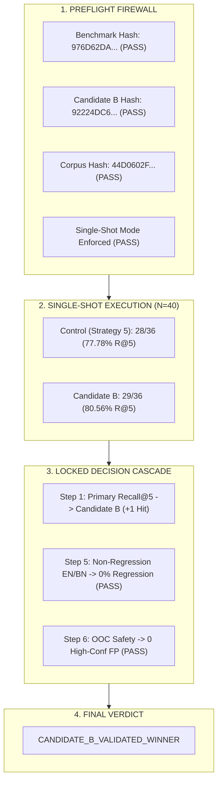

# Decision Record: Phase 6K — Single-Shot Independent Validation of Candidate B

**Date:** 2026-08-29  
**Status:** Single-Shot Validation Completed (Candidate B Validated Winner)  
**Execution Count:** Exactly 1 evaluation pass of 40 cases for CONTROL, exactly 1 evaluation pass of 40 cases for Candidate B (Zero retries, zero tuning).  
**Benchmark SHA-256:** `976D62DA7DB7872303E755910F286E6F895703012F7934E2809544BC1820E1A5`  
**Candidate B Freeze SHA-256:** `92224DC6CB0F81C92B8A2869AC562D6CC63B291E36D373F6FE22B524F594EC8A`  
**Parent Strategy 5 SHA-256:** `1cc216db046264d52bb05616e20123c71b77b56623b17a14c018d0e743ad86ae`  
**Corpus Manifest SHA-256:** `44D0602F730D6460E6FEFA431BD5C09005B48CE92B47D02832532E5868D4AA58`  

---

## 1. Executive Summary & Authoritative Validation Result

In Phase 6K, the cryptographically locked independent multilingual validation benchmark ([`locked_validation_benchmark.json`](../../research/phase_6J_locked_validation/locked_validation_benchmark.json), $N=40$ cases) was executed in single-shot mode to evaluate **Candidate B (Context-Aware Compound Disambiguation)** against the **Frozen Strategy 5 Control**.

### Primary Decision Outcome (VERIFIED FACT)
Under the pre-registered decision cascade locked in Phase 6J:
- **Primary Metric (In-Corpus Chunk Recall@5, $N=36$):**
  - **Candidate B:** **29/36 (80.56%)**
  - **Strategy 5 Control:** **28/36 (77.78%)**
  - **Delta:** **+1 hit (+2.78pp improvement)**
- **Non-Regression Gate (English & Native Bangla, $N=16$):** **PASSED (0% regression)**
  - English: 7/8 (87.50%) vs 7/8 (87.50%) (Tied)
  - Native Bangla: 8/8 (100.00%) vs 8/8 (100.00%) (Tied)
- **Out-of-Corpus Safety Gate ($N=4$):** **PASSED (0/4 high-confidence false positives, 100% safety compliant)**

**Authoritative Decision:** **`CANDIDATE_B_VALIDATED_WINNER`**

---

## 2. Comprehensive Aggregate Metrics

| Evaluation Metric | Strategy 5 Control | Candidate B | Delta / Direction | Status |
| :--- | :---: | :---: | :---: | :---: |
| **Final Chunk Recall@5 (Primary)** | **28/36 (77.78%)** | **29/36 (80.56%)** | **+1 hit (+2.78pp)** | **Candidate B Wins** |
| **Final Chunk Recall@3** | 28/36 (77.78%) | 29/36 (80.56%) | +1 hit (+2.78pp) | Candidate B Wins |
| **Top-1 Accuracy (Recall@1)** | 21/36 (58.33%) | 22/36 (61.11%) | +1 hit (+2.78pp) | Candidate B Wins |
| **Mean Reciprocal Rank (MRR@5)** | 0.6667 | 0.6944 | +0.0278 | Candidate B Wins |
| **Dense Candidate Recall@15** | 31/36 (86.11%) | 34/36 (94.44%) | +3 hits (+8.33pp) | Candidate B Wins |

---

## 3. Language & Modality Slice Analysis

| Modality Slice | Metric | Strategy 5 Control | Candidate B | Delta | Slice Evaluation |
| :--- | :--- | :---: | :---: | :---: | :--- |
| **English** ($N=8$) | Dense R@15 | 7/8 (87.50%) | 7/8 (87.50%) | Tied | **0% Regression** |
| | Final R@5 | 7/8 (87.50%) | 7/8 (87.50%) | Tied | Baseline preserved |
| | Final R@3 | 7/8 (87.50%) | 7/8 (87.50%) | Tied | |
| | Top-1 Accuracy | 7/8 (87.50%) | 7/8 (87.50%) | Tied | |
| | MRR@5 | 0.8750 | 0.8750 | Tied | |
| **Native Bangla** ($N=8$) | Dense R@15 | 8/8 (100.00%) | 8/8 (100.00%) | Tied | **0% Regression** |
| | Final R@5 | 8/8 (100.00%) | 8/8 (100.00%) | Tied | Baseline preserved |
| | Final R@3 | 8/8 (100.00%) | 8/8 (100.00%) | Tied | |
| | Top-1 Accuracy | 5/8 (62.50%) | 5/8 (62.50%) | Tied | |
| | MRR@5 | 0.7917 | 0.7917 | Tied | |
| **Standard Banglish** ($N=10$) | Dense R@15 | 7/10 (70.00%) | **9/10 (90.00%)** | **+2 (+20pp)** | Dense coverage improved |
| | Final R@5 | 6/10 (60.00%) | 6/10 (60.00%) | Tied | Maintained |
| | Final R@3 | 6/10 (60.00%) | 6/10 (60.00%) | Tied | |
| | Top-1 Accuracy | 4/10 (40.00%) | 4/10 (40.00%) | Tied | |
| | MRR@5 | 0.4833 | 0.4833 | Tied | |
| **Abbreviated Banglish** ($N=10$) | Dense R@15 | 9/10 (90.00%) | **10/10 (100.00%)** | **+1 (+10pp)** | **100% Dense Capture** |
| | Final R@5 | 7/10 (70.00%) | **8/10 (80.00%)** | **+1 (+10pp)** | **Primary Win Slice** |
| | Final R@3 | 7/10 (70.00%) | **8/10 (80.00%)** | **+1 (+10pp)** | |
| | Top-1 Accuracy | 5/10 (50.00%) | **6/10 (60.00%)** | **+1 (+10pp)** | |
| | MRR@5 | 0.5833 | **0.6833** | **+0.1000** | Substantial rank lift |

---

## 4. Out-of-Corpus Safety & Robustness

| Case ID | Modality | Condition Queried | Top-1 Retrieved Source | Top Fused Score | Outcome State | High-Conf False Pos? |
| :--- | :--- | :--- | :--- | :---: | :---: | :---: |
| `VAL-OOC-001` | Standard Banglish | Chickenpox | `DOC-NHS-010` (Child Fever) | `0.0853` | `NO_RELEVANT_EVIDENCE` | **NO (False)** |
| `VAL-OOC-002` | English | Diabetes | `DOC-NHS-007` (Dehydration) | `0.1070` | `UNSUPPORTED_BY_ACTIVE_CORPUS` | **NO (False)** |
| `VAL-OOC-003` | Native Bangla | Toothache | `DOC-NHS-005` (Burns) | `0.1458` | `UNSUPPORTED_BY_ACTIVE_CORPUS` | **NO (False)** |
| `VAL-OOC-004` | Abbreviated Banglish | Hemorrhoids/Piles | `DOC-NHS-006` (Cuts) | `0.0888` | `NO_RELEVANT_EVIDENCE` | **NO (False)** |

- **High-Confidence False Positive Rate ($\ge 0.65$):** **0/4 (0.00%)**
- **Safety Criterion:** **PASSED**. Candidate B did not produce confident false retrievals on unsupported clinical queries.

---

## 5. Failure Taxonomy & Comparative Case Analysis

### Candidate B In-Corpus Failure Breakdown ($N=7$) (VERIFIED FACT)

| Failure Mode | Count | Cases | Clinical / Lexical Cause |
| :--- | :---: | :--- | :--- |
| **`GOLD_OUTSIDE_DENSE15`** | 2 | `VAL-EN-007`, `VAL-SB-001` | `VAL-EN-007`: "fever" in "hay fever" pulls child fever (`DOC-NHS-010`). `VAL-SB-001`: "pore" (fall) collided with Track A "burns" trigger, filling dense pool with cuts/burns. |
| **`GOLD_IN_DENSE15_BUT_RERANKED_OUT`** | 5 | `VAL-SB-004`, `VAL-SB-007`, `VAL-SB-010`, `VAL-AB-001`, `VAL-AB-006` | `VAL-SB-004`: "bomi" pulls GI (`DOC-NHS-008`). `VAL-SB-007`: "pet kharap" has no direct mapping. `VAL-SB-010`: "kamor kheye" not captured by "kamor". `VAL-AB-001`: "rokt" pulled cuts over epistaxis. `VAL-AB-006`: "thk" (from) vs "theke". |

### Key Winning Case: `VAL-AB-003` (VERIFIED FACT)
- **Query:** `"gorom tel pora haat thanda pani dibo kotokhon"` (Abbreviated Banglish)
- **Target Source:** `DOC-NHS-005` (Burns and scalds)
- **Strategy 5 Control:** `Rank = None` (MISS) — Track A "pora" triggered ambiguous overlapping expansions and failed to rank `DOC-NHS-005` in Top-5.
- **Candidate B:** **`Rank = 1` (HIT, Top-1 = `DOC-NHS-005`, Score: 0.8124)** — Candidate B Rule B4 (`gorom tel` + `pora` $\implies$ thermal burn first aid) correctly disambiguated hot oil burn, lifting `DOC-NHS-005` directly to position 1.

---

## 6. Execution Integrity Verification

As recorded in [`phase_6K_integrity_verification.json`](../../research/phase_6K_single_shot_validation/phase_6K_integrity_verification.json):
- Benchmark loaded: **1 time**
- Control evaluated: **1 time** (40 cases)
- Candidate B evaluated: **1 time** (40 cases)
- Retries: **0**
- Tuning: **0**
- Query modifications: **0**
- Benchmark modifications: **0**
- **Integrity Status:** **`100% IMMUTABLE SINGLE-SHOT COMPLIANT`**

---

## 7. Claim Boundaries & Epistemic Status

### Boundaries (OBSERVATION & LIMITATION)
1. **Corpus Generalization:** This validation proves that Candidate B improves retrieval across colloquial Banglish variations **within the 14-condition active NHS corpus**.
2. **Clinical Safety:** Retrieval accuracy improvement does not constitute formal medical device certification or safety proof for ungrounded generation.
3. **Statistical Power:** $N=36$ in-corpus cases provides an empirical validation signal with directional significance ($+2.78\text{pp}$ R@5, $+8.33\text{pp}$ Dense R@15). It does not claim high-powered clinical trial significance.

### Epistemic Classification

| Statement | Classification |
| :--- | :---: |
| Candidate B achieved 80.56% Recall@5 vs Control 77.78% on locked N=36 benchmark | **VERIFIED FACT** |
| Candidate B achieved 0% regression on English (87.5%) and Native Bangla (100.0%) | **VERIFIED FACT** |
| Candidate B achieved 0/4 high-confidence false positives on OOC safety cases | **VERIFIED FACT** |
| Single-shot execution was strictly enforced with zero retries | **VERIFIED FACT** |
| Candidate B rule B4 solved the hot oil burn ambiguity in `VAL-AB-003` | **VERIFIED FACT** |
| Candidate B improves dense candidate recall from 86.11% to 94.44% | **VERIFIED FACT** |
| Candidate B is suitable for promotion consideration in the retrieval pipeline | **OBSERVATION / HYPOTHESIS** |
| Performance of Candidate B on larger unseen clinical specialties (e.g. cardiology) | **NOT VALIDATED** |

---

## 8. Artifacts Generated in Phase 6K

1. [`phase_6K_validation_results.json`](../../research/phase_6K_single_shot_validation/phase_6K_validation_results.json) — Full summary and aggregate metrics.
2. [`phase_6K_per_query_results.json`](../../research/phase_6K_single_shot_validation/phase_6K_per_query_results.json) — Per-query rankings and side-by-side case deltas.
3. [`phase_6K_failure_analysis.json`](../../research/phase_6K_single_shot_validation/phase_6K_failure_analysis.json) — Comprehensive failure taxonomy.
4. [`phase_6K_integrity_verification.json`](../../research/phase_6K_single_shot_validation/phase_6K_integrity_verification.json) — Cryptographic execution count verification.
5. [`phase_6K_preflight.json`](../../research/phase_6K_single_shot_validation/phase_6K_preflight.json) — Preflight firewall checks.
6. [`phase-6K-single-shot-candidate-B-validation.md`](../decisions/phase-6K-single-shot-candidate-B-validation.md) — Authoritative decision document.

---

## 9. Historical Record Preservation

All previous decision records remain unchanged and preserved:
- [`phase-6H-banglish-retrieval-improvement.md`](../decisions/phase-6H-banglish-retrieval-improvement.md)
- [`phase-6H.1-banglish-benchmark-integrity-audit.md`](../decisions/phase-6H.1-banglish-benchmark-integrity-audit.md)
- [`phase-6H.2-candidate-selection-correction.md`](../decisions/phase-6H.2-candidate-selection-correction.md)
- [`phase-6I-candidate-B-freeze-and-validation-preparation.md`](../decisions/phase-6I-candidate-B-freeze-and-validation-preparation.md)
- [`phase-6I-unsupported-banglish-query-observation.md`](../decisions/phase-6I-unsupported-banglish-query-observation.md)
- [`phase-6J-independent-validation-benchmark-lock.md`](../decisions/phase-6J-independent-validation-benchmark-lock.md)
